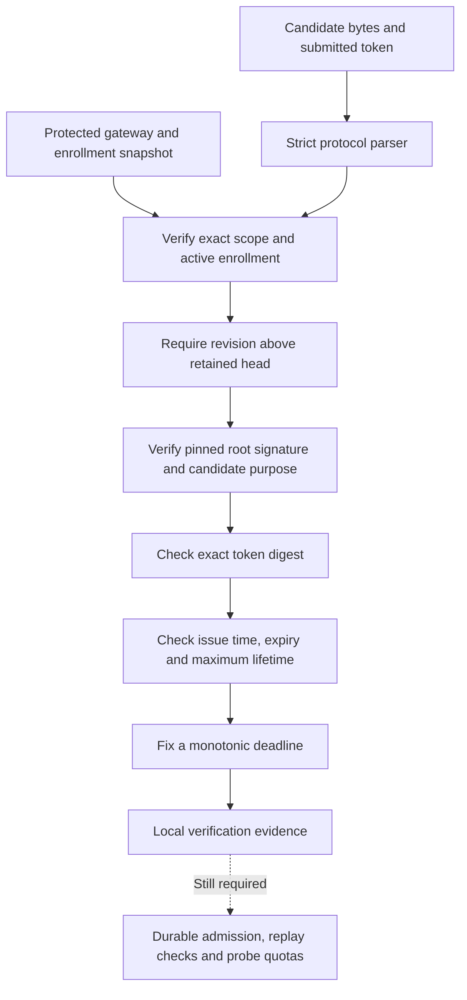

# Gateway candidate verification

`GatewayCandidateVerifier` checks a signed token candidate against a trusted gateway snapshot and current phone enrollment.
Its result is local evidence for later durable admission. It cannot send a probe or activate a recipient.

## Trusted inputs

`GatewayCandidateTrust` contains the owner, Mac, account, gateway and lifecycle epoch, plus the root key pinned during protected setup.
It also contains a trust revision, the applied control revision, gateway availability and one current phone enrollment.
The enrollment binds the phone ID, epoch, tag and active state. The verifier checks all these fields against the signed candidate.
The constructor validates identifier lengths and the P-256 public point.

The service must load this snapshot consistently from protected setup and retained control history.
It must never build trusted state from an incoming candidate, advertised key, token, or transport credential.
The trust revision must change whenever gateway trust, enrollment or the control head changes.
A UUID is a consistency marker, not proof that setup was authorized.

The caller supplies the current Unix time, a sleep-inclusive `AuthorityMoment`, and an explicit maximum candidate lifetime.
The two clock readings must describe the same verification instant. The service must replace the clock epoch after restart.
This layer selects no product timing default.

## Verification rules

The verifier rejects inactive gateways and enrollments, mismatched scope, and revisions at or below the applied head.
It verifies the dedicated candidate signature with the pinned root key. Other wire versions cannot fall back.
The submitted registration token must contain 1 through 16,384 printable, non-space ASCII bytes.
Its SHA-256 digest must equal the signed digest. No normalization or trimming occurs.

The issue time cannot be in the future. The expiry is exclusive, and the full issued lifetime cannot exceed the configured maximum.
After those checks, the verifier adds the remaining lifetime to the local monotonic time. Overflow fails.
The result retains that fixed deadline and clock epoch, so a consumer need not recompute lifetime from a later wall-clock reading.

The evidence also retains the exact typed candidate, canonical payload digest, trust revision and prior control revision.
The raw token stays internal to the Mac core for protected operational storage. Descriptions redact the evidence.
Do not log its fields, persist the token in audit history, or serialize the evidence as an authority credential.

## Durable admission remains required

The gateway writer must recheck the trust revision, control head, clock epoch and deadline before any admission or probe.
It must atomically enforce operation idempotency, candidate uniqueness, revocation tombstones and probe quotas.
Repeated verification does not consume a candidate or prevent replay. An already-admitted retry must resolve through the durable operation record.
The strict revision check here must not be relaxed to treat arbitrary equal revisions as retries.

Candidate admission cannot change the active recipient mapping. A failed candidate must leave the previous mapping intact.
Phone proof authentication, one-time consumption and the final mapping control remain separate work.
Protected setup, the gateway writer, provider dispatch integration and rollback recovery are not implemented by this verifier.

## Evidence

Ten unit tests use disposable in-memory keys. They cover each scope and enrollment binding, inactive trust, signature substitution and revision boundaries.
They also cover exact token bytes, token limits, time boundaries, integer overflow, malformed payloads and explicit codec budgets.
No provider request, persistent enrollment change, device action or privileged installation occurs in these tests.
