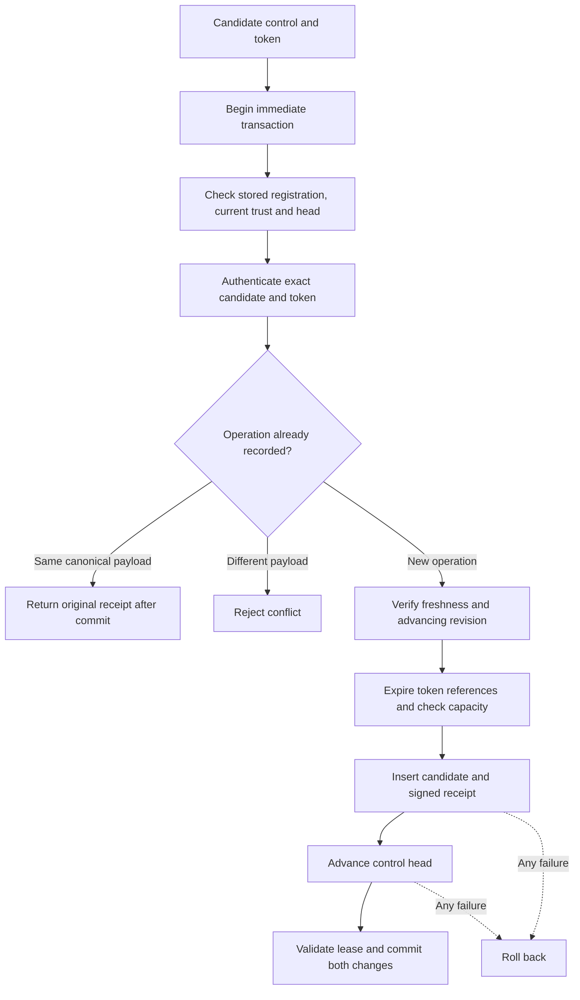

# Gateway candidate database

`GatewayDatabase` owns the push service's private SQLite connection and uses its protected storage lease.
It records candidate controls and the applied revision in one transaction. It has no provider dispatch or recipient activation API.

## Connection and setup

The caller provides a `GatewayRegistrationIdentity` from protected administrator setup.
It binds the owner, Mac, account, gateway, lifecycle epoch and pinned root key. The database checks all fields against its stored identity.
Constructing this value does not authenticate setup. Never source it from an incoming control or transport credential.

Opening requires an existing file and the dedicated service's lease. SQLite uses `NOFOLLOW` without `CREATE`.
Initialization is explicit and accepts only an empty store. Unknown schemas, mismatched identities and malformed stores fail without replacement.
The connection uses a distinct application ID, schema 1, trusted schema disabled, foreign keys enabled, DELETE journaling, EXTRA synchronization and full filesystem synchronization.
Attachments are disabled, extension loading must be omitted, and busy time and value sizes are bounded.
No raw connection, statement or SQL callback escapes the owner.

Calls must be serialized with gateway trust and enrollment changes. The supplied trust snapshot must be current and consistent.
Its registration must match the file, and its applied revision must equal the stored head.
The database cannot authenticate a caller-created snapshot or replace the future service controller's trust ownership.

## Candidate admission

Admission authenticates the pinned root signature, current active enrollment and exact token digest.
A new operation must also pass the candidate verifier's revision, issue-time, expiry and maximum-lifetime checks.
The operation ID, candidate ID and challenge must be unique within retained records. Revisions retain their full unsigned range as big-endian blobs.

Candidate insertion and head advancement commit together. A failed head update rolls back the insertion and its capacity use.
The returned `inserted` flag distinguishes a new record from a historical retry. Neither result authorizes a provider attempt.
A retry must match the original canonical payload and still authenticate against current trust and the submitted token.
It returns the original signed receipt even after expiry, without restoring token material or advancing the head.

The caller explicitly configures the total receipt bound, pending-candidate bound per enrollment, maximum issued lifetime and SQLite busy timeout.
Capacity failure leaves the head and prior records unchanged. This layer does not evict replay evidence to make room.
Receipt retention and admission-rate policy still need service integration; the pending bound is not a time-based rate limiter.
Do not expose this API as a transport-controlled send-to-token endpoint.

## Expiry and restart

Each admission retains a fixed monotonic deadline and this database owner's fresh run ID.
Explicit expiry removes logical token references when the deadline is reached. Receipts and the head remain.
A wrong clock epoch or clock regression retires the owner. The controller must reopen and reconcile trusted state before resuming.

Every reopen clears pending token references. It does not renew old deadlines or generate another probe from a receipt.
A new candidate requires a new signed operation and an advancing revision. The controller must handle this retry automatically when registration remains desired.
Logical removal is not a claim of forensic erasure from SQLite pages or backups. Files remain protected operational data.

## Integrity and remaining integration

Receipt reads reparse the canonical control, check indexed bindings and revision, and verify its root signature.
Detected receipt corruption, lease failure or ambiguous commit retires the owner. Descriptions redact receipt content.
Tokens and challenge payloads never enter the audit journal through this API.
The candidate control and receipt must not be exposed as phone-fetchable metadata: they contain the provider-only challenge.

This component does not implement revocation controls, tombstones, proof consumption, final mapping controls, acknowledgments, reconciliation or the root outbox.
It does not install a service or provide a rollback witness. A restored database and valid old signatures do not establish current trust.
The provider coordinator must add durable attempt tracking, current-trust checks and rate limits before sending probes.
The active recipient mapping is untouched because this store has no mapping mutation API.

## Validation

Thirteen database tests use real private SQLite files under a normal-user fixture lease.
They cover atomic rollback, duplicate and conflicting controls, quotas, expiry, restart, unsigned revision boundaries, registration binding and failure cleanup.
They also check signature corruption, clock changes, file replacement and malformed stores.
The ten candidate-verifier tests cover the shared authentication logic after its extraction for historical retries.
No provider, device or privileged service is contacted.
