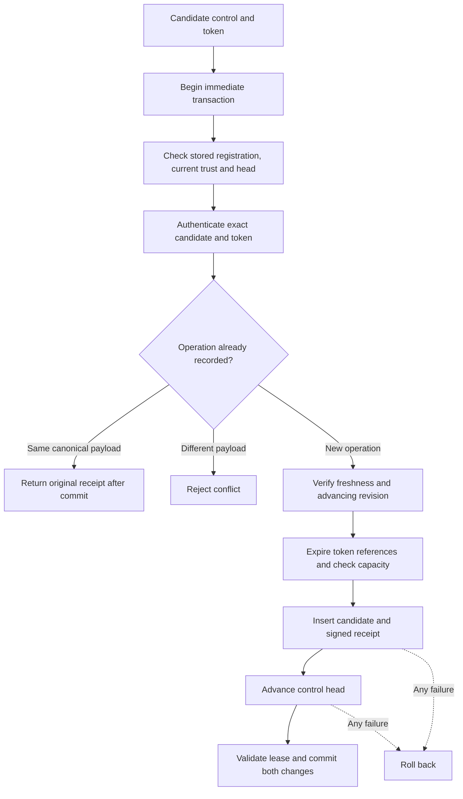
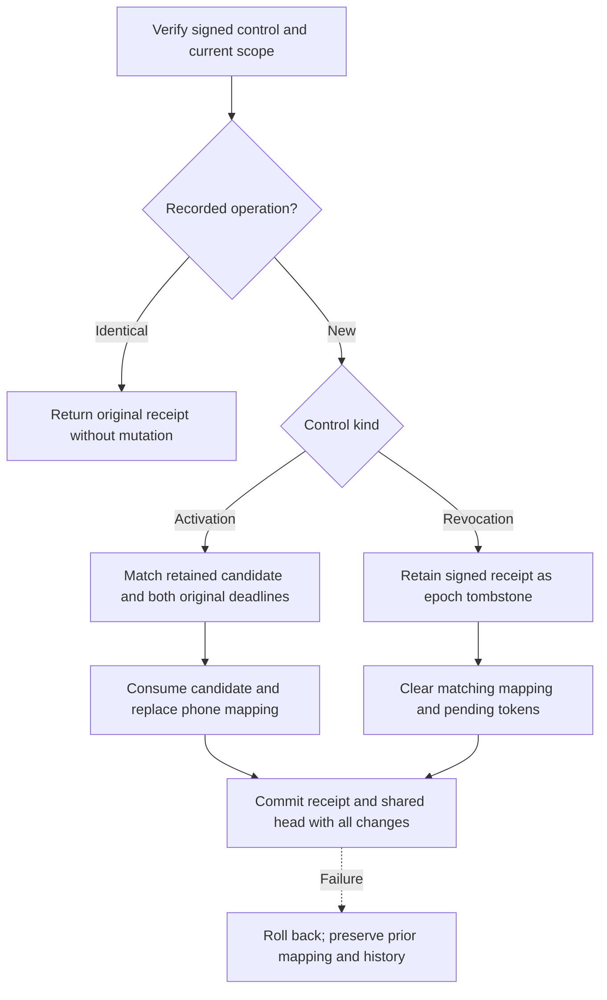

# Gateway control database

`GatewayDatabase` owns the push service's private SQLite connection and uses its protected storage lease.
It commits candidate admission, recipient activation and phone revocation with one shared revision. No method grants provider dispatch authority.

## Connection and setup

The caller provides a `GatewayRegistrationIdentity` from protected administrator setup.
It binds the owner, Mac, account, gateway, lifecycle epoch and pinned root key. The database checks all fields against its stored identity.
Constructing this value does not authenticate setup. Never source it from an incoming control or transport credential.

Opening requires an existing file and the dedicated service's lease. SQLite uses `NOFOLLOW` without `CREATE`.
Initialization is explicit and accepts only an empty store. Unknown schemas, mismatched identities and malformed stores fail without replacement.
The connection uses a distinct application ID, schema 3, trusted schema disabled, foreign keys enabled, DELETE journaling, EXTRA synchronization and full filesystem synchronization.
Attachments are disabled, extension loading must be omitted, and busy time and value sizes are bounded.
No raw connection, statement or SQL callback escapes the owner.

Calls must be serialized with gateway trust and enrollment changes. The supplied trust snapshot must be current and consistent.
Its registration must match the file, and its applied revision must equal the stored head.
The database cannot authenticate a caller-created snapshot or replace the future service controller's trust ownership.

## Candidate admission

Admission authenticates the pinned root signature, current active enrollment and exact token digest.
A new operation must also pass the candidate verifier's revision, issue-time, expiry and maximum-lifetime checks.
Operation IDs and revisions share one namespace across candidates, activations and revocations. Candidate IDs and challenges remain unique within retained candidates.
Revisions retain their full unsigned range as big-endian blobs. A retained revocation blocks new candidates for that phone epoch.

Candidate insertion and head advancement commit together. A failed head update rolls back the insertion and its capacity use.
The returned `inserted` flag distinguishes a new record from a historical retry. Neither result authorizes a provider attempt.
A retry must match the original canonical payload and still authenticate against current trust and the submitted token.
It returns the original signed receipt even after expiry, without restoring token material or advancing the head.

The caller explicitly configures the combined receipt bound, pending-candidate bound per enrollment, maximum issued lifetime and SQLite busy timeout.
Capacity failure leaves the head and prior records unchanged. This layer does not evict replay evidence to make room.
Receipt retention and admission-rate policy still need service integration; the pending bound is not a time-based rate limiter.
Do not expose this API as a transport-controlled send-to-token endpoint.

## Recipient application

`applyRecipient` requires an explicit operation kind, pinned root signature, current registration and matching phone epoch.
Each new control must advance the shared head and pass its own issue-time, expiry and lifetime checks.
An identical retry returns the original signed receipt without repeating a mutation, even after expiry or revocation.
Historical receipt retrieval does not restore an enrollment. Activation retries can acknowledge old history while that phone epoch is inactive.

Activation matches every retained candidate field and the exact token digest. The candidate must belong to this run and remain pending.
Both its original wall expiry and fixed monotonic deadline must still hold. A newer activation envelope cannot extend either deadline.
The candidate revision must exceed that of the phone's last activated candidate. A delayed older candidate cannot replace a newer mapping.
Activation clears this phone's pending token references through the selected candidate revision. Newer pending candidates remain eligible.

Revocation accepts a current root claim for an inactive enrollment too. The signed revocation receipt itself is the durable tombstone.
It invalidates all pending candidates and the active mapping for that exact phone epoch in the same transaction.
No later candidate or activation can clear it. Other phones and a separately authorized new enrollment epoch remain independent.
The caller must obtain fresh enrollment authority from protected state; choosing a new epoch in a message does not create that authority.

`activeMapping` checks current registration, head, active enrollment, tag and revocation state.
It validates the activation receipt, original candidate receipt, latest activation and token digest before returning stored evidence.
Active mappings survive restart; pending probes do not. Receipts include the provider challenge and must not become phone-fetchable metadata.

## Counter evidence for reconnects

`headEvidence` reads the counter and its latest root-signed receipt in one SQLite transaction.
It returns the pinned registration and either a candidate, activation, or revocation receipt.
Only an empty history with counter zero returns no receipt. Gaps between signed revisions are valid.
The full unsigned counter range is preserved.

The read checks that the latest receipt matches the counter, its indexed fields, scope, and root signature.
Conflicting latest revisions or operation IDs across the two receipt tables fail and retire the owner.
Expiry and restart do not erase historical evidence. This read cannot renew a candidate, restore a token, or change a mapping.
It checks the latest receipt, not every historical row or the completeness of an old backup.

This is local evidence for a future authenticated reply, not a network acknowledgment.
The service must bind that reply to the authenticated peer, registration, and fresh query.
The root must compare signed trust changes with its own retained history before advancing any counter.
A valid old signature alone cannot prove freshness or justify restoring enrollment.
No counter reconciliation or acknowledgment persistence is implemented here.
Receipts contain provider challenges. Keep this API restricted to the authority channel and redact its output from logs.

## Schema migration

Supported migrations are schema 1 or 2 to schema 3. The service controller must explicitly set `migrateLegacyStore` for this known transition.
This is a storage API choice, not a new user confirmation. Normal product upgrades should select the known migration automatically.
Migration checks the pinned identity and legacy layout, creates missing recipient and probe tables, and advances the schema version in one transaction.
It preserves all candidate receipts and the shared head. Failure rolls back the schema changes without resetting history.
Unknown versions still fail. Reopening after migration retires pending token references under the existing restart policy.

## Expiry and restart

Each admission retains a fixed monotonic deadline and this database owner's fresh run ID.
Explicit expiry removes logical token references when the deadline is reached. Receipts and the head remain.
A wrong clock epoch or clock regression retires the owner. The controller must reopen and reconcile trusted state before resuming.

Every reopen clears pending token references. It does not renew old deadlines or generate another probe from a receipt.
A new candidate requires a new signed operation and an advancing revision. The controller must handle this retry automatically when registration remains desired.
Logical removal is not a claim of forensic erasure from SQLite pages or backups. Files remain protected operational data.

## Integrity and remaining integration

Receipt reads reparse the canonical control, check indexed bindings and revision, and verify its root signature.
Detected receipt corruption, lease failure or ambiguous commit retires the owner. Descriptions redact receipt content.
Tokens and challenge payloads never enter the audit journal through this API.
The candidate control and receipt must not be exposed as phone-fetchable metadata: they contain the provider-only challenge.

This component does not implement phone proof consumption, acknowledgments, reconciliation or the root outbox.
It does not install a service or provide a rollback witness. A restored database and valid old signatures do not establish current trust.
The [probe attempt store](gateway-probe-attempts.md) provides durable reservations and per-candidate retry limits.
The provider coordinator must use it with current-trust checks and aggregate rate limits before sending probes.
A returned mapping is historical evidence, not permission to send. The coordinator must suspend delivery while a required state change cannot commit.

## Validation

Database tests use real private SQLite files under a normal-user fixture lease.
They cover atomic rollback, duplicate and conflicting controls, quotas, expiry, restart, unsigned revision boundaries, registration binding and failure cleanup.
They also check signature corruption, clock changes, file replacement, malformed stores, recipient transitions, migration and failure during mapping replacement.
The ten candidate-verifier tests cover the shared authentication logic after its extraction for historical retries.
No provider, device or privileged service is contacted.
