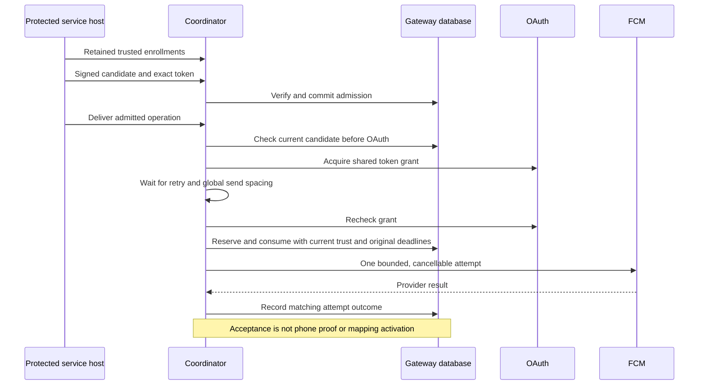

# Gateway delivery coordinator

`GatewayDeliveryCoordinator` connects the protected gateway database, OAuth token source, and FCM sender.
The actor takes sole ownership of the database. Its methods serialize admission, recipient controls, trust changes, and dispatch preparation.
This is a service component. The installed service and authenticated submission endpoint are still required.

## Ownership and cancellation

Protected setup supplies the pinned registration identity. Retained, authenticated enrollment state supplies the phone epochs and tags.
Candidate fields cannot create this trust. `replaceTrustedEnrollments` is a local host API, not a wire command or an XPC method.
The host must authenticate setup and reconciliation before calling it. Database tombstones remain authoritative after a trust reload.
The coordinator derives each snapshot's control head from its owned database. This does not implement root-side reconciliation or rollback detection.

A changed phone epoch, tag, or active state cancels that phone's tasks. A changed gateway active state cancels all tasks.
An identical reload or an unrelated phone change preserves a flight. A committed signed revocation cancels matching phone-epoch tasks.
Cancellation reaches OAuth waits, retry sleeps, and provider requests. A late callback cannot turn a cancelled attempt into acceptance.
Bytes already handed to the network cannot be recalled. They contain a challenge only and confer no approval or enrollment authority.

Shutdown rejects new work, cancels tasks, waits for completion, stops the token source, then closes the database.
Concurrent shutdown callers await the same result. The host must keep this coordinator alive and shut it down before replacing its service instance.
The token source belongs to this coordinator; do not share it with another independently managed gateway.

## Bounds and retry policy

The host supplies local settings through `GatewayDeliveryPolicy` and the database's `GatewayProbePolicy`.
At most 64 flights are allowed. Each flight retains its slot while waiting for OAuth, pacing, a provider reply, or retry.
A duplicate operation fails without starting another task. Capacity errors leave admission intact for the host scheduler to retry.
No unbounded work queue is hidden in this component.

A positive send interval spaces all probe handoffs, including the first handoff after startup.
This limit applies across this coordinator's candidates and phones. It is not a provider-account quota shared across multiple Macs.
Restart does not grant an immediate burst. Database startup retires old pending candidates and attempts, as described in [the attempt lifecycle](gateway-probe-attempts.md).

Retries use exponential local backoff, up to the configured cap, with up to 25 percent additive jitter within that cap.
The database floor and provider delay remain lower bounds. Provider seconds round upward to milliseconds.
Nonfinite, negative, or unrepresentable delays end the attempt sequence. No delay renews the original candidate deadline or attempt budget.
A 401 invalidates only the matching OAuth grant. Network failures can retry within the same candidate budget.
Other provider rejections end the probe without deleting enrollment keys or changing an active mapping.

OAuth failures before dispatch return to the host scheduler without consuming a provider attempt.
A candidate is checked before OAuth and again after every awaited preparation, immediately before dispatch.
The production clock uses sleep-inclusive `mach_continuous_time`; the database must use the same fresh clock epoch.
Clock regression or an epoch change stops the owner. Shutdown remains available to release its resources.

## Validation and remaining work

The focused tests use protected normal-user SQLite fixtures, synthetic credentials, controlled clocks, and cancellable fake provider replies.
They cover acceptance, retry timing and budgets, OAuth refresh, expiry, concurrency, cancellation, late replies, revocation, and shutdown.
One test connects the real FCM sender through an HTTP interceptor that accepts every request locally.
No test sends a live provider request or contacts a phone.

The installed service still needs its authenticated endpoint, protected enrollment updates, durable desired-state scheduler, and root-side proof handling.
That scheduler must resubmit capacity-limited work and recover routine registration after restart without another user prompt.
Approval wake delivery, cross-Mac provider quotas, and independent rollback witnesses remain separate integration work.
