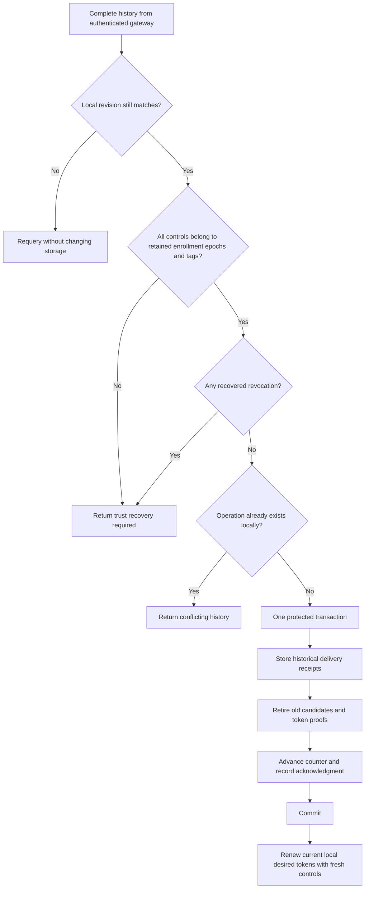

# Gateway history recovery

`JournalTransaction.reconcileGatewayDeliveryHistory` repairs delivery counters from a complete, authenticated receipt sequence.
It runs inside the protected root journal transaction. The caller first establishes local authority continuity and current registration activity.

The transaction checks the current enrollment revision against the caller's expected revision.
Each candidate or activation must refer to a retained phone, enrollment epoch, and notification tag.
A known inactive enrollment can contribute historical delivery evidence, but recovery never reactivates it.
Normal token renewal still requires current active enrollment.

The collector has already checked every revision, operation ID, signature, and the terminal head receipt.
Recovery additionally rejects operation IDs already present in local control history and enforces the journal's storage bounds.
If the local counter changed during collection, the result requests another reconciliation attempt without retiring the storage owner.

Recovered controls enter a separate history table. They contain no registration token and are never eligible for dispatch.
The transaction invalidates every retained candidate's run binding, including candidates created before the recovered range.
It retains local desired token values. The existing renewal API signs a fresh candidate for that current desired state.
A historical remote token digest cannot replace the local desired token.

Receipt insertion, candidate retirement, counter advancement, and acknowledgment commit together.
Any storage failure rolls them all back. The caller can append permitted audit metadata in the same transaction.
The result reports the local revision observed before recovery and the authenticated target revision.
A repeated call with the same evidence observes a changed local head and does not import the receipts again.

## Recovery boundary

`requiresTrustRecovery` and `conflictingLocalHistory` are not success states.
The host must restrict affected authority and mapping publication, apply verified revocations, and use the existing trust recovery path.
This delivery-only API does not implement those host transitions or grant permission to continue accepting phone operations.
It does not establish whole-backup continuity, install a witness, or infer trust from a gateway counter.
Gateway unavailability alone does not require administrator recovery.

## Storage and validation

Root journal schema 9 adds `gateway_reconciled_controls_v1` and preserves existing desired tokens and acknowledgments.
Explicit migrations accept schemas 1 through 8. Migration does not invent recovered history.
The separate gateway database remains at schema 3.

Synthetic tests use real root and gateway databases, signed controls, fresh gateway queries, and the complete history collector.
A rolled-back test transaction models lost local delivery writes while preserving their signed evidence for the gateway fixture.
Tests verify fresh renewal from local desired state, stale-proof rejection, unknown enrollment and tag rejection, and refusal to adopt revocations.
They cover changed local counters, stale trust revisions, inactive registration, read-only transactions, capacity, and operation conflicts.
Injected storage failures verify atomic rollback at every recovery write stage. Reopen and corruption tests exercise recovered receipt verification.
Migration tests preserve existing desired state and require explicit schema consent.

No live gateway, provider credentials, device installation, approval UI, or physical backup restoration was used.
Production service recovery and authority restriction remain integration work.
