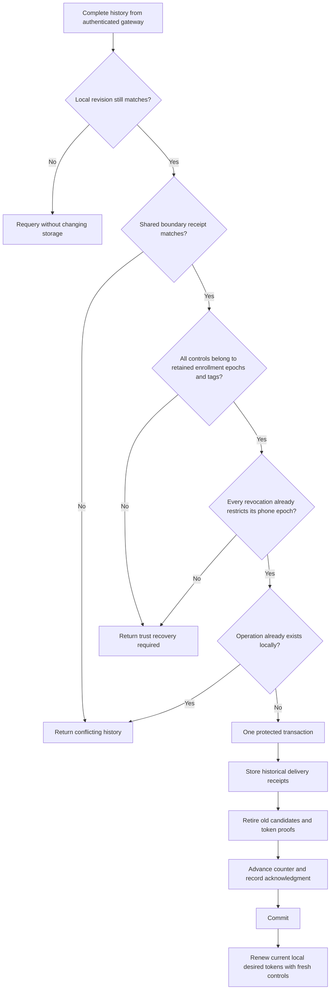

# Gateway history recovery

`JournalTransaction.reconcileGatewayDeliveryHistory` repairs delivery counters from a complete, authenticated receipt sequence.
It runs inside the protected root journal transaction. The caller first establishes local authority continuity and current registration activity.

The caller supplies its expected local revision. For a nonzero local head, collection starts one revision before it.
The first collected receipt must match the local boundary control's kind, operation ID, and canonical payload.
An equal counter is insufficient. A missing or conflicting boundary returns `conflictingLocalHistory` without changing storage.
For a zero local head, collection starts after revision zero. Only the later receipts enter recovered history.

The transaction checks the current enrollment revision against the caller's expected revision.
Each candidate or activation must refer to a retained phone, enrollment epoch, and notification tag.
A known inactive enrollment can contribute historical delivery evidence, but recovery never reactivates it.
Normal token renewal still requires current active enrollment.

For each revocation, the transaction requires permanent local evidence and no active enrollment for that exact phone epoch.
Apply the signed revocation through `recoverGatewayRevocation` first, then use its returned trust revision for reconciliation.
These calls can share a journal transaction. If restriction was committed separately, later counter repair failure cannot undo it.
An inactive enrollment alone is insufficient. A tombstone with a still-active enrollment is also insufficient.
Unknown candidate epochs or notification tags continue to require trust recovery, even when a later receipt revokes that phone.

The collector has already checked every revision, operation ID, signature, and the terminal head receipt.
Recovery additionally rejects operation IDs already present in local control history and enforces the journal's storage bounds.
If the local counter changed during collection, the result requests another reconciliation attempt without retiring the storage owner.

Recovered candidates and activations enter a separate history table without registration tokens.
Recovered removal controls enter the existing revocation table with a retired run binding.
All recovered controls remain ineligible for dispatch. Their original signatures and payloads remain available for head verification.
A fresh removal uses the normal revocation API with a new operation ID and a revision above the repaired head.
The transaction invalidates every retained candidate's run binding, including candidates created before the recovered range.
It retains remaining local desired token values. Revocation recovery has already removed the revoked epoch's desired token.
The existing renewal API signs a fresh candidate for the remaining current desired state.
A historical remote token digest cannot replace the local desired token.

Receipt insertion, candidate retirement, counter advancement, and acknowledgment commit together.
Any storage failure rolls them all back. The caller can append permitted audit metadata in the same transaction.
The result reports the local revision observed before recovery and the authenticated target revision.
A repeated call with the same evidence observes a changed local head and does not import the receipts again.

## Recovery boundary

`requiresTrustRecovery` and `conflictingLocalHistory` are not success states.
The host must restrict affected authority and mapping publication, apply verified revocations, and use the existing trust recovery path.
This delivery-only API does not implement those host transitions or grant permission to continue accepting phone operations.
The host can apply signed restrictive evidence through [recovered gateway revocations](recovered-gateway-revocations.md).
It does not establish whole-backup continuity, install a witness, or infer trust from a gateway counter.
Gateway unavailability alone does not require administrator recovery.

## Storage and validation

This recovery step needs no schema change. Schema 9 introduced `gateway_reconciled_controls_v1` and preserves existing desired tokens and acknowledgments.
Current root schema 11 also retains recovered revocations. Explicit migrations accept schemas 1 through 10. Migration does not invent recovered history.
The separate gateway database remains at schema 3.

Synthetic tests use real root and gateway databases, signed controls, fresh gateway queries, and the complete history collector.
A rolled-back test transaction models lost local delivery writes while preserving their signed evidence for the gateway fixture.
Tests verify fresh renewal from local desired state, stale-proof rejection, unknown enrollment and tag rejection, and refusal to adopt unapplied revocations.
They cover restriction followed by counter repair, shared transaction commit, inactive-state and permanent-evidence checks, and fresh removal delivery.
A repaired removal survives restart, cannot dispatch again, and cannot restore token publication or approval authority.
Fault tests retain previously committed restrictions when history, removal, counter, or acknowledgment writes fail.
They also reject mismatched and missing boundary receipts, including a local revocation hidden behind an equal gateway counter.
They cover changed local counters, stale trust revisions, inactive registration, read-only transactions, capacity, and operation conflicts.
Injected storage failures verify atomic rollback at every recovery write stage. Reopen and corruption tests exercise recovered receipt verification.
Migration tests preserve existing desired state and require explicit schema consent.

No live gateway, provider credentials, device installation, approval UI, or physical backup restoration was used.
Production service recovery and authority restriction remain integration work.

See [unknown trust restrictions](unknown-trust-restrictions.md) for durable phone restrictions that preserve pairing records.
