# Durable gateway probe attempts

`GatewayDatabase` now owns probe reservations and their outcomes alongside candidate and recipient state.
These methods perform no network requests. They provide the durable handoff that the service coordinator must use before each provider attempt.

```mermaid
stateDiagram-v2
    [*] --> Reserved: Commit reservation and count
    Reserved --> Dispatched: Consume once with fresh trust and deadlines
    Reserved --> Terminal: Cancel before dispatch
    Dispatched --> Accepted: Provider accepts
    Dispatched --> Retryable: Retry fits original deadline and budget
    Dispatched --> Terminal: Stop, exhausted budget or expired retry
    Retryable --> Reserved: Backoff elapsed; reserve next attempt
    Reserved --> Terminal: Restart
    Dispatched --> Terminal: Restart
    Retryable --> Terminal: Restart
```

## Policy and handoff

Probe methods are disabled unless opening supplies an explicit `GatewayProbePolicy`.
The service chooses the maximum attempts per candidate, positive minimum retry delay, and maximum provider TTL from local settings.
The candidate and provider cannot raise those limits. The policy allows one through 32 attempts and the provider's existing TTL range.

`reserveProbe` verifies the retained signed candidate, exact token, current registration and enrollment, revocation state, shared head and both original deadlines.
It commits a new random attempt ID and advances the attempt count. It returns no token or challenge payload.
An outstanding reservation or dispatch blocks another reservation for that candidate.

`takeProbe` requires the same process-bound reservation and trust revision. It repeats current-state checks and commits the dispatched state before returning `FCMTokenProbe`.
A second take fails. The returned probe preserves the original candidate deadline and caps TTL at handoff time.
The coordinator must serialize trust changes and transport handoff, send immediately, and never reuse the returned message.
The low-level transport does not enforce this lifecycle itself. These database APIs are not network or XPC endpoints.

## Outcomes and retries

`finishProbe` records only the first outcome for the matching attempt. Late callbacks cannot change a newer attempt.
An accepted outcome means provider acceptance, not phone delivery, proof consumption or recipient activation.
A reserved attempt can be cancelled as terminal; accepted and retry outcomes require a dispatched attempt.

A retry waits for the larger of the provider delay and local policy floor, using the current monotonic clock.
A delay that overflows, reaches the original deadline, follows candidate retirement, or exhausts the attempt budget becomes terminal.
Use a fresh clock reading for every call, including provider callbacks. A clock regression retires the database owner.

Terminal probe state does not revoke enrollment, remove an active mapping or erase a still-valid candidate token.
A proof from a prior delivery may still complete under the independent activation checks.
Provider results do not create authority. Only the retained signed control flow changes recipient state.

## Persistence

Schema 3 adds one bounded row per retained candidate, with its latest attempt ID, count, state, run, trust revision and retry time.
The candidate foreign key and the existing candidate capacity bound limit these rows. This is operational state, not the approval audit log.
Attempts do not advance the root control revision.

Known migrations from schema 1 or 2 require the existing explicit migration option. They preserve signed receipts, the head and active mappings.
Startup retires outstanding attempts and pending candidate tokens in one transaction. Old reservations cannot dispatch or finish against a new database owner.
The controller must obtain a fresh root candidate automatically when registration remains desired after restart.
It must not replay an old receipt or present another biometric prompt for routine registration recovery.

## Service integration still required

The service coordinator must own trust snapshots, OAuth acquisition, cancellation, timeout handling and the network task.
It must use these APIs to enforce the attempt lifecycle and add aggregate rate and concurrency limits across candidates and phones.
This per-candidate budget alone is not an aggregate rate limiter. The store does not schedule retries or call FCM.
Whole-backup rollback detection still needs the independent witness from the design.

## Validation

Nine additional real-SQLite tests cover reservation and dispatch uniqueness, first-outcome behavior, retries, overflow, original expiry and per-candidate budgets.
They also cover trust changes, revocation, activation, restart, cancellation, storage faults, corrupt counters and schema-2 migration with an active mapping.
The existing gateway tests now cover migration from schema 1 to schema 3. No provider or real device is contacted.
