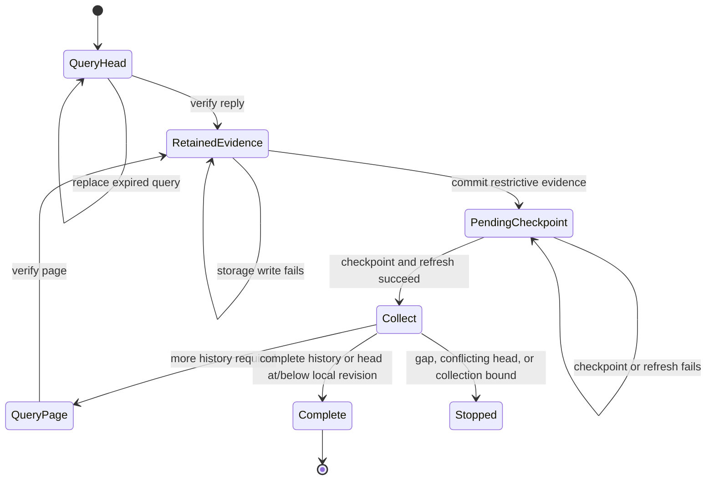
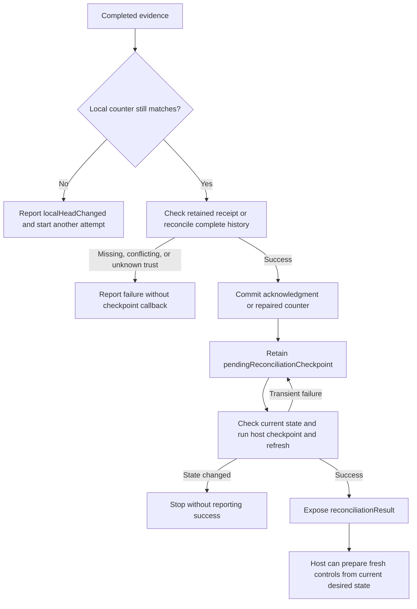

# Gateway recovery attempt

`GatewayRecoveryAttempt` owns one head query and the history pages that follow it.
The protected service serializes this owner with journal writes and registration changes.
Construct it only after independent local authority continuity checks pass.

`makeQuery` creates the next query. An unanswered query can be replaced after its deadline.
`accept` verifies the reply and retains it. Only one query can be in flight.
A retained reply blocks new queries until `processPending` completes its work.
A bad signature does not consume a valid query. Replayed or expired replies cannot supply recovery evidence.

`processPending` uses a real journal transaction to apply the head or page through `recoverGatewayTrust`.
It reads the current trust revision and audit head within that transaction.
A storage failure retains the verified evidence for retry. No checkpoint callback runs before commit.

After commit, the attempt calls the required `checkpointAndRefresh` host operation.
That operation must complete the independent checkpoint and refresh effective trust and delivery queues.
It must be idempotent. A transient failure leaves `pendingCheckpoint` available and blocks transport progress.
Retrying this step retains the original result, including changed phone IDs, without repeating the journal transaction.
The attempt checks the trust revision and audit head before and after the callback.
A change stops the attempt. Reentrant processing and queries are rejected.

The callback is a trusted integration boundary. It does not implement a rollback witness or open an admission gate.
The host must not substitute an empty callback in production or reopen affected admission while work is pending.
Cancellation drops the in-memory attempt but never reverses committed restrictions.
The host retains responsibility for unfinished checkpoints after cancellation or a process restart.

Only after checkpointing and refresh does the attempt check history continuity.
A missing revision or exceeded collection limit cannot undo a restriction from the head or an earlier page.
The collector includes the local boundary receipt when the initial local revision is nonzero.

## Completion and host responsibilities

The result contains either a verified head at or below the initial local revision, or a complete verified history.
Neither result authorizes mapping publication or phone operations.
Call `reconcile` after collection, with the current protected registration activity and a fresh monotonic time.
The owner checks the initial local counter and reads current enrollment trust in one journal transaction.
It uses `acknowledgeGatewayHead` for a head result and `reconcileGatewayDeliveryHistory` for complete history.

A storage failure retains the collected evidence for retry and leaves no partial repair.
A failed host checkpoint retains the committed resolution. Retrying it does not repeat the database repair.
The owner compares the trust revision, audit head, control counter, and acknowledgment before and after the callback.
Concurrent changes require a fresh attempt. Cancellation cannot undo a committed repair.
The callback must not mutate the journal, reenter the owner, or publish controls.

`reconciliationResult` exposes a successful disposition only after the host checkpoint and refresh succeed.
The resolution includes the current local counter, reported gateway counter, acknowledgment, and phones awaiting administrator repair.
A local counter change requires another attempt. Unknown trust restrictions still require independent administrator repair.
A complete history cannot reactivate revoked or restricted phones.

Fresh candidate renewal remains a separate root operation after successful checkpointing.
It must recheck current registration, enrollment, and counter state, and use the retained local desired token.
It must never reuse a recovered candidate, proof, or removal control. Checkpoint new controls before dispatch.
An acknowledged head can be behind the local counter; it is historical evidence, not proof of current gateway synchronization.

Invalidate the attempt when registration activity or either pinned key changes.
The service must authenticate transport callers, enforce admission gates, and schedule bounded retries.
An unreachable gateway alone does not establish rollback or require administrator recovery.
Established local and LAN authority remains governed by its independent continuity checks.

## Validation

Synthetic tests exercise signed gateway replies, real journal transactions, pagination, and separate reconciliation.
They cover storage and checkpoint retries, query expiry, replay, bad signatures, reentrancy, cancellation, and trust drift.
They verify restrictions survive history gaps and collection limits, and that unknown trust remains restricted after complete collection.
They also cover shared boundary inclusion, conflicting local history, counter drift, and clock replacement.
Reconciliation tests cover current desired-token renewal, storage rollback, checkpoint retries, missing history, and unknown trust.
They verify counter and acknowledgment drift, inactive registration, reentrancy, cancellation, and monotonic-clock checks.
The wire protocol and database schema remain unchanged.

Protected service wiring, the independent witness, and real-device end-to-end checks remain separate work.
