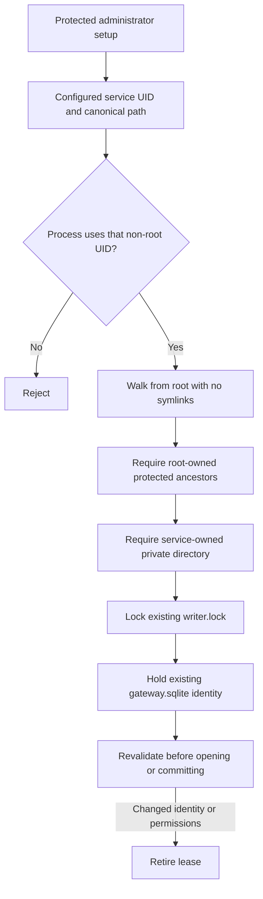

# Protected gateway storage

`ProtectedGatewayLease` holds the dedicated push service's existing directory, writer lock and database file identities.
It provides exclusive local ownership for a future gateway database connection. It does not install a service or create storage.

## Ownership boundary

The public entry point requires an explicit non-root service UID that matches the process's effective UID.
Read this UID and the path from protected administrator setup. Never accept them from a phone, transport request or candidate control.
The library cannot prove that a supplied UID belongs to the designated service. The setup controller and service launcher must establish that binding.

All ancestor directories, including the root anchor, must belong to root and disallow group or other writes.
The final directory must belong to the configured service UID with mode 0700.
Its existing `writer.lock` and `gateway.sqlite` files must belong to the same UID with mode 0600 and a single hard link.
Special mode bits are rejected. All objects must reside on a local filesystem.

The walk rejects symlinks, ambiguous components, overlong paths, non-regular files and unexpected ownership.
ACL grants cannot override this boundary: ancestors cannot grant mutation rights, and private objects cannot grant additional rights.
The lease opens files without creation and takes a nonblocking exclusive writer lock.

## Lifetime

Validation checks the effective UID and process ID, held descriptors, named paths, device/inode identities, modes, owners and ACLs.
Any failed validation permanently retires that lease, even if the original object or permissions are later restored.
Explicit close and deinitialization release the descriptors and lock. Close the SQLite connection first.
Serialize lease use; the class is not a concurrent database owner.

Content changes do not count as file replacement. The future database owner must validate schema, transactions, replay state and retained trust.
A lease does not prove enrollment authority, prevent a malicious root process, or detect restoration of a complete old backup.
It cannot authorize a probe or recipient activation.

## Shared mechanics, distinct entry points

`ProtectedStorageLease` is internal. It contains the path walk, lock and metadata checks shared by the two public wrappers.
`ProtectedJournalLease` still requires root for every production object and opens only `journal.sqlite`.
`ProtectedGatewayLease` fixes root ownership for ancestors, service ownership for private objects, and the filename `gateway.sqlite`.
A gateway lease cannot be passed to the authority database API as an authority lease.

## Validation

Eight gateway tests cover identity rejection, file separation, canonical paths, no implicit creation, lock release, replacement and permission/ACL changes.
The existing twelve authority lease tests also pass against the shared mechanics.
Normal-user fixtures override the internal test anchor and ancestor owner. That override is unavailable through either production entry point.

No service account, root-owned fixture or privileged installation was created. A real mixed-ownership path under the installed service UID still needs validation.
Gateway SQLite ownership, candidate admission, durable replay checks and service setup remain subsequent work.
