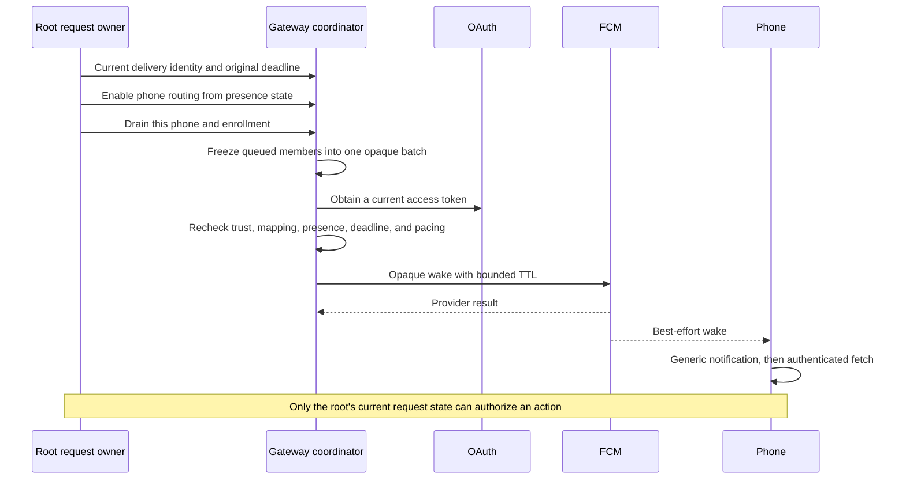
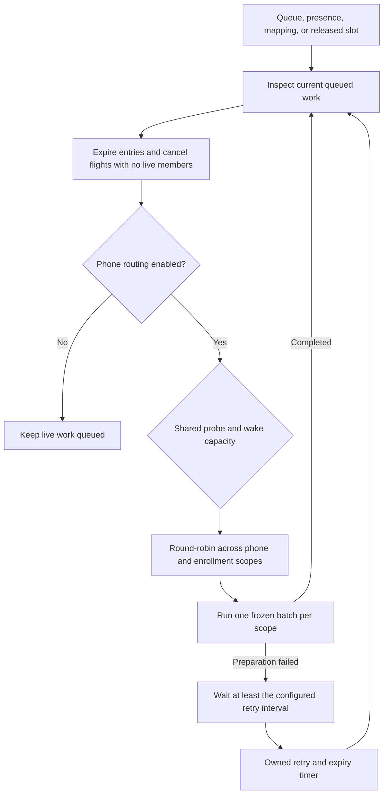
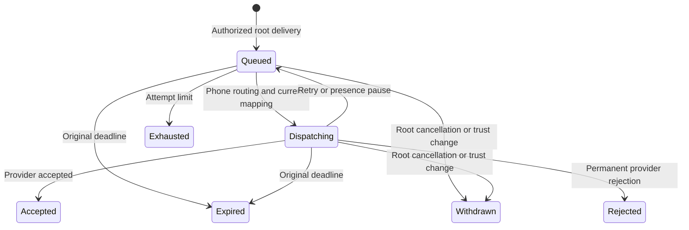

# Approval wake delivery

`GatewayDeliveryCoordinator` schedules opaque FCM wakes for root-owned `PhoneRequestDelivery` entries.
A wake tells a phone to fetch current requests. It carries no approval, command, credential, or request identifier.
Provider acceptance does not prove phone receipt, notification display, request fetch, or consent.

## Host contract

These methods are trusted local APIs. They are not authenticated wire endpoints.
The host must authenticate the root, retain the correct registration scope, and submit only current authorized deliveries.
A `PhoneRequestDelivery` value alone is not proof of authority.
The root and gateway use the same fresh monotonic clock epoch for these local deadlines.

The host supplies `GatewayWakePolicy` settings. Without that policy, wake scheduling is unavailable.
Routing starts locally until the host supplies its current presence decision through `setPhoneRouting`.
This startup state is not a product setting that disables push.
The host starts the owned drain loop with `startWakeScheduling(retryIntervalMillis:)` after protected setup.
Manual hosts can instead call `deliverWakeBatch` and own capacity and preparation retries.
The host must cancel deliveries when their root request resolves, expires, or is withdrawn.

The queue is bounded and lives in memory. It does not restore pending requests from historical gateway receipts.
After restart, the root must resupply only requests that remain authorized and pending, with their original deadlines.
The durable root owner must preserve delivery identity and never reuse an identity for a different request.
A retained duplicate returns its current progress. Conflicting contents cannot extend a retained identity's deadline.
Expired entries become reclaimable when no flight references them.

## Service-owned scheduling

The owned scheduler reacts immediately to newly accepted work, presence changes, activated mappings, and released flight slots.
It also keeps one cancellable timer for preparation retries and expiry checks.
The host supplies a positive retry interval of at most 60 seconds. This is a service setting, not a fixed product default.
Do not start a second drain loop or share ownership of this coordinator with another service.

Scheduling reserves capacity before starting a child task. Those reservations count alongside live probes and wake flights.
The loop rotates across phone scopes so a phone with new arrivals does not immediately take another phone's available slot.
It creates no extra unbounded queue. Existing queue, enrollment, flight, lifetime, and provider-attempt limits still apply.

A preparation failure retains the original frozen batch and waits at least the configured interval before another attempt.
Unexpected cancellation from a preparation dependency also uses this backoff; it cannot create an immediate retry loop.
The remaining original request lifetime bounds these retries; preparation failures cannot renew that lifetime or the provider attempt budget.
A newly committed mapping activation clears that scope's preparation backoff and triggers another drain.
Presence cancellation preserves the same batch and can resume immediately when routing returns to phones.

The timer marks elapsed entries expired and cancels a stalled flight once all its members are terminal.
Cancellation can lag the deadline by the timer interval. The sender still checks the deadline before each network handoff.
This timer changes delivery state only. The root must separately commit request expiry and audit state.
A provider callback that ignores cancellation can delay resource release, but cannot restore acceptance after cancellation.

Shutdown cancels the timer and every scheduled child, awaits their completion, then closes the provider and database owners.
Clock regression stops the owner and cancels these tasks too. Errors from preparation are not logged with tokens or raw credentials.
The service must explicitly shut down its coordinator; the timer is owned for that service's lifetime.

## Coalescing and retries

One batch freezes all currently queued entries for a phone and enrollment epoch.
Entries retain separate identities, deadlines, and terminal states.
Arrivals after that point wait for the next batch. They cannot enlarge a retry's request set.
Every retry keeps the same opaque identifier and shared attempt budget.
A terminal accepted batch is not sent again by this coordinator.

Probe and wake tasks share the global flight limit and send spacing.
Wake batches also obey per-enrollment spacing, including across different batches.
Waiting for OAuth, a provider reply, or a retry retains a flight slot.
Settings bound queue size, attempts, request lifetime, and provider TTL.
These are process-local limits, not a provider-account quota across multiple Macs.

Network loss and retryable provider errors use bounded exponential backoff with jitter.
Provider delays remain lower bounds. A 401 refreshes the matching OAuth grant without renewing the batch budget.
Retries stop at the attempt limit or each entry's original deadline.
The sender uses high priority. The Android receiver must display the generic notification before fetching verified details.

Immediately before each provider handoff, the coordinator rechecks the current mapping and all live member deadlines.
TTL is the smaller of the configured cap and the shortest remaining lifetime, rounded down to seconds.
A subsecond remainder uses TTL zero for immediate delivery only.
Network delay and provider delivery remain outside this clock boundary.
The phone must fetch authoritative state and must not treat a late wake as a still-pending request.

## Presence, cancellation, and token changes

Local presence cancels current wake work but preserves queued deliveries, frozen batch identities, deadlines, and attempt counts.
Resuming phone routing triggers the owned scheduler, or requires another drain from a manual host. It grants no approval authority and does not cancel a phone biometric prompt.
A resolved member is withdrawn without discarding other live members in its batch.
When no live members remain, root cancellation also cancels outstanding provider work, even if progress already reports expiry.
Already transmitted bytes cannot be recalled.

Enrollment changes and committed signed revocations withdraw affected entries and cancel their flights.
An unrelated phone remains independent. Late callbacks cannot restore a cancelled delivery.
A token rotated during OAuth is reread before sending.
An FCM `UNREGISTERED` response removes only the mapping operation used by that send.
A newer activation survives a late rejection for the old token.
This deletion retains enrollment keys, signed history, and control counters. Restoring delivery requires a fresh activation.

Shutdown rejects new work, cancels both probes and wakes, waits for their tasks, and releases the store.
Clock regression stops the owner. The host must not resume its queue under another clock epoch.

## Evidence and integration limits

Synthetic tests cover coalescing, late arrivals, retry timing, expiry, presence pause, queue bounds, and conflicting identities.
They also cover resolution, revocation, token rotation, late invalid-token responses, OAuth refresh, shared capacity, and shutdown.
An HTTP interceptor runs the real FCM sender without contacting Google.
Eleven scheduler tests use controlled timers to verify automatic drains, presence, preparation backoff, expiry cancellation,
round-robin ordering, shared probe capacity, token repair, clock regression, startup bounds, and shutdown.

The installed service, authenticated root channel, root drain scheduler, presence source, and phone notification flow remain integration work.
The owned scheduler expires delivery entries, but does not replace root lifecycle or audit timers.
The root owner must still deliver resolution, revocation, and target-loss events promptly.
No live FCM request, real credential, device installation, or phone end-to-end test is part of these checks.
