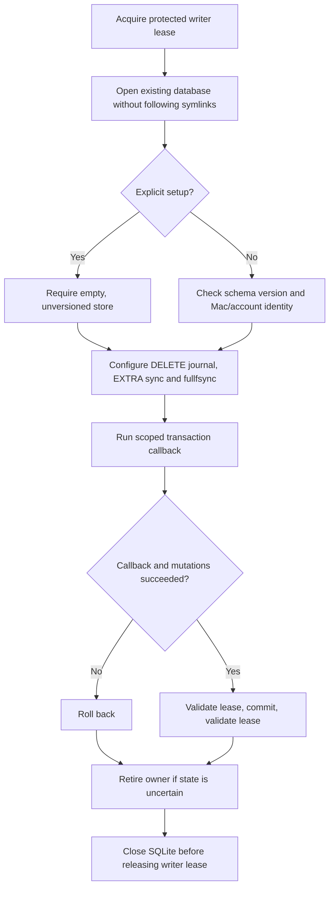

# Owned journal connection

`JournalDatabase` combines the protected storage lease with one private SQLite connection for a Mac/account scope. It owns their lifetimes. All calls must be serialized by the authority owner. It exposes bounded audit operations through synchronous transaction callbacks, without exposing a connection or arbitrary SQL.

## Startup and scope

The public factory requires the existing root-owned layout described in [the lease contract](journal-lease.md). It does not provision files or install a service. Existing stores require application ID `0x524D5A4F`, schema version 9, one matching Mac/account identity, and the required audit, consumption, outcome and gateway-control columns. These checks precede changes to persistent journal mode.

Explicit `initialize: true` is setup only. It requires an empty preprovisioned file and creates all tables atomically. Wrong scope, unknown versions, missing tables, and malformed stores fail without reset. Explicit migration accepts source versions 1, 2, 3, 4, or 5 and advances to version 6 in one transaction. Version 1 also adds consumption tables; versions 1 and 2 also add outcome tables. Versions below 4 add the [authority gateway tables](gateway-authority.md). Versions below 5 add signed phone revocations. Every migration adds [approval enrollment tables](enrollment-journal.md) and preserves existing data. Migration grants no authority continuity and derives no trust from audit history. Setup and migration cannot be combined; the supplied source version must match the store.

The connection uses the system SQLite with extension loading omitted. It disables attached databases and trusted schema, enables foreign keys, bounds SQLite values from the supplied CBOR limits, and verifies DELETE journal mode, EXTRA synchronization and fullfsync. The caller supplies a busy timeout of at most 60 seconds. No product timeout default is selected.

Schema checks establish compatibility, not content authenticity or authority continuity. Startup recovery must still validate the ledger and checkpoint before admission. The connection does not scan every record, authenticate the schema, or detect a restored whole backup.

## Transactions and failure

`read` starts a read transaction. `write` starts an immediate transaction. Each callback receives a token valid only for that invocation. Escaping the object cannot retain access. Nested transactions and closing an active transaction fail. Read callbacks cannot mutate the tables.

Every operation revalidates the lease. The owner also checks it before and after commit. A mutation error marks the callback failed even when the caller catches that error. The outer transaction then rolls back. A clean rollback after an ordinary callback or statement failure permits another transaction.

A failed commit, failed rollback, SQLite automatic write rollback, lease failure, or epoch/head mismatch retires the connection. A rolled-back epoch creation also retires it, because the in-memory writer capability must not survive creation failure. Reopening creates a different table owner; old epoch writers cannot append through it. The higher authority must preserve and resolve any recovery requirement before reopening.

A successful callback return means only that SQLite committed and the lease checks passed. It grants no action permit. The [consumption operation](consumption-journal.md) shares this transaction, and the authority must complete its checkpoint protocol before dispatch. A failure after commit can leave committed data and must never be retried as an action.

## Evidence and remaining gates

Eleven normal-user fixture tests cover setup, persistence, scope/version rejection, missing or malformed storage, writer retirement, transaction lifetime, read-only access, nesting, rollback, caught mutation errors, SQLite-triggered rollback, lease changes and ownership release. Rejected scope also preserves an existing WAL setting. Fixtures use `realpath`: Foundation's temporary-directory normalization can retain a `/var` symlink that SQLite correctly rejects with `SQLITE_OPEN_NOFOLLOW`.

Tests do not certify root service operation, physical power-loss durability, disk-full commit failures, startup recovery, storage reserves, checkpoint integration or whole-backup rollback protection. No privileged install, device approval or end-to-end test ran.
