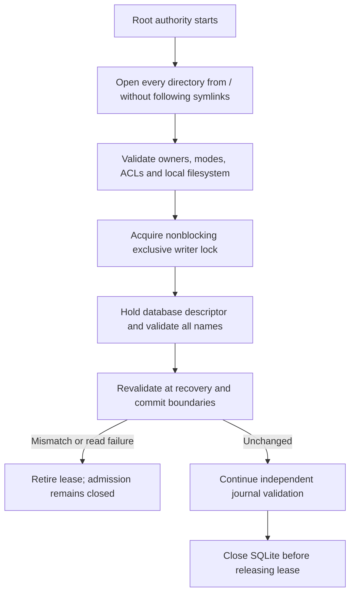

# Protected authority journal lease

`ProtectedJournalLease` holds the existing storage directory, `writer.lock`, and `journal.sqlite` for the authority process. It creates no file, changes no permission, installs no service, and does not open SQLite.

## Required provisioning

The production entry point requires effective UID 0. It starts at `/` and walks an explicit absolute directory path using descriptor-relative opens. Empty components, dot components, NUL bytes, excessive lengths, and symlinks fail.

Every ancestor must be root-owned, on a local filesystem, and not writable by group or others. Special mode bits are rejected. The final directory must be 0700. Both existing files must be regular, root-owned, 0600, and have exactly one hard link. The lease does not choose the installer path or repair incompatible permissions.

ACLs are checked through the held descriptors. Ancestors cannot have an allow entry that grants mutation, deletion, ownership, or security changes. Private objects cannot have any nonempty allow entry. Deny entries are permitted. Read-only ancestor grants do not fail the check. These conservative checks do not try to resolve ACL principals or prove that a deny overrides an allow.

The implementation reads file security metadata explicitly. An absent ACL is accepted only after a successful metadata read and property-presence query. Other failures remain errors. Darwin ACL iteration uses zero for an entry and `EINVAL` at the end of a valid ACL.

## Ownership and invalidation

The lock uses nonblocking `flock`, retained through the live descriptor. A competing writer receives Busy. Every participant, including maintenance and recovery, must honor the same lock. A lock file's existence alone proves nothing.

The lease retains each ancestor descriptor and its device/inode identity. Validation compares held descriptors with their still-named entries, then rechecks metadata and ACLs. Replacing an ancestor, directory, lock, or database retires the lease. A validation failure stays latched even if the original file or permissions return.

Validation is also scoped to the creating process and expected effective UID. Descriptors are close-on-exec. Do not share a lease across a fork or let a child explicitly unlock an inherited descriptor. Serialize all lease calls and close SQLite before closing the lease.

A retired lease is not itself a persisted recovery marker. The authority owner must close admission, retain its recovery state, and complete the classified recovery protocol before it acquires a new lease. A successful new acquisition does not clear a prior recovery requirement.

## Security boundary and evidence

Protected ancestors prevent an unprivileged interactive account from replacing entries between checks. The checks do not defend against a malicious root process or a maintenance process that ignores the lock. They also do not authenticate database content, detect whole-backup rollback, validate a checkpoint, reserve storage, or grant an action permit.

Eleven tests exercise normal-user temporary fixtures through an internal fixture initializer. They cover a separate competing process, release, root-only public entry, unsafe paths, modes, symlinks, hard links, FIFOs, ACL grants, live replacement, permanent invalidation, and lock cleanup after failed acquisition. Content changes deliberately remain the journal validator's responsibility.

These tests do not certify root installation, actual service lifecycle, remote filesystems, or physical durability. The production initializer was not run as root. No system permissions or services were changed.

References: Apple's [advisory lock contract](https://developer.apple.com/library/archive/documentation/System/Conceptual/ManPages_iPhoneOS/man2/flock.2.html), [ACL retrieval](https://developer.apple.com/library/archive/documentation/System/Conceptual/ManPages_iPhoneOS/man3/acl_get_fd_np.3.html), and [Darwin ACL iteration](https://developer.apple.com/library/archive/documentation/System/Conceptual/ManPages_iPhoneOS/man3/acl_get_entry.3.html). File-security declarations come from the installed macOS SDK's public `sys/fcntl.h` and `sys/stat.h`.
