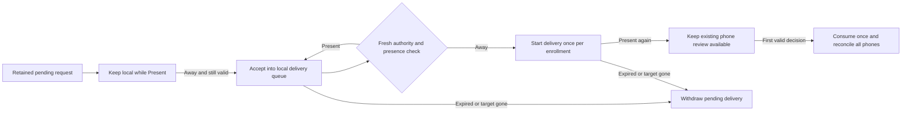

# Pending request handoff

`PendingRequestDelivery` owns delivery state for one retained request. It uses the existing presence result and the protected journal's `requestDeliveryTrust()` snapshot.

## Queue ownership and dispatch

The authority serializes this controller with request lifecycle, target checks, routing, and enrollment changes. It owns one instance for each admitted request. A restart cancels pending requests; it never reconstructs this controller to resume them.

1. Read `requestDeliveryTrust()` in a journal transaction. It returns policy and enrollment epochs from the same protected read.
2. Recheck the original target. Supply the current retained request and the current `PresenceRouter` result to `reconcile`.
3. The synchronous callback accepts bounded local queue ownership. Return false only when no work was accepted. It must not send, await, or reenter the controller.
4. Prepare the authenticated transport and any provider credentials before starting delivery.
5. Refresh trust, target validity, time, and routing. Call `beginDelivery` immediately before the first transport write. Do not await or change authority state between this check and that write.
6. Always apply the returned update, including withdrawals when no delivery can start. A queued identity alone permits neither request fetch nor notification dispatch.

`active` lists queue-owned work. `dispatched` lists work that passed the start boundary. Neither field grants action authority or proves that a phone displayed anything. Each delivery keeps the original request ID, admission moment, and deadline. The signed request retains its original wall times and audit link.

A failed queue acceptance retries with the same opaque delivery ID. Once accepted, the queue owns bounded transport retries with that same ID. Reconcile before each retry, stop withdrawn work, and suppress new notifications while routing is local. Deduplicate retries on the receiving side. Never turn an uncertain delivery into a new notification identity.

Returning to Present does not withdraw a dispatched request or cancel its biometric operation. New recipients wait for phone routing. Consumption, expiry, target loss, incompatible authority policy, or a clock discontinuity withdraw work. Revoked enrollment epochs cannot return within the request session. A newly enrolled epoch gets a separate delivery identity.

The controller checks compatibility against current authority policy and phone capabilities. It does not infer enrollment from a transport advertisement. Keep the snapshot fresh under the same authority serialization boundary; the snapshot is not a timeless permit.

## Limits and lifecycle

The configured recipient limit includes previously seen epochs until this request ends. `capacityLimitedRecipients` reports recipients that could not be admitted. The host must expose that delivery limitation; it must not imply that every phone was notified. Queue backpressure can retry without losing the original identity or deadline.

The host must mark a disappeared or invalid target as non-pending before reconciliation. The controller cannot inspect an external dialog. It reports its closure reason without writing a lifecycle transition or granting an execution permit. Existing durable consumption still chooses the first valid decision.

Discard the controller after applying its terminal withdrawals. Its retained request can contain sensitive capture data. Do not log it or persist its memory state. Coarse routing reasons and meaningful handoffs are available in the returned update for the host's audit writer.

## Evidence and remaining integration

Tests cover local-to-phone handoff, multiple phones, unchanged age and expiry, noisy presence changes, queue failure, and the dispatch recheck. They cover consumption, revocation, replacement, compatibility, clock changes, capacity, and a real protected-journal enrollment snapshot.

This component does not install presence observers, run a transport, write handoff audit events, or implement the local command approval surface. Those service integrations and physical-device acceptance checks remain required. No real credentials, provider calls, or target actions are used by these tests.

The approval request owner exposes `reconcileDelivery` for pending and completed requests. It closes queued and started deliveries from retained metadata after capture release. Apply withdrawals before forgetting terminal owner state.
