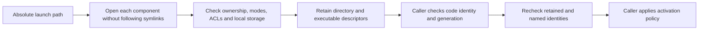

# Protected executable placement

`ProtectedExecutablePath.acquire(path:)` retains descriptors for an existing executable and every parent directory. Production acquisition starts at `/` and requires UID 0. The owner must serialize calls; this type is deliberately not Sendable.

Every component must be root-owned, reside on local storage mounted by root, and deny group/other writes. Special mode bits and ACL mutation grants are rejected. Read ACL grants are permitted. The executable must be a nonempty regular file with one link and owner execution permission. FIFOs are opened nonblocking so validation cannot hang on them.

Validation compares each retained descriptor with its current path entry. It rechecks metadata and executable size, modification time, and change time. A failed check closes all descriptors and permanently retires the object. Closing is idempotent. Validation must run before and after code inspection and immediately before activation.

This is placement evidence only. It neither verifies executable bytes as signed code nor checks release generations. It does not freeze a filesystem against another root process, lock out an updater, inspect a complete bundle's resources, or install a service. The activation owner must serialize updates, validate the complete signed artifact and committed floors, then retain this path through its launch boundary. A malicious root process is outside this check's guarantee.

Eight tests cover valid retention, close, replacement, content changes, unsafe modes, special files, parent symlinks, ownership, path syntax, and ACL changes. A synthetic mount-metadata test rejects non-root mount ownership and remote storage; no disk image was mounted. Fixtures use current-user fixture ownership. The production root entry point rejects non-root callers. Root-owned deployment, live launchd activation, and update continuity remain unproven.
