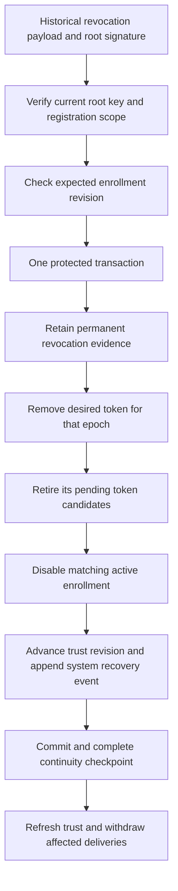

# Recovered gateway revocations

`JournalTransaction.recoverGatewayRevocation` applies root-signed revocation evidence to the local authority.
It can disable only the phone and enrollment epoch named in that evidence. It cannot enroll a phone or grant approval authority.

The root verifies the signature with its configured root public key and checks the complete registration scope.
A gateway assertion or a larger counter is insufficient.
This operation does not require complete gateway history because valid restrictive evidence cannot grant authority.
Its delivery expiry does not cancel the permanent revocation. Old evidence remains scoped to its original lifecycle and phone epoch.

The transaction retains a separate signed revocation row. It neither advances the root control counter nor records a gateway acknowledgment.
It deletes desired token state only for the named epoch and retires that epoch's token candidates.
The public decision and delivery APIs then read the inactive enrollment from durable trust.
The internal gateway trust path also checks recovered revocations, so a stale caller-supplied active flag cannot restore delivery.

Enrollment identity and key records remain available as historical evidence. A newer enrollment epoch and other phones remain usable.
An unknown revoked epoch receives a permanent tombstone and cannot later be enrolled through the setup API.
New enrollment still requires administrator authorization and a fresh enrollment proof.

New evidence or an active enrollment change advances the trust revision and appends one audit event.
The event uses the recovery kind, enrollment category, system authentication, and revoked reason.
It does not claim that an administrator just authorized a new removal.
Repeated evidence for an already restricted epoch does not append another event or change the trust revision.
Existing normal revocation rows also count as permanent evidence. Recovery does not duplicate them or consume another storage slot.

All changes share the journal transaction. Failed evidence insertion, token retirement, enrollment writes, or audit writes roll back together.
The host keeps affected admission closed until restriction and the independent continuity checkpoint succeed.
It must refresh retained trust and reconcile pending deliveries after commit.
Storage or checkpoint failure is not permission to continue using stale authority.

## Storage and validation

Root journal schema 10 introduced `gateway_recovered_revocations_v1`.
Current schema 11 also retains unknown trust restrictions. Explicit migrations accept schemas 1 through 10 and preserve existing authority, delivery history, and audit records.
Recovered revocations share the control storage bound. Known evidence can be retried idempotently when that bound is full.
Historical rows recheck their root signatures and indexed scope when used by the gateway authority.

Tests use synthetic keys and real protected-layout SQLite fixtures.
They verify decision and token-proof rejection, accurate audit metadata, restart persistence, idempotence, and preserved newer epochs and other phones.
They exercise delivery withdrawal, unknown-epoch enrollment rejection, wrong signatures and lifecycle scope, stale trust, and read-only access.
Fault injection covers every write stage. Additional checks cover stored-signature corruption, capacity, and explicit schema-9 migration.

The host recovery coordinator, independent rollback witness, and administrator repair of unknown trust changes remain integration work.
After restriction, [history reconciliation](gateway-history-recovery.md) can record the removal receipt and repair the counter.
This feature does not restore lost authority, resolve conflicting delivery history, or automatically re-enroll a revoked phone.
No real credentials, device installation, phone prompts, or physical backup restoration were used.

The host can apply a verified head or page through [verified recovery evidence](verified-recovery-evidence.md) before checking history continuity.
