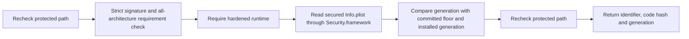

# Signed executable validation

`SignedExecutableValidation` combines a retained protected path with Security.framework signature checks. Its public entry point requires `XPCPeerPolicy`, which binds the Developer ID chain, team, component identifier, permitted code hashes, and forbidden entitlements. The expected UID is a separate live IPC condition; static validation does not prove a running process identity.

The generation is a positive canonical decimal string named `RemozioSecurityGeneration`. It is read from `kSecCodeInfoPList`, not an adjacent unverified file. Missing, numeric, padded, signed, zero, or overflowing values fail. Generation must meet both trusted bounds. A zero installed generation represents first installation; the committed floor must always be positive.

The authority Xcode target embeds generation `1` in its Mach-O Info.plist section. Packaging checks verify that generation through a code-signing requirement in both Debug and Release. Increasing the release generation is a release operation, separate from the human-readable app version.

The caller supplies bounds from protected committed state. This validator does not persist floors, serialize installation, validate a complete bundle's resources, perform notarization assessment, or activate services. Returned evidence is not a permit. The installation owner must keep the path retained, serialize replacement, validate the whole component set, and commit activation durably. Candidate self-validation is not an anti-rollback boundary.

Any signature, runtime, metadata, or generation failure closes the retained path. Placement is rechecked after inspection. The internal requirement-string entry point exists for ad-hoc fixture tests; production callers cannot use it outside this module.

Eight tests cover canonical generation rules, both rollback bounds, signed metadata, wrong identity, missing runtime, tampered signed metadata, and rejection of ad-hoc code by production policy. Fixtures compile and sign disposable binaries but never execute them. Successful Developer ID acceptance and privileged activation remain unproven here.
