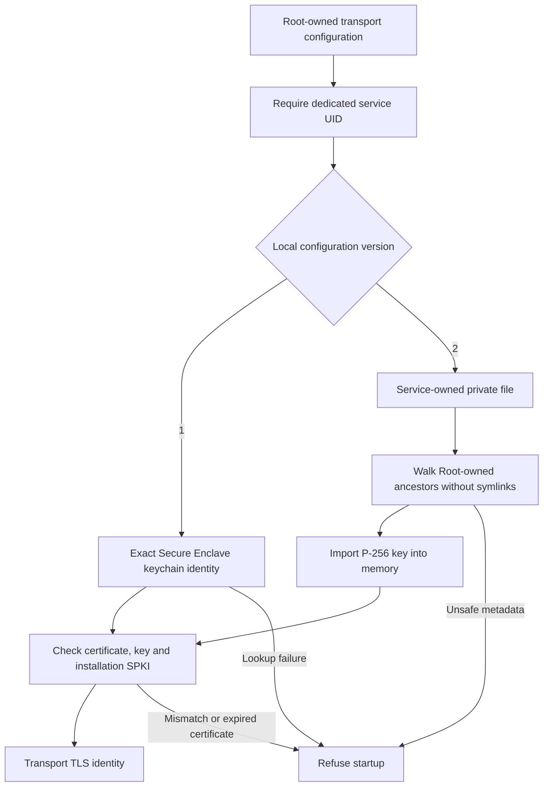

# Approval transport identity

The embedded transport loads exactly one custody source from Root-owned installation metadata.
Provisioning selects the source explicitly. Startup does not generate keys or switch sources after failure.
The approved file fallback applies only to the transport role.
Authority and credential recipient keys keep their separate non-exportable custody requirements.

## Installation metadata

`ApprovalTransportConfiguration` accepts local versions 1 and 2.
Both use the existing exact fields 0 through 13.
Version 1 keeps the original bytes at field 9: one opaque keychain identity reference.
Version 2 requires text at field 9: one absolute protected file path.
All other fields retain their meanings, including the installation SPKI and dedicated service UID.
Unknown versions, fields, or custody types fail. Version 1 encoding remains unchanged.
This local format change does not change the phone protocol or its version negotiation.

The service UID must differ from Root and the recorded interactive owner.
Both real and effective process UIDs must match it before credential access.
Provisioning must establish an actual dedicated account; distinct numbers alone do not prove isolation.

## Protected transport file

The file contains deterministic CBOR with exactly these fields:

| Field | Value |
| --- | --- |
| 0 | Unsigned format version 1 |
| 1 | Text `remozio-transport-identity` |
| 2 | P-256 private key in canonical 97-byte X9.63 representation |
| 3 | DER certificate, at most 8,192 bytes |

The envelope is limited to 16 KiB, depth 1 and nine CBOR items.
The reader first limits the file to the shared 64 KiB storage ceiling.
Only a local regular file with one hard link and mode 0600 is accepted.
Its owner must be the configured service account.
Every containing directory must be Root-owned, with no group or other write access.
ACLs that grant file access or directory mutation fail validation.
The reader walks from the filesystem root with retained descriptors and no symlink traversal.
It rechecks ownership, metadata and path identity after reading.

The loader checks the private scalar and public point, the certificate key, the installation SPKI, and certificate validity.
It constructs an in-memory `SecIdentity` through explicit key and certificate references.
It performs no keychain lookup or import for this path.
No private material belongs in public configuration, setup exports, diagnostics, or evidence reports.
The software key necessarily exists in process memory. This loader does not promise memory erasure.

## Evidence and activation gates

Ordinary-user tests exercise canonical configuration compatibility, role separation, malformed envelopes, and key/certificate/pin mismatch refusals.
An injected file reader supplies the same disposable envelope twice; native Security signatures verify against its original public key.
Protected-reader fixtures cover owner checks, ancestor checks, unsafe modes, symlinks, hard links, FIFOs and directories.
The production reader refuses the ordinary-user fixture because its ancestors are not Root-owned.

The [file TLS experiment](../../docs/experiments/transport-file-tls.md) reloads one disposable identity in two fresh processes.
Each process signs test data and completes pinned mutual TLS 1.3 over loopback.
Its controls reject unsafe file permissions, an incorrect identity pin, and an incorrect TLS peer pin.
It uses the ordinary-user fixture anchor, not production Root-owned ancestry.

These results do not prove dedicated-account deployment, TLS signing in a LaunchDaemon, or availability before login.
They do not establish same-user isolation against a provisioned production identity.
No account, registration or production credential is installed by these tests.
Setup must record custody and validate those gates before selecting and activating the file path.
The current app has no custody-selection UI or service activation flow.

Apple's [keychain guidance](https://developer.apple.com/documentation/technotes/tn3137-on-mac-keychains) distinguishes daemon access from interactive keychain access.
The explicit construction APIs are [SecKeyCreateWithData](https://developer.apple.com/documentation/security/seckeycreatewithdata(_:_:_:)) and [SecIdentityCreate](https://developer.apple.com/documentation/security/secidentitycreate(_:_:_:)).
