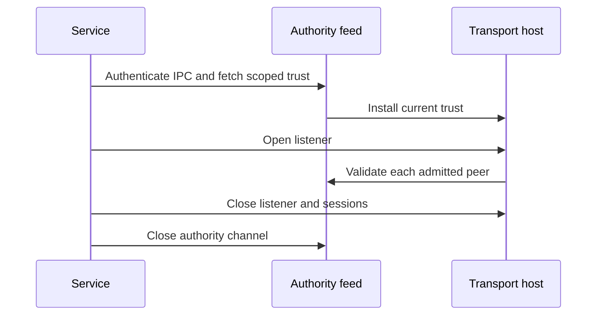

# Transport service lifetime

`DirectApprovalTransportService` connects the direct listener host to its authenticated authority feed. Its production constructor supplies the feed as the host's live peer validator. It owns no journal or authority key.

Startup is one-use. A failure retires the service. Shutdown during a suspended startup prevents a late listener from surviving. Explicit shutdown awaits both owners; deinitialization schedules cleanup as a fallback. Authority interruption retains the feed's immediate lease invalidation and host shutdown behavior. Reconnection requires a new service and fresh trust.

The supplied channel handler still needs an authority request dispatcher. Channel admission grants no approval or execution permission. This change does not install a daemon, provision transport credentials, implement reconnect scheduling, or expose an approval RPC.

Tests exercise startup, duplicate start, shutdown, shutdown before startup, shutdown during a held trust response, and failed startup with the wrong scope. They use the real feed and host with fake IPC and listener drivers. Live service installation and device E2E remain untested.
