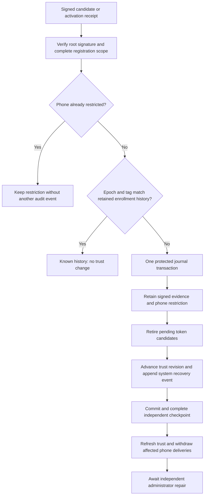

# Unknown trust restrictions

`JournalTransaction.restrictUnknownGatewayTrust` retains a restriction when root-signed delivery history names an unknown enrollment epoch or notification tag.
The restriction covers the phone across its epochs. An unknown epoch does not prove which retained epoch is current.
The gateway cannot supply keys, enroll a phone, or restore approval authority.

The root checks its pinned owner, Mac, account, gateway, lifecycle, and signing key.
A phone assertion, gateway counter, invalid signature, or another lifecycle cannot create this restriction.
Expired delivery receipts remain evidence of a signed trust binding; their expiry does not make unknown trust safe.
Both active and inactive retained enrollment epochs count as known history when the epoch and tag match exactly.

## Preserved records and restricted operations

The marker is separate from enrollment records. It preserves identity keys, approval keys, tags, epochs, and their stored active flags.
`approvalEnrollments` remains a historical management view. Its active flag alone is not current permission.
`approvalTrustRestrictions` identifies phones that await repair. `approvalTrustSnapshot` excludes them from effective authority.
The phone cannot use a known historical receipt, another ordinary enrollment call, or a restart to clear this marker.

Public decision consumption and delivery planning use the restricted snapshot.
Gateway candidate creation, proof consumption, renewal, pending-control reads, and phone routing controls reject restricted phones.
The internal gateway verification path also checks the durable marker and its signed evidence before accepting caller-supplied trust.
Counter reconciliation cannot adopt candidate or activation history for a restricted phone.

Other phones retain their authority. Pending deliveries for the restricted phone are withdrawn after the host refreshes trust.
The host must retain admission closure while a restriction or its independent continuity checkpoint is pending.
A failed storage write does not authorize use of stale trust.

Desired token material remains stored for possible authorized repair, but old candidates and proofs lose their run binding.
No historical mapping is replayed. Explicit administrator-authorized removal remains available and retains the restriction.
A removal can still reach the gateway. The restriction does not erase earlier decisions or infer their outcomes.

## Atomicity, audit, and storage

A new marker, candidate retirement, trust revision, and audit event share one transaction.
The audit event reports system recovery, unresolved outcome, and binding mismatch for the affected phone.
It contains no signed payload, keys, token, or notification tag and does not claim new administrator authorization.
Repeated evidence keeps the same restriction and trust revision without another event, including at full capacity.

Root schema 11 adds `gateway_trust_restrictions_v1`; explicit migrations accept schemas 1 through 10.
The table retains one signed receipt per restricted phone, with at most 1,024 phones and the shared gateway control storage bound.
It does not advance the root control counter or acknowledge gateway history.
This bounded first receipt proves the restriction; it is not a complete recovered history or an authority source for repair.

Tests cover candidates and activations, changed tags, unknown epochs and phones, known inactive history, and repeated receipts.
They verify preserved keys, other-phone decisions, delivery withdrawal, routing and mapping rejection, restart persistence, and explicit removal.
They also cover signature and scope rejection, stale revisions, read-only calls, capacity, stored-proof corruption, and schema-10 migration.
Fault injection checks marker insertion, candidate retirement, trust revision, and audit writes as one transaction.

## Remaining integration

A protected host coordinator must apply restrictions from verified history before admitting affected phone operations.
A timeout or unreachable gateway alone is not this evidence and must not create a restriction.
Local continuity remains required; this table cannot detect restoration of a complete backup.

Independent administrator repair is not implemented by this API. No ordinary phone call can clear a restriction.
Repair must establish current trust from authenticated evidence and complete the independent checkpoint before restoring authority.
The product must preserve pairing when that evidence supports it. This primitive does not force key deletion or re-pairing.
No real enrollment, device approval, privileged installation, or end-to-end test was performed.
