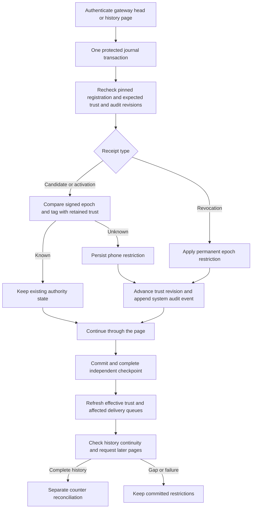

# Recovery from verified gateway replies

`JournalTransaction.recoverGatewayTrust(from:)` accepts a verified gateway head or one verified history page.
It applies restrictive evidence before the host attempts complete history collection or counter repair.
A missing revision or a later missing page cannot make a valid signed revocation harmless.

The query owner verifies the gateway signature, fresh query, range, and root signatures before producing these typed inputs.
The root journal checks its current registration pin and verifies each root receipt again through the recovery primitives.
The page may contain up to 16 receipts. The head contains at most one.
An empty head still requires a write transaction, matching registration, current trust revision, and correct audit head.

Each candidate or activation uses [unknown trust recovery](unknown-trust-restrictions.md).
Each revocation uses [permanent revocation recovery](recovered-gateway-revocations.md).
The operation updates the expected trust revision and audit sequence between receipts.
Fresh random event IDs distinguish actual changes. Known history and repeated restrictions append no event.

The result contains the resulting trust revision, audit head, changed phone IDs, and phones awaiting administrator repair.
Changed phone IDs describe this call only. An empty set does not prove that any phone has authority.
The repair set covers unknown trust markers; revoked epochs remain excluded through the effective trust snapshot.
The host must refresh that snapshot and reconcile deliveries even when reprocessing a page produces no new writes.

All page changes share one journal transaction. A later receipt or audit failure rolls back earlier changes from that page.
Restrictions committed by an earlier call remain in force. Keep affected admission closed while a failed page awaits retry.
A storage failure or failed independent checkpoint does not permit use of stale authority.

## Host sequence

Apply the verified head receipt before collecting history. Apply each verified page before passing it to `GatewayHistoryCollector`.
Complete the independent continuity checkpoint and refresh trust after each committed change.
Carry the returned trust revision and audit head into the next operation; an unrelated concurrent change requires a fresh local snapshot.
Discard the query owner and collected history when registration or key pins change.

After collection succeeds, [counter reconciliation](gateway-history-recovery.md) separately checks the shared boundary and retained trust.
This API never advances a control counter, records a gateway acknowledgment, publishes a mapping, or restores authority.
A complete receipt sequence still cannot bypass a persisted unknown trust restriction.

## Evidence and remaining integration

Tests use real gateway databases, signed replies, fresh root queries, and the protected root journal fixtures.
They cover early head revocation, page idempotence, sequential audit events, partial pages, missing revisions, and restart persistence.
A late page failure proves rollback of earlier restrictions and audit events. Scope, revision, audit head, and read-only failures are covered.
The schema and wire protocol remain unchanged.

The production host must drive the query, transaction, checkpoint, and collection sequence.
Independent rollback continuity and administrator repair remain separate work; these tests do not establish either.
No real gateway credentials, phone prompts, privileged installation, or end-to-end tests were used.

[Gateway recovery attempts](gateway-recovery-attempt.md) now own query verification, retry state, checkpoint sequencing, and history collection.
The protected service must still provide the real checkpoint and delivery refresh operation before using this owner.
