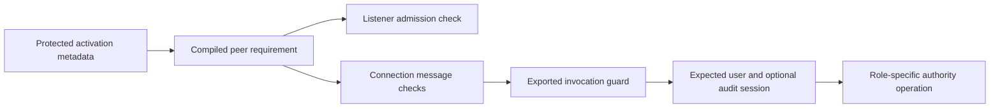

# XPC peer policy

`XPCPeerPolicy` builds and compiles a release code-signing requirement before it reaches Foundation. It requires the Developer ID Application certificate chain, an exact Team ID, an exact component identifier, and one of at most 16 approved CodeDirectory hashes. Inputs are bounded and cannot insert requirement expressions.

The approved hashes must come from protected activation metadata. They are not supplied by a connecting process. Activation must verify protected placement, hardened runtime, acceptable entitlements, and the installed build floor before admitting a hash. This module does not implement activation or derive an allowlist from a peer's self-reported build number.

The requirement rejects enabled debugging, library-validation exceptions, DYLD environment exceptions, unsigned executable memory, and JIT entitlements. This is not a substitute for verifying the hardened-runtime signing flag during activation.

Configure the listener before activation. Configure each accepted connection exactly once before activating it, so subsequent messages retain the signing requirement. Bind its exported object to an `XPCInvocationGuard`. Every exported method, including the harmless handshake, calls `verifyInvocation()` synchronously before dispatching work elsewhere. The guard requires the current invocation's connection to be the bound connection and checks its kernel-supplied user and audit-session identifiers. It does not look up a process by PID.

A client configures its expected server requirement before activation, completes the [harmless handshake](../../docs/experiments/macos-xpc.md), and verifies the connection credentials before sending sensitive data. Any interruption retires that connection incarnation. Reconnection requires a new handshake. The service must still implement these connection and request lifecycles; configuring a signing requirement alone does not perform them.

The component identifier selects the expected code role. It does not authorize arbitrary operations by that component or prove user consent. Root methods must enforce their own account enrollment, operation scope, request binding, and one-time consumption checks.

## Evidence and remaining work

Four unit tests exercise Apple's requirement parser, reject malformed and oversized configuration, check user/session policy, and reject invocation outside the bound connection. They do not prove Developer ID authentication between live processes, runtime entitlement enforcement, injection resistance, protected installation, or update transitions. The existing ad-hoc XPC experiment remains separate and does not validate this release requirement.

No service is registered or activated by these tests. Product IPC protocols, connection lifecycle, ordered trust updates, protected hash manifests, and live signed-process validation remain integration work.

References: Apple's [connection signing requirement](https://developer.apple.com/documentation/foundation/nsxpcconnection/setcodesigningrequirement(_:)) and [requirement language](https://developer.apple.com/library/archive/documentation/Security/Conceptual/CodeSigningGuide/RequirementLang/RequirementLang.html). The local SDK's `NSXPCConnection.h` documents that new messages which fail the requirement invalidate the connection. The implementation uses public connection credentials, rather than private audit-token accessors.
