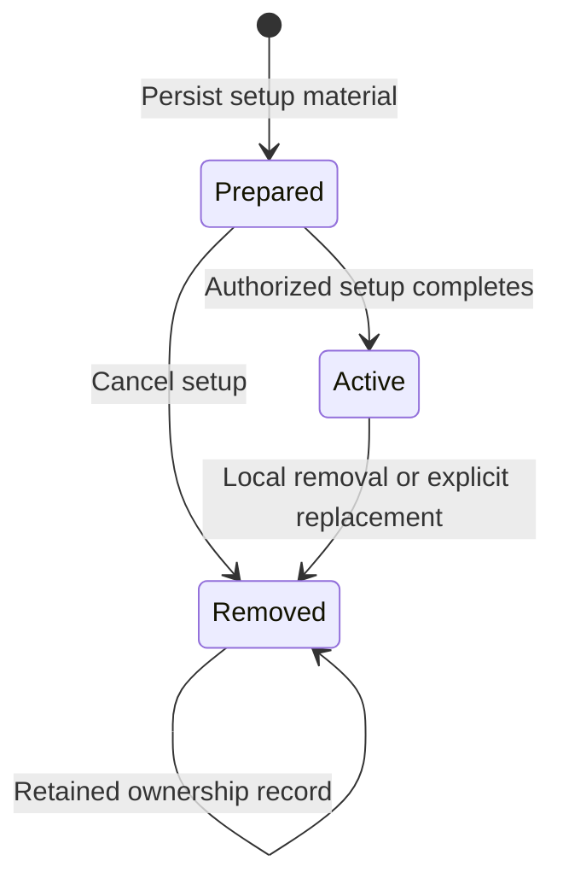
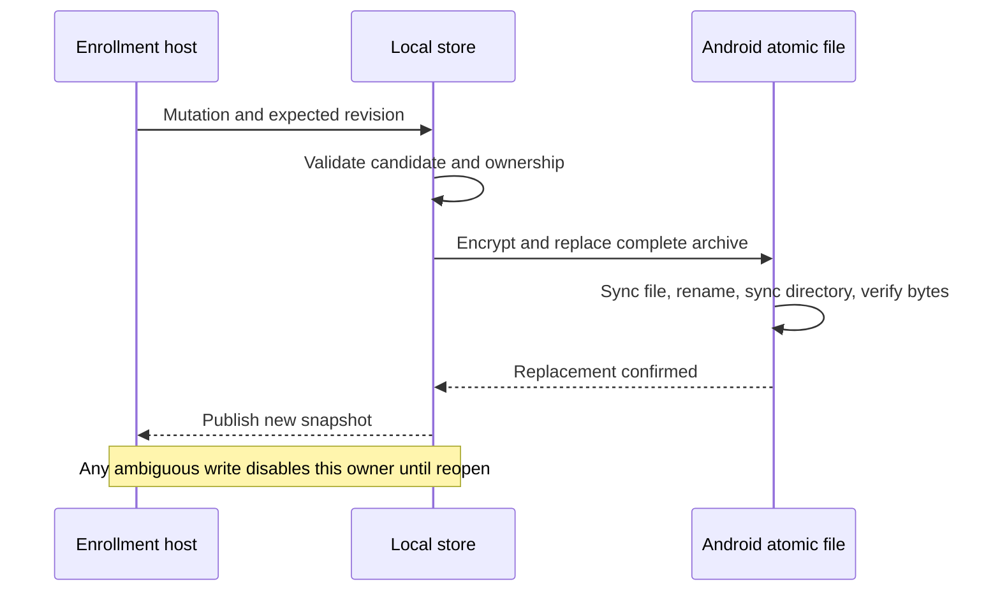

# Phone enrollment storage

`EncryptedEnrollmentStore` owns local enrollment records across app restarts. Trusted setup code prepares and activates them. Network input cannot select this store as an enrollment endpoint.

Activation requires the exact current record ID when replacing an active enrollment. It retires that record and activates its replacement in one encrypted write. A prepared replacement does not disable the current enrollment. Removed record IDs cannot be reused or reactivated.

## Retained data

| Data | Purpose |
| --- | --- |
| Record ID | Identify this local setup attempt and reject late callbacks |
| Mac/account IDs | Isolate one enrollment from the others |
| Phone ID and enrollment epoch | Bind the corresponding remote enrollment |
| Mac authority and transport pins | Keep approval authority separate from channel authentication |
| Three local key references | Retain transport, decision, and biometric key IDs, aliases, and public keys |
| Enrollment tag | Bind opaque push registration metadata |
| Optional relay credential | Retain its exact host, port, path, and Access headers |
| Label | Display a name without using it as identity |

Private signing keys never enter the archive. Enrollment objects and snapshots have redacted descriptions and immutable collections or copied byte values. They contain confidential relay credentials; the host must not pass them directly to UI, telemetry, or logs.

Enrollment tags are unique across all retained records, including removed ones. A replacement needs a fresh tag so retired push routes cannot collide.

Aliases must match their key role. Keys for different purposes must differ. Records for different Mac/account pairs cannot share local key aliases, IDs, or public material. A replacement within the same pair can retain unchanged key references. This supports pairing continuity; it does not authorize key rotation.

The setup owner must validate administrator authorization, phone biometric proof, current remote enrollment, and local key custody before activation. The store does not perform those checks or turn a transport key into approval authority.

## Commit and recovery

Every mutation checks the current archive revision. Storage failure prevents further snapshots and mutations from that owner. Reopen reads the actual durable result. The host reconciles by record ID and phase instead of blindly repeating setup or removal.

Creation and opening are separate operations. Missing, malformed, incompatible, oversized, or unauthentic archives are never reset. Version 1 uses strict deterministic CBOR inside a purpose-bound AES-256-GCM envelope. Unknown fields, phases, and schemas fail. Each encryption uses the provider's fresh nonce and a 128-bit authentication tag.

Storage limits are explicit caller inputs: at most 1,024 retained records and 16 MiB of plaintext. Removed records count toward the limit. The empty archive must fit before the Android adapter creates any persistent key or file. No automatic pruning or product retention default is selected.

## Android storage

`AndroidEnrollmentStore` retains the archive in `noBackupFilesDir/enrollments`. It holds an in-process reservation and an OS file lock for the lifetime of the owner. A second in-process open fails before opening another channel. This follows the [FileLock guidance](https://developer.android.com/reference/java/nio/channels/FileLock) about channel closure releasing process-wide locks. `AtomicFile` supplies replacement; file and directory synchronization and a read-back check precede publication. Directory synchronization uses Android's public `Os` APIs.

A dedicated, non-exportable AES-256 Keystore key protects the archive. StrongBox is preferred; only explicit unavailability with no partial entry permits a TEE attempt. The loader checks hardware level, origin, alias, purposes, block mode, padding, and authentication requirements. It rejects software keys.

The key allows access after the first device unlock without a biometric prompt for each archive read. It has no approval purpose. Android credential-encrypted storage still controls pre-unlock file availability.

Only an absent key and absent archive permit initial creation. An archive without its key fails. A key without its archive also fails, including an interrupted initialization. The adapter never guesses that an existing identity can be reset. The launcher can read an existing archive through `openExisting`. This path never creates a key or archive; both absent returns an empty inventory. Displaying a stored record grants no authority.

## Removal and freshness boundaries

A removed row is a local ownership record, not a Mac-side revocation receipt. The host must close its live channels and request owners, revoke the enrollment on the Mac where appropriate, and retire unused keys. Shared references in a replacement must remain intact. This adapter neither deletes keys nor assumes those external operations completed.

AES authentication and the archive revision do not prove freshness against a complete same-device rollback. No independent rollback witness is implemented here. Current authority reconciliation, key retirement, and restored-state admission remain required before this store can drive production approvals. Restoring a record also makes no claim that its Mac is online or present.

## Evidence

Portable tests cover encrypted restart, two-Mac isolation, exact replacement, cancelled replacement, stale revisions and callbacks, malformed state, capacity, and failures before or after a write. Android compilation and lint check API use.

The tests use software encryption keys and memory storage. They do not prove Android Keystore custody, filesystem behavior during power loss, backup resistance, or restart behavior on a Pixel. Those checks remain in the planned physical-device session. No enrollment UI, privileged Mac setup, key retirement, or live approval is enabled by this storage component.

## Pairing commit receipts

`PhonePairingAttempt` binds a retained transcript to one local PREPARED record. It checks the Mac/account/phone/epoch scope, both Mac pins, all phone key IDs and points, notification tag, and local protocol floor. An independently selected replacement must match the transcript's old phone and epoch and the same Mac/account.

Activation verifies the Mac commit signature with the authority key from that local record. It then rechecks the exact prepared material and active replacement in the current archive before calling the revision-checked atomic activation. A concurrent archive change rejects the write. Repeated receipts cannot reactivate an ACTIVE or REMOVED record. Invalid signatures and phone-proof signatures leave preparation intact.

A receipt may arrive after the setup deadline because the Mac could have committed before expiry. Only the Mac's commit receipt can finish that ambiguous setup; an elapsed timeout does not prove failure. The host must independently authenticate the Mac and verify the human transcript before constructing this owner. It must hold the application enrollment mutex and invalidate runtime owners before activation.

This owner remains in memory. Persisting the exact transcript with PREPARED state, recovering receipts after a process restart, native biometric enrollment signing, and the setup UI remain separate integration work. Reconstructing an owner from a newly received network transcript is not recovery. No network enrollment endpoint is added here.
