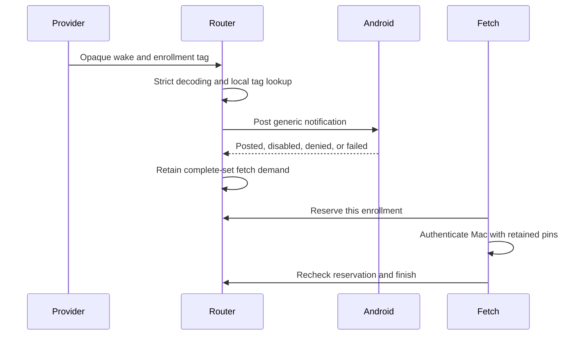
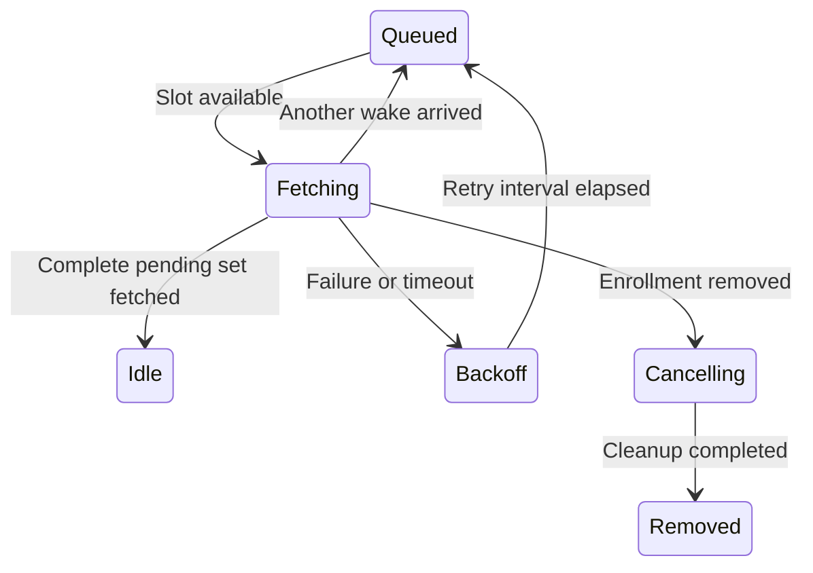

# Phone wake routing

Push data selects a locally enrolled Mac/account through its opaque notification tag. It cannot install an endpoint, key, enrollment, or request.

`PushWakeRouter` owns one process window. Trusted setup supplies all enrollment identities and fresh random tags. Removal invalidates the exact handle and outstanding fetch reservations. Retired tags cannot select replacements. Other Macs and accounts remain independent.

Each enrollment permits one fetch reservation. Wakes before that reservation coalesce. A new wake during a fetch retains demand for another complete pending-set fetch. Failure retains demand. Old completions cannot clear a replacement reservation. The host must recheck reservations around awaits and deliver verified results through the current authenticated request owner.

A bounded cache suppresses duplicate hints. Cache eviction and expiry may permit another generic notification and fetch. They never remove pending fetch demand. This cache is not durable replay protection or request authority. Notification alert spacing applies independently to each enrollment. Failed posts do not advance that spacing.

Enrollment capacity, remembered tags, duplicate lifetime, hint capacity, alert spacing, and notification timeout are explicit configuration inputs. This change selects no product defaults. Exhausted enrollment/tag capacity rejects registration rather than evicting trusted state. The future persistent enrollment owner must manage restoration and retired tags across process windows.

The router samples the supplied clock under the same lock as receipt processing. Concurrent callbacks cannot reverse clock observations. Clock regression or an epoch change closes this process owner and invalidates reservations. It does not delete persistent pairing. Restore a fresh owner from trusted enrollment records. Callbacks are synchronous and must not reenter the router or perform network work under its lock.

## Android adapter

`AndroidPushWakeReceiver` samples elapsed realtime and posts through `AndroidWakeNotifications` before returning fetch demand. Notifications contain generic text only. An immutable explicit intent opens the app without request details or actions. One notification per enrollment replaces earlier hints. Silent updates do not alert again inside the configured interval.

The adapter reports missing permission, disabled notifications, disabled channels, and platform failures. `POSTED` means Android accepted the call; it does not prove visibility or reading. Notification timeout is not request expiry. Removing an enrollment cancels its generic notification.

The manifest declares notification permission. There is no startup permission prompt. The launcher, Firebase listener, enrollment persistence, token-challenge proof flow, and authenticated fetch transport are not connected yet. Android background work admission remains to be integrated. This backend does not claim working push delivery. Device notification appearance, channel behavior, and background lifecycle remain for the Pixel session.

References: [Android notification permission](https://developer.android.com/develop/ui/compose/notifications/notification-permission), [notification channels](https://developer.android.com/develop/ui/compose/notifications/channels), and [FCM processing priority](https://firebase.google.com/docs/cloud-messaging/android-message-priority).

## Fetch worker lifecycle

`PhoneWakeScheduler` drains router demand in a caller-owned coroutine scope. Construct it with the same router as the Android receiver. The receiver signals after each wake and enrollment removal. Existing demand is drained when the scheduler starts. Signals coalesce; the router retains the actual work.

Concurrency, timeout, and retry interval are explicit bounded settings. Failed fetches retain demand but release their slot during backoff. Other Macs can proceed even with a single slot. Repeated wakes do not bypass backoff. A cancelled worker keeps its slot until cleanup completes; removal invalidates its reservation immediately.

The fetch adapter must authenticate the selected enrollment, fetch its complete pending set, and verify results before delivering them to request owners. Recheck the reservation around every await. A successful callback reports fetch completion only; it never implies user consent, a decision, or terminal request state.

The scheduler uses a separate monotonic elapsed clock. Negative or regressing readings close this process owner. Parent cancellation or explicit close closes the router and cancels workers. `closeAndJoin` waits for cooperative cleanup before the host releases transport or key resources. A blocking, non-cooperative adapter can delay shutdown; it must supply cancellable network calls and bounded cleanup.

Timers run only for active fetch timeouts and queued retry delays. Idle schedulers wait for a signal. This coroutine owner is not an Android background execution entitlement. The Firebase listener and Android work scheduler still need to acquire an allowed work window, restore trusted enrollments, and reconcile pending requests after process death.

Tests use virtual time for retries and timeouts. They cover independent Macs, duplicate wakes, concurrency limits, removal, cancellation cleanup, shutdown, and clock failure. They do not contact a device or network.
