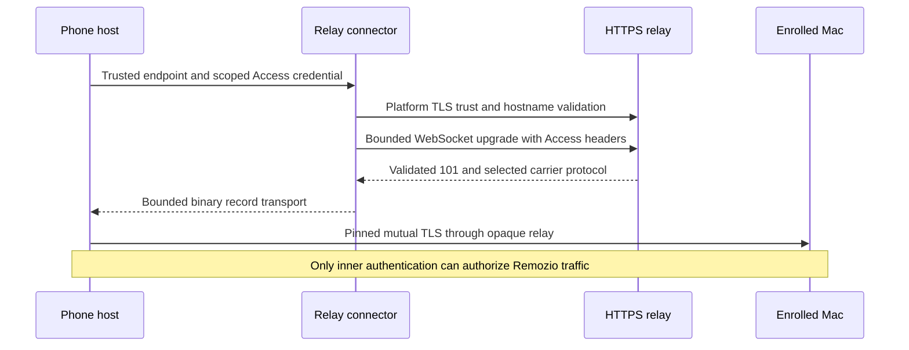

# Phone relay connector

`RelayConnector` opens outer HTTPS for a trusted relay endpoint. It returns an `EncryptedRecordTransport` for `TLSRecordSession`.

## Trust and credentials

The platform socket factory checks the HTTPS certificate and hostname. TLS 1.2 or TLS 1.3 protects this outer connection. The inner session still requires its enrolled peer pin and client identity.

The host supplies the endpoint from trusted enrollment storage. Push payloads and discovery responses cannot select it. A credential is scoped to the exact host, port, and path. A mismatch fails before connecting. Credentials reach the relay only after HTTPS authentication succeeds.

The upgrade sends the two Cloudflare Access service headers. It does not follow redirects, persist cookies, process response bodies, or negotiate compression. Errors and object descriptions omit credentials and endpoint details. Managed credential strings cannot promise secure erasure. The Android host must load them from protected storage and must not log them.

## Limits and ownership

One deadline covers connection setup, HTTPS authentication, and the upgrade. It defaults to 15 seconds and permits 1–60,000 milliseconds. Headers have a 16 KiB total limit, a 4 KiB line limit, and a 64-field limit. The parser never consumes the first frame as header data.

The selected carrier protocol is `remozio.ciphertext.v1`. It identifies this framing contract; it does not replace inner Remozio protocol negotiation. Binary messages have a maximum size of 32 KiB. Queue capacity defaults to one message. Both limits apply before the first frame is parsed.

The caller supplies a parent scope with a job and owns the returned transport. Cancellation closes TCP before the layered TLS socket. This interrupts pending socket reads. `close()` aborts the connection; `awaitClosed()` joins its carrier jobs. `TLSRecordSession` closes and joins the transport it owns.

Blocking platform DNS or provider work can finish after cancellation. A cancelled setup cannot install a new socket or return a live transport. The connector does not retry. An application request still needs outcome reconciliation after connection loss.

## Why the upgrade is separate

In [Ktor CIO 3.6.0](https://github.com/ktorio/ktor/blob/3.6.0/ktor-client/ktor-client-cio/common/src/io/ktor/client/engine/cio/utils.kt), the upgraded raw WebSocket starts before the client plugin applies its configured frame limit. Remozio constructs its existing bounded framer directly after a small HTTP upgrade parser. This preserves the limit from the first frame. This parser is not a general HTTP client.

## Evidence and remaining integration

Tests use disposable certificates, synthetic credentials, and loopback listeners. They cover certificate and hostname rejection, redirects, header limits, credential scoping, binary exchange, normal close, and cancellation. An oversized frame header fails without its body. A native test connects this carrier and the owned TLS session to the Swift peer.

These checks do not prove Android Conscrypt behavior, Cloudflare Access provisioning, mobile network recovery, or background operation. The production enrollment store, credential loader, wake host, and relay server still need integration. These tests change no real Cloudflare configuration or phone.
