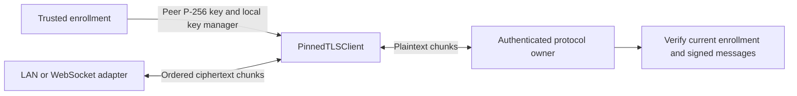
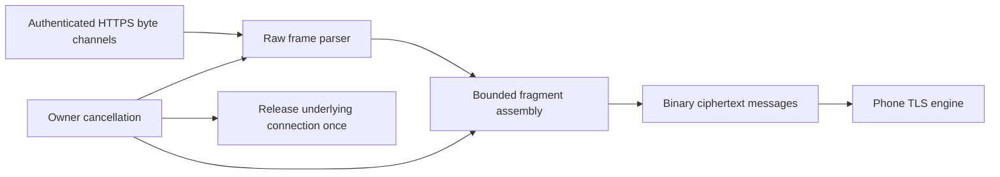
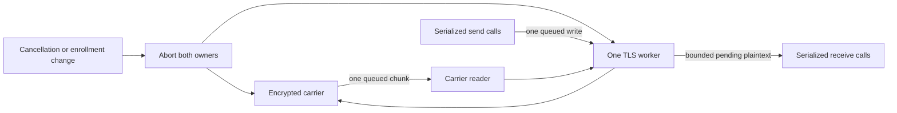

# Phone TLS engine

`PinnedTLSClient` wraps a fresh TLS 1.3 `SSLEngine`. The host feeds ciphertext into `receive` and sends returned ciphertext in order. The component performs no socket I/O.

The trusted host supplies one enrollment-specific X509 key manager, an exact P-256 SubjectPublicKeyInfo pin, and the expected ALPN. The key manager must select only that enrollment's local identity. The pin identifies the transport key, not the request authority key. A certificate renewal can retain the pin when its public key stays unchanged. Key rotation requires a trusted enrollment update.

The engine checks the peer certificate's validity and public key. It requires TLS 1.3, the expected ALPN, and a local certificate. Platform CA trust cannot substitute for the pin. Each instance uses a fresh TLS context to avoid inheriting another connection's cached session.

## Host contract

- Call `start` once. Feed ordered ciphertext chunks of at most 32,768 bytes into `receive`.
- Send plaintext only in `OPEN`. Split large frames into chunks of at most 32,768 bytes.
- Retain the suffix beyond `consumedPlaintextBytes`. If TLS waits for peer input, feed that input before retrying the suffix.
- Deliver every returned ciphertext batch in order. Apply carrier queue limits and backpressure before producing more output.
- Validate plaintext using the authenticated protocol. `OPEN` does not prove server acceptance of a request or grant approval authority.
- Enforce connection deadlines and recheck current enrollment around asynchronous work. Close the instance when enrollment changes.
- Treat abrupt EOF as failure. A TLS close notification reports peer closure, never a request result.
- Close the carrier and discard its queued batches when the engine closes or fails. Do not retry an uncertain decision automatically.

The initial handshake has a caller-selected cumulative byte budget, up to 1 MiB. It counts consumed input and emitted output before authentication. Application records that share a carrier chunk do not consume that budget. Each working buffer is fixed at 65,536 bytes. These are transport bounds; they do not change application capture limits.

Calls serialize engine operations. Delegated key tasks run synchronously and can block inside the platform provider. Run the component off the UI thread. Host deadlines cannot guarantee interruption of a provider key operation.

`close` aborts the instance. It clears its working buffers and drops the engine reference. It does not perform a graceful TLS shutdown or promise erasure of provider internals and caller-owned copies. Failures expose a generic exception without certificate or payload details.

## Validation and remaining work

`TLSInteropTest` exercises the engine against the native Swift loopback peer using disposable keys. It covers fragmented records, a large application frame, peer pin and ALPN rejection, handshake/input limits, abort, and abrupt EOF. The [direct WebSocket extension](../../docs/experiments/websocket-carrier.md#direct-phone-engine-extension) also feeds this engine without a local client bridge. The earlier socket experiments remain separate fixtures.

The engine is a phone-core component, not a wired Android connection. The bounded framing layer is described below. The [Android identity loader](../../android/transport-identity.md) now supplies an existing hardware-backed key through `ClientTLSKeyManager`. The session owner below couples framing to TLS. HTTPS connection setup, enrollment storage, and key creation remain to be implemented. Pixel hardware-key behavior and real network transitions require the interactive device tests.

## Bounded WebSocket records

`WebSocketRecordTransport` supplies runtime binary framing over host-owned byte channels. The host must first authenticate the HTTPS endpoint and validate its WebSocket upgrade. The constructor does not connect to a URL or establish trust.

The adapter uses Ktor WebSockets 3.6.0. It passes the frame limit into `RawWebSocket` at construction, before the reader starts. The default session enforces the same limit across fragments. All incoming and outgoing Ktor queues have the caller's explicit finite capacity. Compression extensions are disabled. Text and reserved-bit messages are rejected.

The message limit is at most 32,768 bytes. This limits ciphertext messages, not application captures. Split larger TLS output batches across messages. Each library queue has the configured capacity; several queues and parser buffers exist in the pipeline. The host must also bound its byte channels and concurrent connections.

`send` copies the caller's bytes and suspends under backpressure. Its return means queue acceptance. Concurrent sends retain message order through a mutex. `receive` serializes consumers and drains binary messages that precede a peer close. Null means carrier EOF; pass it to the TLS layer without inventing an authenticated close or request outcome.

Cancelling a send or receive aborts this transport. Explicit close and parent cancellation also release its input, output, and underlying connection. Reads reject buffered messages after local cancellation, including when a peer close arrived first. Only normal peer closure permits draining. The required close callback must be nonblocking and release the host connection. Cleanup attempts each release step once. `closeAndJoin` explicitly cancels and joins Ktor’s independent default-session job, then joins the owner. Parent cancellation also waits for that session through a cleanup guard. The adapter does not retry messages or decisions.

The Ktor configuration constructor and session start method require an `InternalAPI` opt-in. This is confined to the adapter and the dependency is pinned. Parser, queue, and lifecycle tests must pass when that dependency changes; no reflection or private fields are used.

Portable tests cover a first oversized header without a body, fragmented overflow, output masking and copy ownership, ping handling, rejected message types, backpressure, queued messages before close, and cancellation. Android compilation and lint check API availability. Actual HTTPS setup, the connection owner, current-enrollment checks, and device behavior remain integration work.

## TLS session ownership

`TLSRecordSession` owns one engine and one `EncryptedRecordTransport`. `WebSocketRecordTransport` implements that carrier contract. The caller still supplies an authenticated HTTPS connection and a trusted enrollment identity. The session does not open an endpoint or establish enrollment trust.

The worker defaults to `Dispatchers.IO`. It serializes engine calls and preserves partial writes. Ciphertext is split to the carrier's declared message limit, at most 32,768 bytes. Send calls accept nonempty plaintext chunks up to 32,768 bytes. Send completion means local carrier acceptance, never delivery, approval, or execution.

Queues hold one incoming ciphertext chunk, one write, and one plaintext chunk each. The reader can hold one additional input chunk while its queue is full. The worker retains at most 65,536 pending plaintext bytes, plus the engine's bounded buffers and current batch. Carrier queues have their own documented bounds. Application consumers must drain incoming data; backpressure does not permit unbounded retention. A full plaintext queue still permits independent writes that need no further peer input.

The handshake deadline defaults to 15 seconds and accepts settings from 1 to 60,000 milliseconds. It covers TLS negotiation and its carrier writes. It does not include application consumption after authentication. Operation deadlines remain the protocol owner's responsibility. Cancelling `awaitOpen`, `send`, or `receive` aborts this incarnation; it does not retry a decision.

`close` marks the session aborted, discards queued application data, cancels work, and closes the carrier without waiting. Late provider output is checked and discarded. A hardware provider call may finish later because coroutine cancellation cannot interrupt every native key operation. `closeAndJoin` waits for the worker and carrier jobs to finish. The carrier's `close` must be nonblocking; `awaitClosed` must await any independent cleanup jobs.

An authenticated TLS close permits draining plaintext already received, then returns null. Abrupt carrier EOF fails the session. Neither condition proves a request outcome. Explicit close or parent cancellation discards buffered plaintext. The enrollment owner must close the session when trust changes and recheck current enrollment before using returned plaintext as authority. Closing the session does not delete or replace enrollment keys.

Deterministic tests cover partial writes, both framing layers, backpressure, cancellation, deadlines, bounded input, and cleanup. Native Swift/Kotlin tests cover a fragmented exchange and wrong-pin rejection through the session owner. These tests use synthetic keys and loopback traffic. Android Keystore behavior, real HTTPS setup, app lifecycle integration, and network transitions remain unverified on a Pixel.
