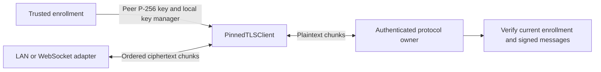

# Phone TLS engine

`PinnedTLSClient` wraps a fresh TLS 1.3 `SSLEngine`. The host feeds ciphertext into `receive` and sends returned ciphertext in order. The component performs no socket I/O.

The trusted host supplies one enrollment-specific X509 key manager, an exact P-256 SubjectPublicKeyInfo pin, and the expected ALPN. The key manager must select only that enrollment's local identity. The pin identifies the transport key, not the request authority key. A certificate renewal can retain the pin when its public key stays unchanged. Key rotation requires a trusted enrollment update.

The engine checks the peer certificate's validity and public key. It requires TLS 1.3, the expected ALPN, and a local certificate. Platform CA trust cannot substitute for the pin. Each instance uses a fresh TLS context to avoid inheriting another connection's cached session.

## Host contract

- Call `start` once. Feed ordered ciphertext chunks of at most 32,768 bytes into `receive`.
- Send plaintext only in `OPEN`. Split large frames into chunks of at most 32,768 bytes.
- Retain the suffix beyond `consumedPlaintextBytes`. If TLS waits for peer input, feed that input before retrying the suffix.
- Deliver every returned ciphertext batch in order. Apply carrier queue limits and backpressure before producing more output.
- Validate plaintext using the authenticated protocol. `OPEN` does not prove server acceptance of a request or grant approval authority.
- Enforce connection deadlines and recheck current enrollment around asynchronous work. Close the instance when enrollment changes.
- Treat abrupt EOF as failure. A TLS close notification reports peer closure, never a request result.
- Close the carrier and discard its queued batches when the engine closes or fails. Do not retry an uncertain decision automatically.

The initial handshake has a caller-selected cumulative byte budget, up to 1 MiB. It counts consumed input and emitted output before authentication. Application records that share a carrier chunk do not consume that budget. Each working buffer is fixed at 65,536 bytes. These are transport bounds; they do not change application capture limits.

Calls serialize engine operations. Delegated key tasks run synchronously and can block inside the platform provider. Run the component off the UI thread. Host deadlines cannot guarantee interruption of a provider key operation.

`close` aborts the instance. It clears its working buffers and drops the engine reference. It does not perform a graceful TLS shutdown or promise erasure of provider internals and caller-owned copies. Failures expose a generic exception without certificate or payload details.

## Validation and remaining work

`TLSInteropTest` exercises the engine against the native Swift loopback peer using disposable keys. It covers fragmented records, a large application frame, peer pin and ALPN rejection, handshake/input limits, abort, and abrupt EOF. The existing socket and WebSocket experiments remain separate fixtures.

The engine is a phone-core component, not a wired Android connection. A direct WebSocket adapter, lifecycle owner, current-enrollment integration, and Android Keystore identity manager remain to be implemented. Pixel hardware-key behavior and real network transitions require the interactive device tests.
