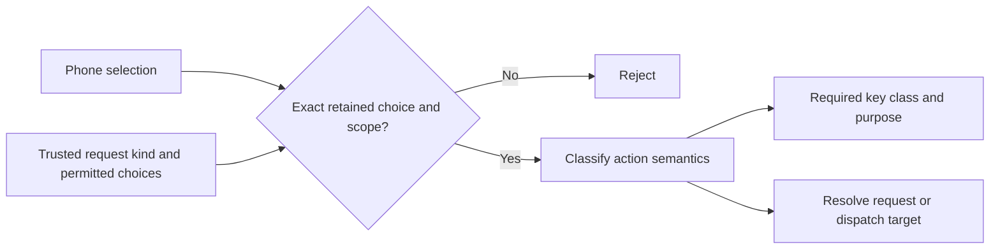

# Approval action policy

Swift and Kotlin classify each choice against the retained request kind and the exact permitted choice/scope set. A phone cannot select a weaker key by asserting that an action is temporary or needs no biometrics.

| Retained action | Key class | Purpose | Effect |
| --- | --- | --- | --- |
| Decline Remozio | Decision | Cancellation | Resolve request |
| Cancel the current UI dialog | Decision | One-time UI | Dispatch target |
| Little Snitch allow-once or deny-once | Decision | One-time UI | Dispatch target |
| Little Snitch allow, deny, or remove a reusable rule | Biometric | Biometric authorization | Dispatch target |
| Execute a command | Biometric | Biometric authorization | Dispatch target |
| 1Password access or vault unlock | Biometric | Biometric authorization | Dispatch target |

Session, timed, and Forever rules are reusable. All require the biometric key, including deny and removal. A timed scope must contain a positive duration. The policy never substitutes Once for Forever. The captured default and the eventual UI retain the selected scope.

The permitted set must come from the root authority's retained capture, or the GUI adapter's independent trusted capture. Never populate it from a phone decision. Target details, adapter compatibility, and effect classification still need the signed request and live adapter validation. This library does not make an arbitrary UI control safe to call Once.

## Integration boundary

The result is a policy requirement, not an authorization. Verifiers must check the signature against the actual enrolled key record and required purpose. A purpose label supplied by the phone cannot grant authority. Request digest, challenge, account, expiry, enrollment, and replay checks remain mandatory.

Every target effect uses the durable consumption and dispatch path. This includes cancel, deny-once, and allow-once. A decline resolves only Remozio's pending request. Closing a sheet is a local UI event and does not call this policy or resolve the request.

Cancelling an already-running command, enrollment, credential-package release, routing, and update scheduling have separate control contracts. Do not infer their authority from this table. A credential package still requires its separately bound biometric release transaction.

The action enums and fixtures describe semantic policy; they do not yet assign signed wire field numbers. The shared `action-policy-v1.json` fixtures cover all supported request kinds, reusable lifetimes, incompatible choices, invalid scopes, and omitted permissions. Both implementations also reject a changed duration even when the broad action category is the same.
