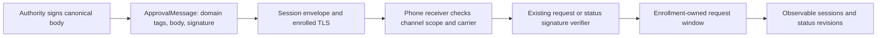
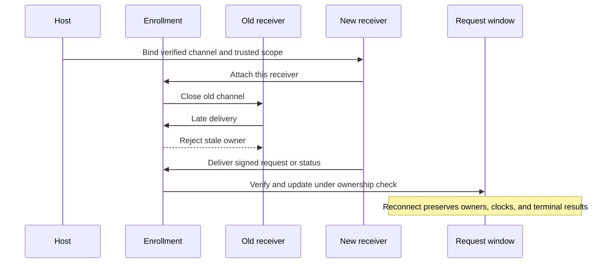

# Signed approval messages

`ApprovalMessage` carries an existing signed body through the negotiated channel. Swift and Kotlin preserve the exact body and detached signature. Carrier parsing grants no authority and does not canonicalize the enclosed body.

## Carrier version 1

All six fields are mandatory. Additional fields and unknown versions or tags fail.

| Key | Value |
| --- | --- |
| 0 | Unsigned carrier version 1 |
| 1 | Approval wire version 1 |
| 2 | Message type: request 1, decision 2, status 3 |
| 3 | Signing purpose from the approval signing contract |
| 4 | Nonempty, unchanged body bytes |
| 5 | Detached 64-byte P-256 signature |

Request messages require the issued-request purpose. Status messages require the status purpose. Decisions permit cancellation, one-time UI, or biometric authorization. These tags never select a key supplied by the sender. The existing verifier uses retained trust and checks the expected signature domain and body contract.

The body remains opaque to this carrier. A signature or body of the correct length can still be invalid. The consumer must authenticate and parse it before changing request state. Action schema and feature requirements remain inside the original signed body.

Each caller supplies a body limit. The carrier reserves 128 extra bytes inside the channel payload budget. Its maximum body budget is 16 MiB minus 128 bytes. These are implementation bounds, not product defaults. Request and status parsers retain their separate, potentially smaller limits.

## Phone receiver ownership

`CommandRequestReceiver.bind` takes exclusive ownership of an already negotiated phone channel. The Mac/account comes from the retained inbox enrollment. The caller supplies the phone ID and epoch from trusted enrollment state. Binding checks the complete channel scope and supported command contract before replacing the current receiver.

This receiver handles command requests and their statuses. The phone must advertise only the implemented command contract, with no required feature extensions or audit support. The adapter checks this before binding. The Mac must also advertise command support. Other message families need their own handlers before the phone advertises them.

The enrollment monitor serializes receiver replacement, removal, and delivery. Old callbacks cannot change the window after replacement. A failed scope or capability check closes the new channel and leaves the old receiver intact. Removing or replacing the enrollment closes its channel and all owned request sessions.

Every duplicate request authenticates before lookup. An exact duplicate reuses the existing owner; it cannot reset its timer or restore a terminal capture. Status routing uses only a bounded candidate identity to find a retained owner. That owner verifies the signature, bindings, revision, and transition. A status cannot create a request. Inbound decisions fail before delivery.

`requestSessions` exposes the same owned sessions as observable app state. It does not create another capture cache. Status revisions and session closure remain observable through each existing session.

EOF, local close, and delivery failure retain the window. They do not mean expiry, cancellation, execution, or successful delivery. The caller runs the receiver in its connection scope and owns reconnection. This layer never retries decisions or treats a signature as proof of freshness. Existing status timing still reports unknown delivery delay.

## Verification and remaining work

Shared Swift/Kotlin byte tests cover carrier encoding, domain combinations, unknown fields, malformed inputs, and size bounds. Receiver tests use real signatures and cover duplicate delivery, timer continuity, terminal capture removal, bad signatures, wrong Macs, missing requests, stale callbacks, removal, cancellation, and failed binding.

The synthetic Swift authority emits this carrier for its real signed request/status fixtures. A flow test feeds those messages through the Kotlin receiver. A separate loopback test carries signed fixture messages through the actual HTTPS relay, TLS engines, and negotiated channels into the same inbox. The relay test uses a disposable test authority and the native peer's echo mode; it does not claim a deployed Mac authority integration.

Production pairing, persisted enrollment activation, current-authority reconciliation, app connection startup, and physical-device behavior remain separate work. Reconnect completeness needs authenticated evidence before absence can withdraw a request. No real approvals, service installation, or device tests run here.
