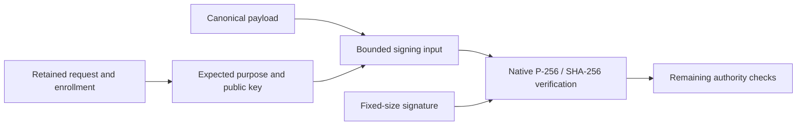

# Approval signatures

Wire version 1 uses ECDSA over NIST P-256 with SHA-256. Hash the complete [signing input](signing-input.md) exactly once. Native APIs perform that hash; do not prehash the input before calling them.

| Field | Encoding |
| --- | --- |
| Public key | 65 bytes: `04`, followed by 32-byte X and 32-byte Y coordinates |
| Signature | 64 bytes: 32-byte R followed by 32-byte S |
| Integer representation | Unsigned, big-endian, padded to the fixed width |

The public point must be on P-256. Both signature scalars must be greater than zero and less than the curve order. Public keys with compressed points, alternate curves, or trailing bytes are not accepted.

## Platform adapters

Swift uses CryptoKit's raw signature and X9.63 public-key initializers. Its [data signing API](https://developer.apple.com/documentation/cryptokit/p256/signing/privatekey) uses SHA-256 with P-256.

Kotlin uses [Java's Signature API](https://developer.android.com/reference/java/security/Signature) with `SHA256withECDSA`. The shared `P256SignatureEncoding` converter maps fixed R/S values to a bounded DER sequence of two positive integers. It also converts provider DER output into the fixed wire format. The native provider verifies that sequence. Conversion rejects nonminimal or negative integers, zero or out-of-range scalars, incorrect lengths, extra fields, and trailing bytes. Inputs are bounded before copying. Neither direction hashes, signs, or changes the S value. Curve parameters come from the named `secp256r1` curve; the input cannot supply another curve.

The verifier returns false for invalid signature/key data. Unsupported protocol contexts, malformed canonical payloads, and size violations remain explicit exceptions from the signing-input layer. Missing crypto algorithms or providers propagate as platform failures, rather than masquerading as a rejected user decision.

The method accepts no private key. Production signing belongs to the Secure Enclave or Android Keystore adapter and, where required, the biometric operation. There is no software-key fallback in this module.

## Verification is one gate

The caller must select the public key from trusted enrollment and the expected purpose from retained request policy. An attached public key or purpose supplied by a sender is not authoritative.

A valid signature does not prove fresh enrollment, biometric enforcement, a live target, a valid deadline, or an unused challenge. Those checks still precede consumption and dispatch. Replay prevention uses the request identity, challenge, enrollment epoch, and durable state; it must never use signature bytes as a unique decision identity. Both mathematically valid S forms are permitted.

## Evidence and limits

The [shared fixtures](vectors/approval-signatures-v1.json) contain 20 signatures. Ten came from CryptoKit and ten from Java 21 SunEC, using two disposable keys. Each producer signed the same ten input vectors. Only public keys, public messages, and signatures were retained. No private key is present.

Each fixture also includes canonical DER encoding. Kotlin converts both ways; CryptoKit independently parses and re-encodes those bytes. Tests require both native verifiers to accept both producers. Negative cases alter the payload, type, purpose, signature, or public key. Boundary cases cover wrong sizes, zero/out-of-range scalars, unsupported point prefixes, and invalid points.

Java's original fixture generator used its P1363 signature output mode. The live synthetic approval-flow harness now signs with standard DER output and converts to wire format before Swift verifies the decision. Host tests also verify generated signatures independently with both Java formats and both valid S forms. The production verifier uses `SHA256withECDSA`, which Android documents. JVM tests do not establish Android provider or Keystore behavior. Repeat on supported Pixels during device tests, including biometric cancellation, enrollment changes, and key invalidation. Hardware key custody remains a separate experiment gate.
