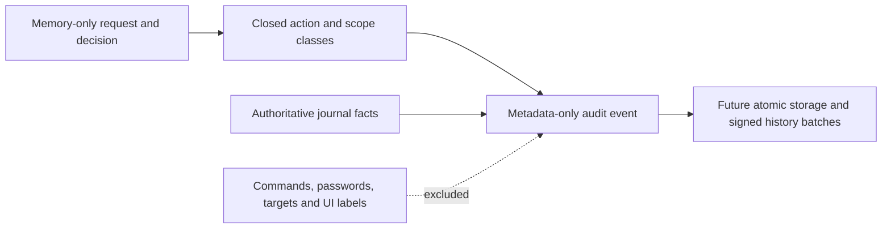

# Audit event metadata, schema 1

This contract provides metadata for the authoritative journal and phone history. It does not authenticate events, commit them, prove their truth, or grant approval authority.

## Privacy boundary

`AuditEventMetadata` has no free-text, command, environment, target, credential, or arbitrary payload field. Its byte strings are fixed 16-byte opaque identities. Producers must supply actual IDs, not encode sensitive content into them.

`AuditActionMetadata` is a separate type from the full signed action. Its projection retains the action kind and lifetime class. It omits timed durations. Target scope is a closed host/domain/any class; the API accepts no hostname, address, port, or item identity. The projection does not validate or authorize an action, so it can also describe a rejected decision.

Map unrecognized provider observations to the explicit `unknown` category. Never copy provider error text into records. Null means a field is missing or not applicable; `unknown` means a category was recorded without a recognized value. Neither means success.

Schema 1 accepts only its listed wire tags and fields. An unrecognized wire tag requires explicit contract support; it is not silently normalized before integrity checks. An unsupported record must later appear as an unavailable history segment, not a fabricated event. No raw provider value has an escape field.

## Field map

All 20 keys are required, including nullable fields. Encoding uses the deterministic CBOR subset.

| Key | Field | Encoding |
| --- | --- | --- |
| 0 | Metadata schema | Unsigned `1` |
| 1 | Event ID | 16 bytes |
| 2 | Mac ID | 16 bytes |
| 3 | Account ID | 16 bytes |
| 4 | Journal epoch | 16 bytes |
| 5 | Per-epoch sequence | Positive unsigned 64-bit integer |
| 6 | Request ID | 16 bytes or null |
| 7 | Event time | Unix milliseconds or null |
| 8 | Authority receipt time | Unix milliseconds or null |
| 9 | Event kind | `AuditEventKind` tag |
| 10 | Category | `AuditCategory` tag |
| 11 | Selected action kind | `AuditActionKind` tag or null |
| 12 | Lifetime class | `AuditLifetime` tag or null |
| 13 | Target scope class | `AuditTargetScope` tag or null |
| 14 | Deciding phone ID | 16 bytes or null |
| 15 | Authentication evidence class | `AuditAuthentication` tag |
| 16 | Outcome evidence | `AuditOutcome` tag |
| 17 | Structured reason | `AuditReason` tag |
| 18 | Dropped individual-event count | Positive unsigned count for aggregated rejections; otherwise null |
| 19 | Bridge peer device ID | 16 bytes or null |

Action kind and lifetime must both be present or both absent. Target scope requires an action. An unknown action/lifetime uses the explicit zero tags. Individual rejection records and counters still require the source authentication and rate limits from the design; parsing does not enforce a write budget.

Event time is the authority's wall-clock observation of the event. Receipt time is when that authority received the associated event or decision. Missing times remain null. Phone cache receipt and last-sync times are separate local metadata. Wall clocks may move, so this codec imposes no order between the two times.

Order within an epoch by its sequence. Epoch IDs do not establish epoch order; authenticated epoch headers and explicit discontinuities must do that. Never infer a global ordering across Macs from wall clocks. A valid record alone proves none of these relationships.

## Tag assignments

**AuditEventKind**: `0` unknown, `1` requestCreated, `2` phoneDecision, `3` decisionAccepted, `4` decisionRejected, `5` consumed, `6` dispatched, `7` verifiedResult, `8` expired, `9` cancelled, `10` unknownOutcome, `11` enrollmentAdded, `12` enrollmentRevoked, `13` recovery, `14` updateScheduled, `15` updateActivated, `16` updateInterrupted, `17` bridgeStarted, `18` bridgeStopped, `19` dismissed, `20` biometricCancelled, `21` aggregatedRejections, `22` routingChanged

**AuditCategory**: `0` unknown, `1` command, `2` onePasswordAccess, `3` onePasswordUnlock, `4` littleSnitch, `5` enrollment, `6` authority, `7` update, `8` adbBridge

**AuditActionKind**: `0` unknown, `1` decline, `2` cancelTarget, `3` execute, `4` approveAccess, `5` unlockVault, `6` allow, `7` deny, `8` removeRule

**AuditLifetime**: `0` unknown, `1` currentRequest, `2` session, `3` timed, `4` forever

**AuditTargetScope**: `0` unknown, `1` host, `2` domain, `3` any

**AuditAuthentication**: `0` unknown, `1` unverified, `2` decisionKey, `3` biometricKey, `4` localAdministrator, `5` system, `6` localUser

**AuditOutcome**: `0` unknown, `1` pending, `2` accepted, `3` rejected, `4` noDispatch, `5` attempted, `6` verifiedSuccess, `7` verifiedFailure, `8` unresolved, `9` cancelled, `10` expired

**AuditReason**: `0` unknown, `1` none, `2` userDeclined, `3` userCancelled, `4` authorizationExpired, `5` targetTimedOut, `6` targetDisappeared, `7` revoked, `8` bindingMismatch, `9` replay, `10` incompatible, `11` authorityRestarted, `12` storageUnavailable, `13` outcomeUnavailable, `14` updateInterrupted, `15` peerDisconnected, `16` manualStop

## Interpretation and remaining work

A phone decision is not Mac acceptance. Consumption is not dispatch. Dispatch is not a verified effect. `unknownOutcome` and `unresolved` retain uncertainty. A dismissed view leaves the pending request unchanged; a cancelled biometric prompt is not a denial.

Authentication classes record evidence available to the authority. A biometric-key signature does not prove a particular person acted. Producers must not infer an authentication class from the mere existence of an event.

The codec validates representation and field dependencies. The future journal writer must derive event/outcome combinations from real transitions and validated evidence. It must reserve lifecycle capacity, rate-limit rejection telemetry, and commit consumption with its audit event before dispatch. Protected local checkpoint recovery remains required. The [accepted restore limit](../docs/design-decisions.md#whole-mac-backup-rollback) excludes whole-Mac backup restoration; it does not waive ordinary replay prevention or crash recovery.

History batches need their own authenticated contract. They must bind Mac/account, epoch, immutable epoch-creation trust generation, sequence range, and retention boundary. This record does not replace that header, supply a cursor, or select current trust. Do not sign it under an existing approval purpose as a substitute for a history batch.

The Android encrypted cache, sync protocol, history views, and retention controls are not implemented here. No history record can reconstruct an actionable request, and history must never offer replay.

## Evidence

The shared fixtures include 87 valid cases and 78 invalid cases. Both native codecs round-trip the same canonical bytes. Tests cover every tag, missing observations, unsigned bounds, malformed fields and IDs, unsupported tags/schema, orphan scopes, rejection counts, and independent byte limits. Projection tests cover each action and lifetime and prove different timed durations collapse to the same metadata class. Kotlin tests also verify array ownership.

These are synthetic contract tests. They do not prove journal durability, authentic history, UI behavior, hardware authentication, or end-to-end operation.

Routing changes add event kind `routingChanged` (22) and local authentication `localUser` (6). They carry no approval action or request payload.
