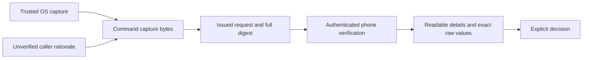

# Command capture schemas 1 and 2

`CommandCapture` supports approval wire 1 with command capture schemas 1 and 2. Swift and Kotlin retain typed fields and exact canonical bytes.

The caller supplies the expected schema from the authenticated request contract. The default is schema 1 for existing callers. The inner version must match exactly. Parsing establishes structure, not OS provenance.

The OS capture, authenticated delivery, and phone rendering steps remain integration work. This change does not advertise a production command handler or enable execution.

## Root fields

Every map has exactly the documented keys. Optional observations use explicit CBOR null, not omitted fields. Unknown keys, versions, types, and enums fail. All field numbers below are unsigned map keys.

| Key | Field | Type |
| --- | --- | --- |
| 0 | Capture schema | Unsigned `1` or `2`, matching the signed contract |
| 1 | Effective executable | Map below |
| 2 | Complete argv, including argv[0] | Nonempty array of raw byte strings |
| 3 | Working directory | Map below |
| 4 | Target credentials | Map below |
| 5 | Effective environment | Ordered array of entries below |
| 6 | Bound stdin source | Map below |
| 7 | I/O mode | Pipes `0`, PTY `1` |
| 8 | Started-command disconnect behavior | Terminate `0`, continue running `1` |
| 9 | Requester observations | Map below |
| 10 | Observed ancestry and limits | Map below |
| 11 | Unverified caller rationale | Text or null |
| 12 | Submission bindings | Map below |

The disconnect field describes an already-started command. It does not add resumable admission, detached approval, or automatic retries. Product defaults and supported I/O combinations belong to the execution adapter.

## Paths, argv, environment, and credentials

File identity is `{0: device UInt64, 1: inode UInt64}`. It identifies an observed file, not immutable content. The executable map is `{0: absolute path bytes, 1: file identity, 2: SHA-256 bytes32}`. The directory map is `{0: absolute path bytes, 1: file identity}`.

Paths and argv preserve their raw bytes. Paths start with `/`; all C-string fields reject NUL. Empty arguments, non-UTF-8 bytes, control characters, and distinct Unicode spellings remain intact. No shell quoting, path normalization, or argument splitting occurs in this parser.

Target credentials are `{0: UID32, 1: GID32, 2: ordered supplementary GID32 array, 3: observed user name text|null}`. A missing name does not hide the numeric identity. The service must capture effective credentials from trusted policy and OS state.

Each environment entry is `{0: name bytes, 1: value bytes, 2: source}`. Source is minimal environment `0` or explicit requested addition `1`. Names are nonempty, contain neither NUL nor `=`, and are strictly ordered by unsigned byte lexicographic order. Duplicate names fail. Values can be empty but cannot contain NUL. Capture the complete effective environment, not just a cosmetic change list.

The authority builds the deterministic environment before approval and executes the captured values. This codec does not choose PATH, HOME, locale behavior, or an environment allowlist. Ambient service variables must not be substituted later.

## Input and requester provenance

Stdin is `{0: kind, 1: stream binding16|null, 2: observed absolute path bytes|null, 3: file identity|null}`.

| Kind | Tag | Supported schemas |
| --- | --- | --- |
| Null | 0 | 1, 2 |
| Caller-controlled pipe | 1 | 1, 2 |
| File | 2 | 1, 2 |
| Caller-controlled TTY | 3 | 1, 2 |
| Caller-controlled PTY | 4 | 1, 2 |
| Caller-controlled socket | 5 | 2 |
| Directory | 6 | 2 |
| Caller-controlled device | 7 | 2 |
| Other caller-controlled source | 8 | 2 |

Null input requires all three remaining values to be null. Other kinds require the opaque stream binding. Available path and identity observations remain optional.

Schema 2 keeps all existing fields and tag meanings. Schema 1 rejects tags 5 through 8. Future tags and schemas fail in both parsers. An unavailable classification must use `other`, never a fabricated file or pipe label. A directory label does not promise that reading succeeds.

The authority retains the actual stream behind that binding. A path or stream ID alone cannot open, replace, or authorize an input stream. The phone must disclose that caller-controlled content is not captured or approved byte-for-byte. Streaming remains supported.

Requester fields are:

| Key | Value |
| --- | --- |
| 0 | Observed absolute executable path bytes |
| 1, 2 | Real UID32 and effective UID32 |
| 3, 4 | Positive PID up to Int32.max and PID-version UInt32 |
| 5 | Signing observations below |
| 6 | Session ID UInt32 or null |
| 7 | Observed absolute TTY path bytes or null |

Signing observations are `{0: status, 1: identifier text|null, 2: team text|null, 3: cdhash bytes20|null}`. Status is unsigned `0`, ad-hoc `1`, validated `2`, invalid `3`, or unavailable `4`. Available descriptive fields do not override status. Never show invalid, ad-hoc, or unavailable observations as a verified publisher. Null metadata must remain visibly unavailable.

Ancestry is `{0: completeness, 1: ordered entries, 2: reason}`. Completeness is complete `0`, partial `1`, or unavailable `2`. Reason is none `0`, process exited `1`, permission `2`, truncated `3`, or unsupported `4`. Complete requires reason none; partial and unavailable require a limitation reason. Unavailable requires no entries.

Each ancestor is `{0: positive PID up to Int32.max, 1: PID-version UInt32, 2: absolute executable path bytes|null, 3: UID32}`. Entries run from the immediate parent outward. They describe observations at submission time. Neither a complete chain nor an authenticated frontend proves which person or AI model initiated the command.

Submission bindings are `{0: ID16, 1: nonce32, 2: caller-channel binding16}`. They are opaque bytes. The service must associate them with its verified IPC peer and retained caller/session lifetime. A supplied identifier is not proof of that association.

## Integration rules

Verify the issued request and its exact command/wire/schema contract before selecting this parser. Preserve its bytes in the request digest. Successful parsing must not itself enable an unsupported contract.

The Android command connection advertises implemented schemas 1 and 2, with no optional features. The receiver retains their intersection with the authenticated Mac offer. Each new request must use that connection's shared schema. The signed outer schema and inner capture schema must match before inbox admission. Unknown peer contracts remain opaque. Unsupported local advertisements fail.

Existing authenticated request owners survive reconnects. Status messages refer to their retained request digests and do not introduce another capture. A duplicate request still needs a supported contract on the current connection. Direct `open` and `accept` callers keep schema 1 by default.

The producer must choose a contract before encoding the capture. Never relabel a socket, directory, or device to fit schema 1. A peer without schema 2 cannot receive those captures through this handler.

The phone must render every relevant signed value without letting a value create a fake label or row. Make controls, newlines, bidi characters, empty values, and invalid UTF-8 unambiguous. Keep readable details and expandable exact arguments; never replace the signed invocation with a cosmetic shell summary. Rationale must always be labelled unverified.

The authority still must capture the OS values, bind the live caller and streams, recheck the target, and consume the decision durably. Hashes and file identities do not close the measured pathname-execution race. The user accepted [pathname execution after a final recheck](../docs/design-decisions.md#command-execution-by-pathname), including the remaining race and mutable dependencies. Production execution remains unimplemented.

## Evidence and bounds

Schema 1 retains its nine valid and 86 invalid shared fixtures unchanged. Schema 2 adds 13 valid and 16 invalid shared fixtures.

Both parsers require explicit version selection. Phone tests cover signed version mismatches, disjoint offers, unknown contracts, and schema downgrade after reconnect.

The schema 1 cases cover every input and signing tag, missing observations, unsigned boundaries, nested unknown fields, invalid byte lengths, NULs, relative paths, duplicate/unsorted environment entries, and ancestry consistency. Separate tests cover immutable snapshots, resource bounds, and preservation through the issued-request wrapper.

The caller supplies explicit byte, depth, and item budgets. Nothing is truncated. Test budgets are not product limits; legitimate oversized captures need the design's explicit Request too large result.

Fixtures use invented paths, identities, and metadata. They provide no evidence of OS capture, GUI rendering, caller authentication, or command execution.
