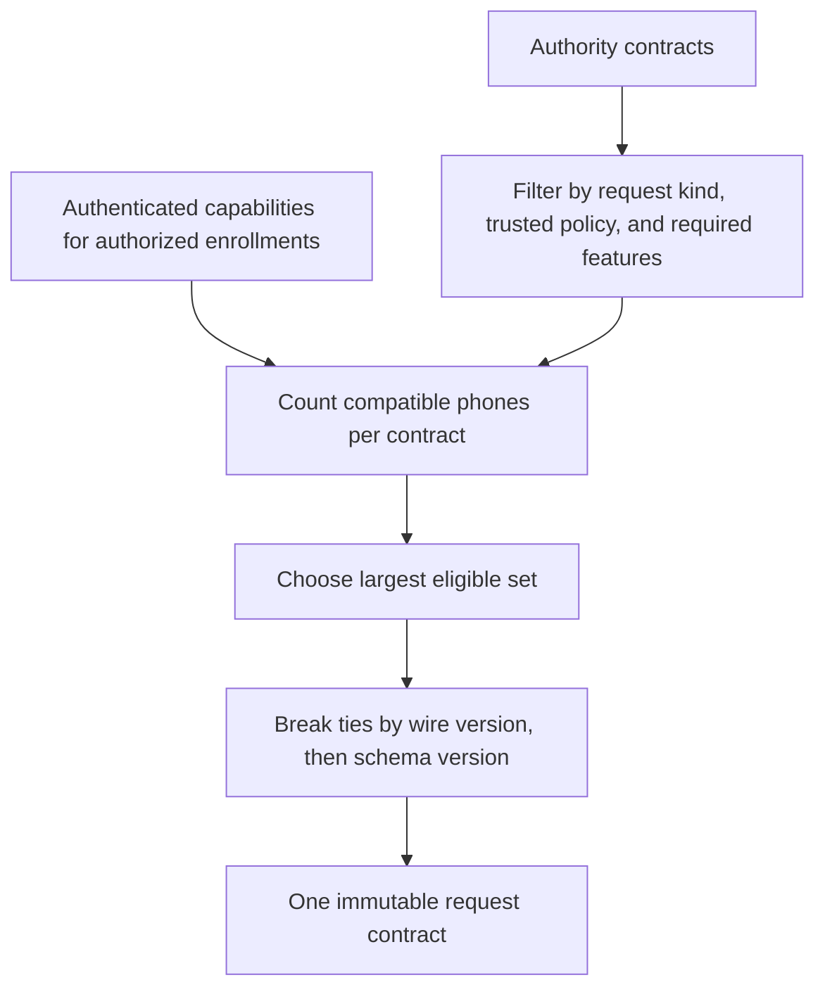

# Compatibility selection

Envelope selection and request selection answer different questions. The shared policies operate only on already-authenticated capability records. They do not implement or authenticate a handshake.

| Selection | Rule |
| --- | --- |
| Connection envelope | Highest exact version in both supported sets, at or above the trusted local minimum |
| New request contract | Safe contract reaching the most eligible enrollments; ties choose the highest request wire version, then schema version |

A request contract includes its request kind. A Little Snitch schema cannot stand in for a command schema with the same numbers. Required features must be supported by both the authority and each counted phone for that exact contract.

The caller supplies current authorized enrollments for the specific Mac/account. Key the snapshot by stable enrollment ID, not labels or transport connections, so duplicate routes do not count as additional phones. Include authenticated last-known capabilities for offline phones. The Kotlin capability snapshot copies its maps and feature sets.

A stale record can reduce reachability. It must not bypass current negotiation or operation verification. Every delivery and decision still checks current support. Other compatible phones remain usable when one phone needs an update.

## Security boundary

Supported versions are explicit sets. Trusted minimums, allowed contracts, and required features come from the local supported release and authenticated policy, never an unauthenticated peer or relay. The selection function does not authenticate those inputs for its caller.

The handshake must bind both advertisements, fresh nonces, endpoint identities, and the chosen envelope version. Initial pairing must bind the same values to its verified enrollment transcript. Do not retry an older format after a signature failure.

Call request selection only before creating a new immutable request. An enrollment or reconnect must not rewrite or re-sign an existing request into a weaker contract. Keep its digest and single consumption ledger.

No safe common envelope or compatible request returns a specific compatibility failure. This pure policy does not remove pairings, erase history, or block other Mac/account connections. Callers must show the affected operation as unavailable and retain safe enrollment state.

Tests cover sparse supported sets, trusted floors, reachability over recency, tie-breaking, missing features on either side, mismatched request kinds, independent schema versions, and empty eligibility. Real transcript authentication and mixed-version device tests remain separate work.
