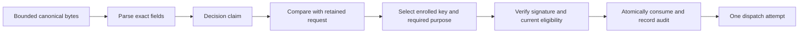

# Decision payload, schema 1

`DecisionPayload` parses and encodes the phone's decision claim. The Swift and Kotlin implementations use the same byte fixtures. This is an approval-wire-version-1 body for the existing `decision` signature domain. It does not implement enrollment, request verification, biometric signing, consumption, or dispatch.

Only the parsing step is added here. The remaining steps need the authority and harness implementation. A successfully parsed or correctly signed claim alone grants no authority.

## Exact body

Encode a deterministic CBOR map with exactly these fields. Every field is required. Schema 1 defines no ignorable extension fields; reject all unknown fields, including nested action fields.

| Key | Value | Representation |
| --- | --- | --- |
| 0 | Decision schema | Unsigned integer `1` |
| 1 | Stable Mac identity | 16 opaque bytes |
| 2 | Account identity | 16 opaque bytes |
| 3 | Request identity | 16 opaque bytes |
| 4 | Complete request digest | 32 bytes, SHA-256 |
| 5 | Request challenge | 32 bytes |
| 6 | Phone identity | 16 opaque bytes |
| 7 | Enrolled signing-key identity | 16 opaque bytes |
| 8 | Selected action and scope | Field map below |

The IDs are opaque installation, enrollment, or request identifiers. They are not hostnames, display names, numeric OS user IDs, or public keys. Enrollment and capture map these stable identifiers to their actual principals. Preserve their exact bytes; a string representation must not participate in signing. Length validation does not establish identity or randomness.

The request digest is SHA-256 of the complete canonical **issued-request signing input**, including its domain, wire version, type, purpose, and original request body. It is not merely the digest of command text or the action payload. It excludes the request signature itself. The request body must bind its action schema, required features, immutable payload, permitted choices, and expiry. This avoids a self-reference: an inner payload digest and the complete request digest are different values.

Request construction and digest calculation remain separate work. The Mac must recompute this digest from its retained original request. The phone must first authenticate and parse that complete request before it can construct a decision.

## Action map

| Key | Meaning |
| --- | --- |
| 0 | Choice tag |
| 1 | Scope tag |
| 2 | Duration in seconds, present only for timed scope |

| Choice | Tag | Choice | Tag |
| --- | --- | --- | --- |
| Decline Remozio request | 0 | Allow once | 5 |
| Cancel target prompt | 1 | Deny once | 6 |
| Execute command | 2 | Allow rule | 7 |
| Approve 1Password access | 3 | Deny rule | 8 |
| Unlock 1Password vault | 4 | Remove rule | 9 |

Scope tags are current request `0`, session `1`, timed `2`, and forever `3`. Timed scope requires a positive unsigned 64-bit duration. Every other scope forbids the duration field. Reject unknown choice or scope tags and incorrect value types.

These tags are explicit wire constants, independent of enum order or spelling. Structural parsing does not make a combination permissible. For example, Allow rule with current-request scope parses but fails the retained [action policy](action-policy.md). Never infer a weaker requirement from a parsed scope or a button label.

## Signature and authority checks

The outer [signing input](signing-input.md) binds wire version 1, message type Decision, and the required decision purpose. Derive that purpose and key class from the retained request's action policy. The body cannot select a weaker purpose.

Compare the Mac, account, request, digest, challenge, phone, key, exact captured action, and scope with current trusted state. Check the enrollment and its key purpose, revocation, negotiated request support, monotonic expiry, target validity, and single-use consumption. All checks remain required even when the native signature verifies.

The full request digest binds expiry and the immutable request contract. Phone wall time is not authority. A valid signature cannot revive an expired, cancelled, or consumed request. Unknown schemas need explicit support; never retry or reinterpret them as schema 1.

## Evidence and limits

Thirteen shared valid fixtures cover every choice and scope, including the maximum duration. Forty-eight invalid fixtures cover missing and unknown fields, byte lengths, wrong types, unsupported tags, duration rules, malformed encoding, and trailing bytes. Both implementations also test constructor immutability and explicit resource limits. Native Swift signature tests change each identity binding, the challenge, request digest, action, and purpose independently.

The fixture identities are synthetic. Test size limits are not product payload caps. The production codec creates no keys, enrollment, network endpoints, stored approvals, or real actions. The signature test uses a disposable in-memory key.
