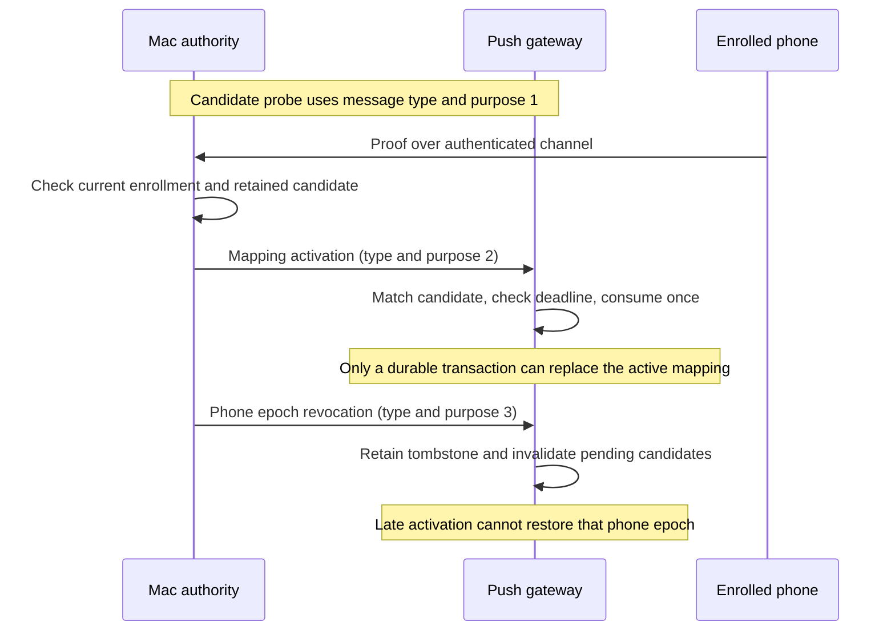

# Gateway recipient controls

Swift and Kotlin encode signed mapping activation and phone revocation claims. These codecs do not apply gateway state or authorize provider dispatch.

The diagram describes the integration contract. Candidate storage exists; activation, tombstones, the authority outbox and reconciliation remain separate work.

## Exact payloads

Both controls use this canonical CBOR map. Unknown or missing fields fail.

| Key | Activation | Phone revocation |
| --- | --- | --- |
| 0 | Schema: unsigned 1 | Schema: unsigned 1 |
| 1 | Full candidate binding | Phone epoch binding |
| 2 | Own unsigned revision, greater than zero | Own unsigned revision, greater than zero |
| 3 | Own operation ID: 16 bytes | Own operation ID: 16 bytes |
| 4 | Issue time: unsigned Unix milliseconds | Issue time: unsigned Unix milliseconds |
| 5 | Expiry: unsigned Unix milliseconds | Expiry: unsigned Unix milliseconds |
| 6 | Kind: unsigned 2 | Kind: unsigned 3 |

Expiry must exceed issue time. The parser preserves the full unsigned range. Lifetime and current-time checks belong to the stateful verifier.

Activation uses every field of the [candidate binding](gateway-token-registration.md#shared-binding), including candidate ID, token digest, challenge and enrollment tag.
Its revision, operation ID and times describe the activation, not the original candidate.
The retained candidate must preserve its own deadline. A fresh activation envelope cannot extend that deadline.
The activation also contains the provider challenge. Do not expose it or its retained receipt through phone-fetchable metadata.

The revocation binding contains exactly keys 0 through 6 from that binding: owner, Mac, account, gateway, gateway lifecycle, phone and enrollment epoch.
Each value is exactly 16 bytes. It has no candidate, token, challenge or enrollment tag.
Revocation targets one phone epoch. It does not revoke an entire gateway registration or a future, independently authorized enrollment.

## Signed envelope

`GatewayRecipientSigningInput` requires an explicit expected kind and validates that typed payload before encoding the signing input.

| Key | Value |
| --- | --- |
| 0 | Text domain: `dev.remozio.gateway` |
| 1 | Wire version: unsigned 1 |
| 2 | Message type: unsigned 2 for activation, 3 for revocation |
| 3 | Purpose: unsigned 2 for activation, 3 for revocation |
| 4 | Canonical payload bytes |

The verifier uses P-256/SHA-256 and a 64-byte raw signature. The public key must come from protected registration setup.
No incoming control can supply its own trusted key. Unsupported wire versions, unknown kinds and mismatched payload shapes fail.
Probe signatures, approval signatures and the other recipient purpose cannot substitute for the expected operation.
The outer kind also keeps these payloads distinct from the existing candidate and proof shapes.

## Application contract

A valid signature proves a claim from the selected key. Before changing a mapping, the gateway still needs these checks:

1. Match protected registration, lifecycle and current enrollment. Verify that the supplied trust snapshot is still current.
2. Check the control lifetime, operation identity and monotonic revision against durable state. Retry an identical operation without applying it twice.
3. For activation, match every binding field against the retained candidate and token. Require its original deadline and pending status.
4. Reject a revoked phone epoch regardless of the activation revision. A higher counter cannot clear a revocation tombstone.
5. Commit the receipt, candidate consumption, mapping change and revision together. For revocation, commit the tombstone and invalidate that epoch's candidates and mapping together.

The authority must verify the actual authenticated phone identity and consume its retained proof before issuing activation.
Candidate creation, invalid proof and expired proof must leave the prior mapping unchanged.
Routine token rotation remains automatic and introduces no biometric prompt.
Re-enrollment needs fresh administrative authorization and a new phone epoch.

Root desired state and its idempotent outbox must survive restart. Reconciliation must verify retained signed receipts against local trust history.
A gateway reporting a larger counter does not establish trust or solve whole-backup rollback detection.
Gateway uninstall, submission-credential rotation, acknowledgement and reconciliation message schemas are not defined here.

## Evidence

Both suites read `vectors/gateway-recipient-v1.json`: four valid controls and 134 malformed controls, plus public signature fixtures.
Tests cover every signed identity and metadata field, unsigned boundaries, wrong keys, domain and purpose substitution, version rejection and resource limits.
Kotlin also tests constructor and getter copies. Descriptions redact control values.
Fixture private keys were ephemeral and were not saved. These tests contact no device or provider.
