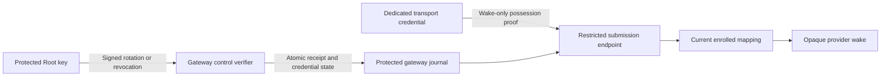

# Gateway submission credential controls

Swift and Kotlin encode Root claims that rotate or revoke a transport wake credential.
These codecs do not install a credential, change gateway state, or authorize a wake.

The diagram defines the remaining integration contract. The journal and submission endpoint do not yet apply these controls.
The Root control key, transport credential, and provider credential have separate purposes.
The credential control contains only a public key. Shared setup exports must exclude the corresponding private key and credential identity.

## Exact payload

The canonical CBOR map has exactly keys 0 through 8. Unknown or missing fields fail.

| Key | Rotation | Revocation |
| --- | --- | --- |
| 0 | Schema: unsigned 1 | Schema: unsigned 1 |
| 1 | Registration binding | Registration binding |
| 2 | Unsigned revision greater than zero | Unsigned revision greater than zero |
| 3 | Operation ID: 16 bytes | Operation ID: 16 bytes |
| 4 | Issue time: unsigned Unix milliseconds | Issue time: unsigned Unix milliseconds |
| 5 | Expiry: unsigned Unix milliseconds | Expiry: unsigned Unix milliseconds |
| 6 | Kind: unsigned 4 | Kind: unsigned 5 |
| 7 | New credential ID: 16 bytes | Revoked credential ID: 16 bytes |
| 8 | Uncompressed P-256 public key: 65 bytes, prefix 4 | Null |

The binding contains exactly five keys. Each value is 16 bytes:

| Key | Value |
| --- | --- |
| 0 | Owner ID |
| 1 | Mac ID |
| 2 | Account ID |
| 3 | Gateway ID |
| 4 | Gateway lifecycle epoch |

Expiry must exceed issue time. The codecs preserve the full unsigned range.
The public-key parser checks its encoding shape. Application must also validate the actual P-256 point before retaining a rotation.
Current time, bounded lifetime, registration trust, replay, and revision checks belong to the stateful verifier.

## Signature domain and compatibility

`GatewaySubmissionSigningInput` requires an explicit expected kind and validates the matching payload before encoding.

| Signing input key | Value |
| --- | --- |
| 0 | Text: `dev.remozio.gateway` |
| 1 | Wire version: unsigned 1 |
| 2 | Message type: unsigned 4 for rotation, 5 for revocation |
| 3 | Purpose: unsigned 4 for rotation, 5 for revocation |
| 4 | Canonical payload bytes |

The signature uses P-256/SHA-256 and the existing 64-byte raw format.
Select the trusted Root key from protected registration. Neither the incoming control nor its credential public key can establish trust.
A valid signature proves a claim. It does not prove that the gateway applied it.

Schema and signing wire version 1 are supported. Unknown versions and kinds fail.
Existing candidate and recipient formats remain unchanged. Their decoders reject these new shapes.
Older components do not gain these operations by accepting an existing version number.
Native IPC must explicitly negotiate support before submitting a credential control. Its version is independent of this signing version.

## Required durable application

1. Match the complete protected registration and its current lifecycle. Reject an inactive registration.
2. Authenticate the Root signature. Check freshness, bounded lifetime, operation identity, and the shared durable control revision.
3. Retry the same retained operation without applying it twice. Reject conflicting reuse of an operation identity.
4. Rotation replaces the current credential atomically. Use a fresh credential ID; never reuse a retired or revoked ID.
5. Revocation retains a tombstone for that credential ID. A delayed revocation of an older credential must not revoke a newer credential.
6. Commit the credential change, Root receipt, and shared revision together. Include that receipt in head and history recovery.
7. Recheck current credential, mapping, Root authority, presence, and original deadline before each provider handoff.

Transport possession must grant only opaque wake submissions to current enrolled mappings.
It must not change recipients, send arbitrary token probes, select provider tokens, retrieve provider secrets, or access approval details.
Rotation and revocation must preserve phone pairing and require no recurring gateway-operator action after setup.
Uninstall and gateway reactivation retain their separate lifecycle rules.

## Evidence and remaining work

Both suites read four valid controls and 124 malformed controls from `vectors/gateway-submission-v1.json`.
They verify unsigned boundaries, exact fields, wrong keys, purpose substitution, credential-key substitution, and signed-field mutations.
Kotlin also verifies stable constructor and getter copies. Descriptions redact values.
The fixture generator used disposable private keys and retained only public fixtures.

Durable credential storage, Root issuance, authenticated native submission, protected provisioning, rotation delivery, and provider tests remain required.
These protocol tests contact no provider or device and install no credential.
