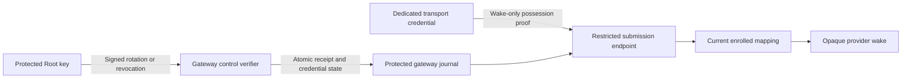
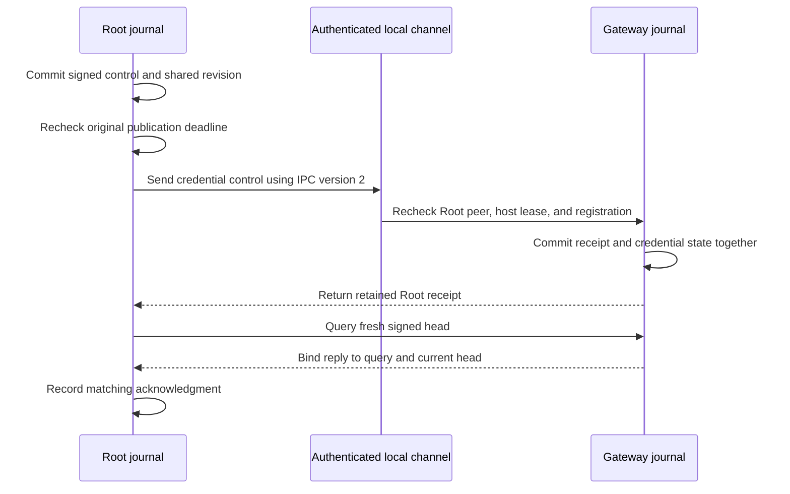

# Gateway submission credential controls

Swift and Kotlin encode Root claims that rotate or revoke a transport wake credential.
These codecs do not install a credential, change gateway state, or authorize a wake.



The macOS core journal applies these controls. The gateway exposes a separate restricted wake endpoint and client.
The Root control key, transport credential, and provider credential have separate purposes.
The credential control contains only a public key. Shared setup exports must exclude the corresponding private key and credential identity.

## Exact payload

The canonical CBOR map has exactly keys 0 through 8. Unknown or missing fields fail.

| Key | Rotation | Revocation |
| --- | --- | --- |
| 0 | Schema: unsigned 1 | Schema: unsigned 1 |
| 1 | Registration binding | Registration binding |
| 2 | Unsigned revision greater than zero | Unsigned revision greater than zero |
| 3 | Operation ID: 16 bytes | Operation ID: 16 bytes |
| 4 | Issue time: unsigned Unix milliseconds | Issue time: unsigned Unix milliseconds |
| 5 | Expiry: unsigned Unix milliseconds | Expiry: unsigned Unix milliseconds |
| 6 | Kind: unsigned 4 | Kind: unsigned 5 |
| 7 | New credential ID: 16 bytes | Revoked credential ID: 16 bytes |
| 8 | Uncompressed P-256 public key: 65 bytes, prefix 4 | Null |

The binding contains exactly five keys. Each value is 16 bytes:

| Key | Value |
| --- | --- |
| 0 | Owner ID |
| 1 | Mac ID |
| 2 | Account ID |
| 3 | Gateway ID |
| 4 | Gateway lifecycle epoch |

Expiry must exceed issue time. The codecs preserve the full unsigned range.
The public-key parser checks its encoding shape. Application must also validate the actual P-256 point before retaining a rotation.
Current time, bounded lifetime, registration trust, replay, and revision checks belong to the stateful verifier.

## Signature domain and compatibility

`GatewaySubmissionSigningInput` requires an explicit expected kind and validates the matching payload before encoding.

| Signing input key | Value |
| --- | --- |
| 0 | Text: `dev.remozio.gateway` |
| 1 | Wire version: unsigned 1 |
| 2 | Message type: unsigned 4 for rotation, 5 for revocation |
| 3 | Purpose: unsigned 4 for rotation, 5 for revocation |
| 4 | Canonical payload bytes |

The signature uses P-256/SHA-256 and the existing 64-byte raw format.
Select the trusted Root key from protected registration. Neither the incoming control nor its credential public key can establish trust.
A valid signature proves a claim. It does not prove that the gateway applied it.

Schema and signing wire version 1 are supported. Unknown versions and kinds fail.
Existing candidate and recipient formats remain unchanged. Their decoders reject these new shapes.
Older components do not gain these operations by accepting an existing version number.
Native IPC must explicitly negotiate support before submitting a credential control. Its version is independent of this signing version.

## Required durable application

1. Match the complete protected registration and its current lifecycle. Reject an inactive registration.
2. Authenticate the Root signature. Check freshness, bounded lifetime, operation identity, and the shared durable control revision.
3. Retry the same retained operation without applying it twice. Reject conflicting reuse of an operation identity.
4. Rotation replaces the current credential atomically. Use a fresh credential ID; never reuse a retired or revoked ID.
5. Revocation retains a tombstone for that credential ID. A delayed revocation of an older credential must not revoke a newer credential.
6. Commit the credential change, Root receipt, and shared revision together. Include that receipt in head and history recovery.
7. Recheck current credential, mapping, Root authority, presence, and original deadline before each provider handoff.

Transport possession must grant only opaque wake submissions to current enrolled mappings.
It must not change recipients, send arbitrary token probes, select provider tokens, retrieve provider secrets, or access approval details.
Rotation and revocation must preserve phone pairing and require no recurring gateway-operator action after setup.
Uninstall and gateway reactivation retain their separate lifecycle rules.

## Evidence and remaining work

Both suites read four valid controls and 124 malformed controls from `vectors/gateway-submission-v1.json`.
They verify unsigned boundaries, exact fields, wrong keys, purpose substitution, credential-key substitution, and signed-field mutations.
Kotlin also verifies stable constructor and getter copies. Descriptions redact values.
The fixture generator used disposable private keys and retained only public fixtures.

The macOS core authenticates the Root claim and the actual P-256 point before application.
It commits the signed receipt and shared revision together. Signed receipts define credential state; there is no separate unsigned active-key cache.
Rotation requires a fresh ID. Revocation retains a tombstone, including for an unknown ID.
A late revocation of an older ID leaves its replacement active. Exact retries return the retained receipt after expiry or restart without restoring state.
Credential reads authenticate every retained credential row before filtering. This prevents altered index columns from hiding a signed revocation.
The shared operation limit bounds those reads. Cost grows with retained credential history.

Gateway store schema 4 requires explicit protected migration from schemas 1, 2, or 3.
Runtime opening does not migrate or recreate an older store. Migration preserves existing receipts and rolls back on failure.
Head and history replies include kinds 4 and 5 and retain their Root signatures.
Older decoders reject these kinds. Existing query shape and signature domains remain unchanged.

## Root issuance and native delivery

Root store schema 16 adds signed credential history to the shared control head and capacity limit.
Protected setup installs it explicitly after the code policy, history recovery, and command replay schemas exist.
Installation changes the authority continuity digest. Setup must checkpoint that change before runtime activation.
Runtime opening does not install or recreate the table.

Root assigns each rotation a fresh credential ID, operation ID, and revision.
The caller supplies a staged public key and the protected Root signer. The journal stores no private key.
Publication requires the original process run and both original deadlines.
After restart, explicit renewal uses only current retained intent and creates a fresh operation and credential ID.
Renewal may retain the public key. It cannot restore a superseded or revoked rotation.
Revocation can retain an unknown credential tombstone without changing phone pairing.



The native gateway advertises IPC version 3. The Root client supports peers advertising versions 1, 2, and 3.
Existing commands retain version 1. Credential command 7 uses version 2 and a version 2 reply.
The Root client rejects credential delivery to a version 1 peer before sending. Unknown versions fail closed.
Root delivery registration is command 8. It uses version 3 and a version 3 reply.
The client rejects registration to a version 1 or 2 peer before sending any delivery fields.
An older Root client cannot connect to the upgraded gateway; bundled components must update together.
IPC compatibility does not change credential schema or signing wire version 1.

Root schema 16 can reconcile authenticated missing credential receipts from gateway history.
Recovered receipts retain historical intent. They restore neither a private key nor a fresh publication deadline.
Credential recovery leaves phone trust unchanged. Older Root stores still reject unsupported credential recovery.

The in-process test covers issuance, endpoint checks, coordinator application, retry, and a fresh acknowledgment.
It contacts no provider or device and installs no runtime credential.
It does not prove OS peer credentials or service-account installation.
Protected provisioning, continuity checkpoint integration, transport key custody, runtime delivery, and provider tests remain required.

## Restricted wake delivery

Root registers a current retained delivery over its authenticated control channel.
The gateway preserves its opaque identity, recipient epoch, original admission time, and original deadline.
Registration schedules nothing. Repeating it cannot renew the deadline or switch its origin to a direct Root wake.
Root withdrawal, enrollment removal, expiry, and process shutdown retire its authority.
The registry is transient and shares the bounded wake-entry limit. Restart requires Root to supply still-valid deliveries again.

```mermaid
sequenceDiagram
    participant R as Root request owner
    participant G as Gateway
    participant T as Transport account
    participant F as FCM
    R->>R: Recheck retained request and enrollment
    R->>G: Register original delivery over Root IPC 3
    T->>G: Verify wake-only IPC 1 handshake
    T->>G: Request one-use connection challenge
    G-->>T: Random 32-byte challenge
    T->>G: Signed scope, credential ID, delivery ID, challenge
    G->>G: Consume challenge; verify current credential and Root grant
    G->>G: Recheck presence, lease, mapping, and original deadline
    G->>F: Obtain OAuth access
    G->>G: Repeat authority checks after asynchronous waits
    G->>F: Send opaque enrollment wake
```

The restricted interface contains only `hello`, `challenge`, and `wake`.
Its connection policy requires the dedicated non-root transport UID, signed component identity, and approved code hashes.
The native client verifies the gateway account on every reply. It sends no proof before a supported handshake.
The endpoint checks each invocation before decoding or starting asynchronous work.
Its connection limit, operation budget, handshake timeout, and challenge lifetime are bounded local settings.
Transport connection loss cancels its work. It does not retire the separate Root connection.

The wake payload is an exact canonical CBOR map. Schema 1 has these fields:

| Key | Value |
| --- | --- |
| 0 | Schema: unsigned 1 |
| 1 | Five-element array: owner, Mac, account, gateway, lifecycle IDs; each 16 bytes |
| 2 | Current credential ID: 16 bytes |
| 3 | Root-registered delivery ID: 16 bytes |
| 4 | Connection challenge: 32 bytes |

The P-256/SHA-256 signature uses 64 raw bytes. Its signing map has exactly keys 0 through 3.
They contain `dev.remozio.gateway.wake`, unsigned wire version 1, unsigned purpose 1, and canonical payload bytes.
Unknown fields and versions fail. No transport field can specify a recipient, token, request details, or deadline.
The endpoint consumes a challenge once and rejects stale, superseded, or crossed connection challenges.
The coordinator checks the original challenge deadline again when its actor accepts the proof.

Credential rotation or current-credential revocation pauses affected queued work.
A new current proof can resume the same Root grant without new pairing.
The frozen wake identifier, original deadline, pacing, and each delivery's attempt count remain unchanged.
A paused batch does not block newer authorized deliveries to the same phone.
A provider result updates only the members that passed the final authority check.
Revoking an older credential does not interrupt a current credential's wake.

Protected gateway configuration schema 1 retains the Root-only listener.
Schema 2 adds the separate wake service and its account, code policy, limits, and challenge lifetime.
It rejects shared Root/transport component identities, shared service names, and overlapping transport, gateway, or owner accounts.
Canonical decoding rejects duplicate or unsorted code pins. Unknown configuration versions fail.
Protected setup must publish both Mach services before enabling schema 2.

Tests cover native client-to-endpoint-to-coordinator delivery using disposable keys and injected peer checks.
They cover challenge expiry at actor admission and authority changes during OAuth, without contacting FCM.
They also cover rotation, preserved retries, partial coalesced batches, original deadlines, and independent new deliveries.
These tests do not prove OS code validation, service-account provisioning, protected key custody, or device notification receipt.
The retained Root request publisher, signer provisioning, startup migration, and provider/device tests still require integration.

## Dedicated transport wake signer

`GatewayWakeSigner` restores a distinct local key and signs only a typed wake submission.
It checks all five registration identifiers and the current credential ID before signing.
It uses the existing wake signing purpose and verifies each signature against the provisioned public key.
The typed channel overload builds the submission from a fresh gateway challenge and this protected signer identity.
It preserves the existing handshake, peer checks, timeout, and one-at-a-time transaction.

Protected provisioning chooses Secure Enclave custody or the explicit transport-only private-file option.
Both use a private record owned by the dedicated transport account, under protected Root-owned ancestors.
The hardware record contains a device-bound wrapped representation. The file option contains private P-256 bytes.
The loader requires matching real and effective transport UIDs before reading the record.
Missing, malformed, mismatched, or inaccessible material fails without key creation, rotation, or custody fallback.
Hardware restoration and signing forbid authentication dialogs.
Authority and recipient keys retain their separate hardware-only requirements.

The Root-owned public configuration contains local identity pins and the record location, never private key material.
Configuration schema 1 has this exact canonical CBOR map:

| Key | Value |
| --- | --- |
| 0 | Schema: unsigned 1 |
| 1 | Owner, Mac, account, gateway, lifecycle IDs; each 16 bytes |
| 2 | Current credential ID: 16 bytes |
| 3–5 | Transport, owner, and gateway UIDs; nonzero and distinct |
| 6–8 | Wake Mach service, signing team, and gateway component identifier |
| 9 | Sorted distinct approved gateway code hashes |
| 10 | Custody: 1 for Secure Enclave; 2 for explicit private file |
| 11 | Absolute protected key record path |
| 12 | P-256 public key: valid uncompressed point, 65 bytes |
| 13 | Client timeout: 1 through 60,000 milliseconds |

The private key record uses schema 1 and exact keys 0 through 5.
They contain the schema, five identity IDs, credential ID, public key, custody, and private or wrapped representation.
Unknown versions, fields, and custody values fail. The record must match every configured identity pin and custody choice.
Neither the record nor its per-Mac configuration belongs in a shared setup export.

Tests use disposable file keys to prove purpose separation, substitution rejection, account checks, and typed channel composition.
They do not prove Secure Enclave restoration under a service account or installed file ownership.
Protected setup must stage these records, prevent reuse of TLS keys, and publish the public credential through Root history.
The transport runtime must reconcile credential activation and rotation before selecting a signer.
Installed XPC and key custody checks remain required before production activation; see issue #286.
