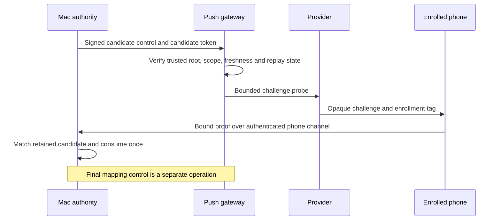

# Gateway token registration

These Swift and Kotlin types encode a candidate probe and its phone receipt. They do not activate a push recipient.

The diagram describes the integration contract. This change implements only the typed payloads and candidate signature verification.

## Shared binding

Both messages contain this exact CBOR map. All fields are byte strings.

| Key | Field | Bytes |
| --- | --- | --- |
| 0 | Owner ID | 16 |
| 1 | Mac ID | 16 |
| 2 | Account ID | 16 |
| 3 | Gateway ID | 16 |
| 4 | Gateway lifecycle epoch | 16 |
| 5 | Phone ID | 16 |
| 6 | Phone enrollment epoch | 16 |
| 7 | Candidate ID | 16 |
| 8 | Token digest | 32 |
| 9 | Provider challenge | 32 |
| 10 | Enrollment tag | 32 |

The token digest is SHA-256 of the exact UTF-8 registration token. The gateway must check it against the submitted token before sending.
The raw token is excluded from these payloads. The challenge must be unpredictable and unique to the retained candidate.
The enrollment tag identifies the intended enrollment without exposing approval content to the provider.

## Candidate control

`GatewayTokenCandidate` has these exact outer fields:

| Key | Value |
| --- | --- |
| 0 | Schema: unsigned 1 |
| 1 | Shared binding map |
| 2 | Unsigned revision, greater than zero |
| 3 | Operation ID: 16 bytes |
| 4 | Issue time: unsigned Unix milliseconds |
| 5 | Expiry: unsigned Unix milliseconds, greater than issue time |

The signature covers a deterministic CBOR map with keys 0 through 4:

| Key | Value |
| --- | --- |
| 0 | Text domain: `dev.remozio.gateway` |
| 1 | Wire version: unsigned 1 |
| 2 | Message type: unsigned 1, candidate probe |
| 3 | Purpose: unsigned 1, candidate probe |
| 4 | Canonical candidate payload bytes |

The signing API first validates the typed candidate. It rejects other wire versions and proof payloads.
Signatures use the existing P-256/SHA-256 verifier and 64-byte raw signature representation.
The caller supplies the root key pinned during authenticated gateway setup. A key supplied by the message cannot establish trust.
Approval signatures and other gateway purposes cannot substitute for this signature.

A valid candidate control permits only its bounded probe. It does not authorize recipient activation, enrollment, revocation reversal, or an approval.
[Recipient controls](gateway-recipient-controls.md) use distinct types and purposes for mapping activation and phone revocation.
Acknowledgement and reconciliation controls remain separate work.

## Phone proof

`GatewayTokenProof` contains exactly key 0, schema unsigned 1, and key 1, the shared binding map.
It has no standalone signature wrapper. The proof must arrive through the authenticated, encrypted phone-to-Mac channel.
The authority must bind the actual channel identity to the phone and its current enrollment.

The challenge must reach the phone only through the provider probe. Do not include it in phone-fetchable metadata or echo the candidate control to the phone.
Otherwise, a phone could construct a matching proof without receiving a provider message.
Other binding metadata can travel through the authenticated channel without the challenge.
Normal token rotation does not introduce a biometric prompt.

## Stateful integration requirements

Before sending a probe, the gateway must check the trusted owner, Mac, account, gateway epoch, phone enrollment, revision and operation ID.
It must enforce expiry, a bounded lifetime, duplicate handling, probe limits, and retained revocation tombstones.
A higher revision alone does not establish authority or repair rolled-back trust state.

Before activation, the authority must match every proof field against its retained, unexpired candidate and the current enrollment state.
It must check the candidate token digest and enrollment tag, consume the candidate once, then issue a separate mapping control.
State changes require durable transactions and the planned outbox and reconciliation rules.
These codecs provide none of those stateful checks. They do not solve whole-backup rollback detection.

## Validation and limits

All encode and decode calls require explicit byte, depth and item limits. Unknown fields, missing fields, wrong types and invalid lengths fail.
Timestamps retain the full unsigned range; current time and maximum lifetime are policy checks outside the parser.
Value descriptions redact their content. Kotlin constructors and getters copy mutable byte arrays.

The shared `vectors/gateway-token-v1.json` fixtures cover canonical bytes, integer boundaries, malformed fields and signature domains.
Both language suites reject modified binding fields, modified control metadata, wrong keys, wrong purposes and approval-domain signatures.
Fixtures contain disposable public keys and signatures only. Tests contact no provider or device.
