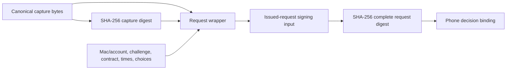

# Issued-request wrapper, version 1

`IssuedRequestPayload` constructs and parses the common request body. It checks the capture digest, action policy, and explicit local capability set. It does not authenticate the Mac or validate the meaning of a command or prompt capture.

The body belongs to approval wire version 1, message type Request, purpose Issued request. The wrapper version and the per-kind action schema are separate fields. Transport envelope negotiation remains separate from both.

## Exact field map

All fields are required. Reject unknown fields, unsupported wrapper versions, invalid types, and malformed canonical encoding.

| Key | Value | Representation |
| --- | --- | --- |
| 0 | Common wrapper version | Unsigned `1` |
| 1 | Stable Mac identity | 16 opaque bytes |
| 2 | Account identity | 16 opaque bytes |
| 3 | Request identity | 16 opaque bytes |
| 4 | Challenge | 32 bytes |
| 5 | Request kind | Unsigned tag below |
| 6 | Per-kind action schema version | Positive unsigned integer |
| 7 | Required feature tags | Strictly increasing unsigned array |
| 8 | Creation time | Unix milliseconds, unsigned |
| 9 | Remozio expiry information | Unix milliseconds, unsigned |
| 10 | Original canonical capture | Byte string containing a CBOR map |
| 11 | Capture digest | SHA-256 of field 10's exact bytes |
| 12 | Permitted action choices | Ordered array of action maps |

Kind tags are command `0`, 1Password access `1`, 1Password unlock `2`, and Little Snitch `3`. Unknown tags fail. The IDs use the same opaque representation as the [decision payload](decision-payload.md). Creation requires a fresh random challenge from the authority; this codec only checks its length.

The action map uses the decision contract's explicit choice/scope tags. The list must be nonempty. Each complete `(choice, scope)` pair must be distinct and valid under the action policy for the request kind. The same choice tag can appear with different scopes: Allow for this session and Allow forever are separate offered actions. Preserve their supplied order. Do not reinterpret the first choice as the default: the per-kind capture must bind and validate any observed default separately.

Feature tags describe a set. Construction sorts them; parsing rejects duplicates or an unsorted array. Choices remain an ordered list and are never sorted.

## Supported contracts are explicit

Parsing requires `localCapabilities`. The exact `(request kind, wire version 1, action schema version)` must exist in that map, and its feature set must contain every required feature. An empty map accepts no request. There is no default range or fallback schema.

Supply capabilities from locally implemented capture handlers and current trusted policy. Never construct this argument from an untrusted peer advertisement. The common wrapper preserves capture bytes but does not interpret their fields. Before showing actionable controls, the selected handler must validate every semantic field and render the exact understood capture. Unknown critical capture fields or semantics must fail there.

The test capabilities are synthetic. This change does not advertise production support for any command or prompt schema. It provides no capture adapter, default-scope selection, credential access, or target execution.

## Two digests

The constructor computes the capture digest. The decoder recomputes it and rejects a supplied mismatch. This detects inconsistent capture data; it does not authenticate its source.

`requestDigest` computes SHA-256 of the complete [issued-request signing input](signing-input.md), including its domain, wire version, type, purpose, and canonical body. This is the digest that the phone decision binds. It includes the capture digest and every metadata field, but excludes the request signature itself. The inner and complete digests must never be substituted for each other.

The immutable capture bytes survive parsing and encoding without normalization. This includes text byte spelling inside the capture. Kotlin copies incoming arrays and collections and exposes immutable collections or byte copies. Swift retains value semantics.

## Time and authority

Creation must precede expiry in the transmitted information. These wall-clock values are informative. The Mac retains a separate, trusted monotonic deadline that includes sleep; phone time or clock skew cannot extend authority. No codec method decides whether a request is currently valid.

Creation is not the target dialog's first-seen time. The per-kind capture and authenticated timing updates still need target age, observed deadline, default effects, and uncertainty. Refreshing a request must preserve those target facts. Each new authorization, including refresh, has a fresh request ID and challenge. Re-delivery retains the exact issued body. A conflicting body under the same Mac/account/request identity is a protocol error; it cannot reset a phone session.

Before accepting a decision, verify current authority and enrollment, negotiated support and security floors, the retained full request digest, challenge, selected choice, key purpose, revocation, monotonic expiry, target validity, and atomic consumption. This wrapper replaces none of those checks.

## Bounds and evidence

Construction and decoding require independent body and capture limits. Complete digest calculation also requires a separate signing-input limit. Oversized bytes, containers, or nesting fail without truncation. Test budgets are not product payload caps.

Nine valid shared fixtures cover every request kind, exact capture bytes, action order, scope variations, and unsigned boundaries. Fifty-eight invalid fixtures cover fields, versions, capabilities, types, digest mismatch, feature ordering, action compatibility, times, and canonical encoding. Native Swift and Kotlin hash results match independently generated SHA-256 vectors. Additional tests cover mutation isolation, independent limits, and changes to request bindings.

The fixtures use invented identities, captures, capabilities, and timestamps. No real command, prompt, key enrollment, network endpoint, or device operation is exercised.
