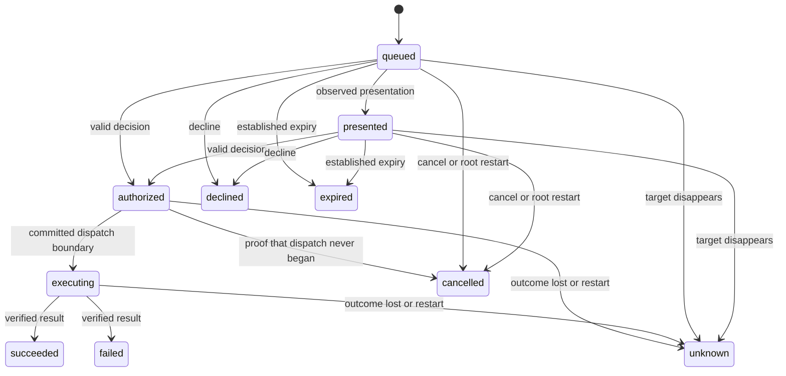

# Request lifecycle

Swift and Kotlin share the same transition contract. The [fixture](vectors/lifecycle-v1.json) lists allowed edges; tests reject every other state/event pair.

An authorization can arrive while the request is queued. Phone presentation acknowledgments do not gate valid decisions. Closing a phone sheet is not an event here; it leaves the Mac request pending.

## Authority integration

This module contains pure transition rules. It supplies neither authentication nor concurrency control, storage, clocks, or dispatch permits. The Android app can use the model for display, but only the Mac authority changes authoritative state.

The authority must perform these operations under its exclusive writer and transaction:

1. Load the retained request and current state.
2. Check enrollment, signature, challenge, action binding, expiry, and current target eligibility.
3. Evaluate the action policy and this transition rule.
4. Commit consumption and audit evidence through the journal/checkpoint protocol.
5. Dispatch only after that protocol confirms a complete commit.

The first valid decision accepted by the Mac wins. A later competing decision gets Already handled and the retained winner. The transition function rejects the second change; the caller must supply that richer response from the ledger. Device timestamps do not establish priority.

`authorize` includes external Allow, Deny, and target Cancel actions. The action policy distinguishes them from `decline`, which resolves the request without touching the target. The lifecycle retains no target strings, credentials, or command arguments.

## Evidence and time

`expire` is valid only before consumption. The caller must establish expiry from a trusted deadline or an observed target timeout. An estimated 1Password deadline, target disappearance, or missed notification is not proof of expiry. Original first-seen age and authoritative deadlines must survive transport reconnects. Deadline comparisons must include sleep and must not use phone wall-clock timestamps.

`loseTarget` records Unknown when a pending target disappears without an established result. It never authorizes a retry or changes a consumed request.

`beginDispatch` marks entry into the uncertain side-effect boundary, not proof that a click or child process started. Loss of acknowledgment after consumption becomes Unknown. An execution timeout cannot turn into Expired.

`proveNoDispatch` is reserved for a journal recovery result that proves no actor could have dispatched. A timeout or missing acknowledgment is insufficient. Without that proof, root restart turns authorized/executing requests into Unknown. Pending requests become Cancelled and require fresh submission or eligible recapture.

All terminal states reject every event. Late evidence may be recorded separately, but it cannot reopen a request, authorize a retry, or rewrite an Unknown outcome as success. The same rule prevents a migration or restored history from resurrecting a request.

This change does not implement the durable journal, identity verification, deadline source, target reconciliation, or multi-process locking. Those remain separate integration gates.
