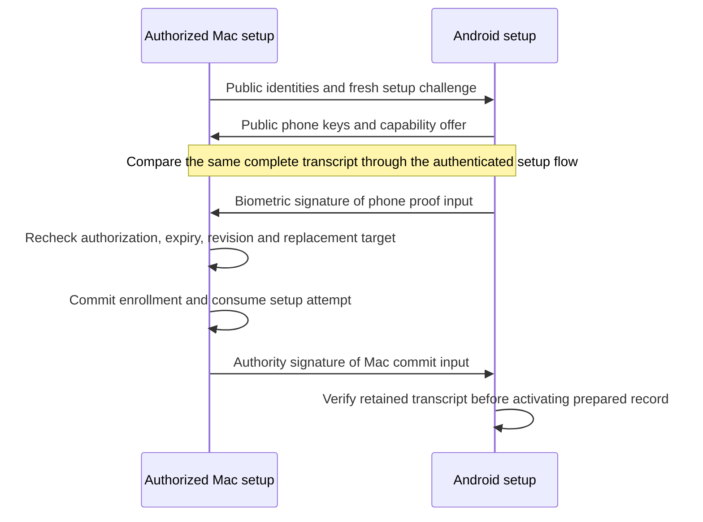

# Pairing transcript version 1

The transcript binds public setup claims before either host activates an enrollment. It does not create trust. The Mac host must verify administrator authorization, the retained setup attempt, expiry, and the phone biometric proof. The phone must independently authenticate the Mac and verify the committed result.

## Encoding

Use deterministic CBOR. The outer map allows exactly keys 0 through 14. Unknown schema versions, fields, noncanonical encodings, or incompatible offers fail. Maximum transcript size is 132,000 bytes, depth 4, and 80 outer items. Embedded channel offers have their own existing limits: 65,536 bytes, depth 5, and 5,000 items each.

| Key | Value |
| --- | --- |
| 0 | Schema version 1 |
| 1 | Fresh 16-byte setup ID |
| 2 | Fresh 32-byte setup challenge |
| 3 | Canonical phone ChannelOffer bytes |
| 4 | Canonical Mac ChannelOffer bytes |
| 5 | Required minimum envelope version |
| 6 | Selected envelope version |
| 7 | Mac authority P-256 point |
| 8 | Mac transport P-256 point |
| 9 | Three key rows in transport, decision, biometric order |
| 10 | Fresh 32-byte enrollment notification tag |
| 11 | Null for add, or [old phone ID, old enrollment epoch] for replacement |
| 12 | Expected Mac trust revision |
| 13 | Issue time, unsigned Unix milliseconds |
| 14 | Expiry time, unsigned Unix milliseconds, after issue time |

Each key row is [16-byte key ID, 65-byte uncompressed P-256 point]. All five public points must differ. Phone key IDs must differ. Keys are validated as curve points. Transport points identify the same keys that transport adapters encode as SPKI; they do not include certificates.

Both offers must use the same Mac/account/phone/epoch scope. Roles must be phone and Mac, and their nonces must differ. Selection must equal the highest shared version at or above the supplied minimum. The host must check that this minimum matches its retained policy; a peer cannot choose the security floor. A replacement epoch must differ from the proposed new epoch. The host must match the old phone and epoch to the exact selected current enrollment.

## Proof inputs

Both proof inputs are deterministic maps:

| Key | Value |
| --- | --- |
| 0 | `dev.remozio.pairing` |
| 1 | Version 1 |
| 2 | Purpose: 0 for phone biometric proof; 1 for Mac commit receipt |
| 3 | Complete canonical transcript bytes |

Proof inputs allow 132,096 bytes, depth 3, and 16 items. Sign with ECDSA P-256 and SHA-256 using the existing 64-byte r/s signature format. A proof for one purpose cannot verify for the other. The digest is SHA-256 of the phone proof input. It is a full transcript fingerprint, not a specified abbreviated human verification code.

The verifier takes an explicit public key. The caller selects it from the retained setup context and expected role. Mathematical verification alone proves neither administrator authorization nor Android hardware custody or biometric enforcement. Do not use the phone transport or decision key as enrollment authority.

## Host obligations and remaining integration

The Mac must retain a bounded, fresh, expiring setup attempt. Recheck elapsed deadlines and the exact transcript at commit; wall-clock fields alone are not freshness. Consume setup identity and expected trust revision with the enrollment write. Sign a commit receipt only after durable success. A receipt replay can reconcile that exact completed setup; it cannot create another enrollment or restore revoked trust.

Android must retain PREPARED state and the exact expected transcript through ambiguous completion. A Mac receipt must use the independently authenticated authority key and match that record before activation. Key aliases, private keys, relay credentials, and setup export secrets are excluded from this public transcript. Secure delivery and persistence of confidential routing configuration remain host work.

The existing design still requires QR and equivalent text pairing, human verification, administrator authorization, and a phone biometric. These codecs do not implement those flows, an invitation endpoint, a verification-code UX, or crash recovery. No network message can call privileged enrollment merely because it decodes here.

Shared add/replacement vectors test identical Swift/Kotlin bytes and digests. Invalid vectors cover malformed keys, repeated identities, incompatible roles and versions, expiry ordering, and schema changes. Tests also verify purpose separation and altered setup claims. Physical pairing and hardware proof remain untested.
