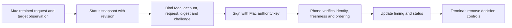
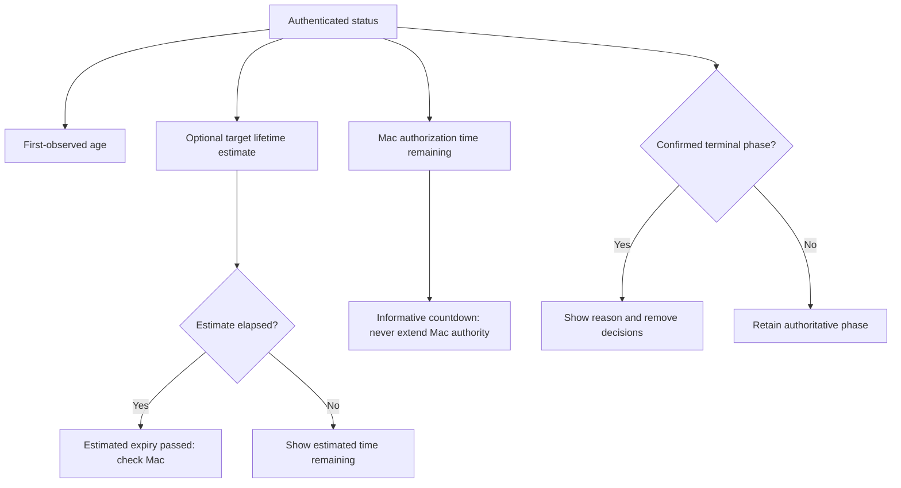

# Request status, version 1

`RequestStatusPayload` encodes a Mac status claim for an existing issued request. It separates an authoritative outcome from timing information. Parsing does not authenticate the claim or establish freshness.

The body uses approval wire version 1, message type Status, purpose Status. Use the [signature input](signing-input.md) and the current, trusted Mac authority key. A phone decision key cannot issue Mac status.

## Exact body

All keys are required, including explicit nulls. Reject extra keys, unknown tags, wrong types, invalid lengths, and noncanonical encoding. Caller-provided limits bound encoding and decoding.

| Key | Field | Representation |
| --- | --- | --- |
| 0 | Body schema | Unsigned `1` |
| 1 | Mac identity | 16 bytes |
| 2 | Account identity | 16 bytes |
| 3 | Request identity | 16 bytes |
| 4 | Complete issued-request digest | 32 bytes |
| 5 | Request challenge | 32 bytes |
| 6 | Status revision | Positive unsigned integer |
| 7 | Request phase | Unsigned tag below |
| 8 | Status reason | Unsigned tag below |
| 9 | Original observation identity | 16 bytes |
| 10 | Age since first observation | Unsigned milliseconds, sampled on the Mac |
| 11 | Remaining authorization time | Unsigned milliseconds for queued/presented; otherwise null |
| 12 | Estimated target lifetime | Positive unsigned milliseconds from first observation, or null |
| 13 | Observation started late | Boolean |
| 14 | Age at terminal transition | Unsigned milliseconds for terminal phases; otherwise null |
| 15 | Deciding phone identity | 16 bytes when known; otherwise null |

The digest covers the complete issued-request signing input. It is not the inner capture digest. Status cannot replace an issued request or change its challenge, capture, or offered actions.

The Mac creates a random observation identity when it first captures a command submission or target dialog. Recapture of that same target and challenge refresh preserve this identity and its first-observed time. A new original operation gets a new identity. Matching bytes alone do not prove that two dialogs are the same target; the adapter must establish continuity.

The deciding phone is descriptive. It identifies the accepted phone decision when one exists, including a decline or cancellation. It grants no authority and does not prove dispatch or success. Pending phases require null. Later phases permit null when no phone decision is known. A receiver must not invent a phone name for an unknown identity.

## State and reason

| Phase | Tag | Allowed reasons |
| --- | --- | --- |
| Queued | 0 | None |
| Presented | 1 | None |
| Authorized | 2 | None |
| Executing | 3 | None |
| Succeeded | 4 | Verified result |
| Failed | 5 | Verified result |
| Unknown | 6 | Outcome unavailable; target disappeared before consumption; authority restarted |
| Declined | 7 | Declined |
| Cancelled | 8 | User cancelled; target disappeared; authority restarted; no dispatch proved |
| Expired | 9 | Authorization expired; target timed out |

Reason tags are: none `0`, verified result `1`, outcome unavailable `2`, declined `3`, user cancelled `4`, authorization expired `5`, target timed out `6`, target disappeared `7`, authority restarted `8`, and no dispatch proved `9`.

The codec rejects combinations outside this table. It cannot prove an outcome or check the transition from previously retained state.

“Unknown / target disappeared” ends the pending Remozio request without naming a deciding phone. The earlier “Cancelled / target disappeared” pair remains accepted for compatibility. It does not claim that Remozio cancelled the original operation or knows why its dialog disappeared. Present it as “No longer available · reason unknown.” A target timeout and a disappearance are different observations.

After authorization or dispatch, disappearance must follow the existing consumption and outcome rules. It cannot become harmless expiry or cancellation without proof that no action dispatched. A failed result requires affirmative failure evidence; loss of a response produces Unknown.

## Timing has separate meanings

The Mac samples age and remaining time together using a monotonic clock that includes sleep. Do not derive them by subtracting unrelated wall clocks. Age continues after completion; terminal age records when the terminal event occurred and cannot exceed the sampled age.

The target lifetime is an estimate, initially about 60 seconds for a supported 1Password prompt. It is not a target deadline or a universal promise. Null means there is no estimate. Late observation warns that the target may disappear sooner than the estimate suggests. The per-kind adapter must validate that this estimate applies to its supported prompt type and version.

An elapsed estimate does not change the phase. A pending snapshot may also report zero remaining authorization time while expiry processing catches up. Zero is not permission to act. The Mac's retained monotonic deadline remains decisive even when a phone displays older information.

On the phone, elapsed time must include sleep. Add measured delivery delay only when the authenticated transport can bound it. Otherwise show timing uncertainty and retain a lower-bound age. Do not use a fresh receipt timestamp to make an old signed snapshot look newly sampled.

Unsigned values can reach their full wire range. Receivers must check or saturate arithmetic; converting to signed durations must not wrap. Estimated remaining time floors at zero. A terminal timestamp or an unknown outcome never turns into a new pending request through arithmetic.

## Receiver and producer obligations

The Mac serializes status publication with its retained lifecycle and durable consumption state. It increments the revision whenever it publishes a new snapshot for this request. It never reuses a revision for different bytes or wraps the counter. A duplicate transmission repeats the same signed body.

Authenticate the current channel and authority, then match all five request bindings against the retained issued request. Validate the per-kind timing facts, observation continuity, and deciding phone against that context. The parser accepts only the shape of these claims.

The phone retains the highest accepted revision within that complete binding. Reject older snapshots; equal revisions must have identical bytes and cannot restart a countdown. Newer snapshots must pass transition checks, including immutable terminal results and nondecreasing observed age. Coalesced updates may skip intermediate phases; they cannot contradict an already known result.

A signed revision is not proof of freshness on a new connection or after process death. Reconnect must use the authenticated synchronization protocol and its freshness evidence before presenting actionable controls. These codecs do not implement that synchronization protocol. The shared phone core implements in-memory revision tracking and the Android reducer.

Terminal status removes controls on all receiving phones. An in-flight decision can still reach the Mac before dismissal; only serialized Mac admission and durable consumption choose the winner. A phone UI or this codec cannot arbitrate that race.

Status bodies contain no command bytes, UI text, destination, secret, or free-form diagnostic text. Pending request data stays in memory under the existing policy. Status is not an audit record; durable history has its own authenticated epochs, sequence, and retention contract.

## Evidence and remaining integration

Twenty shared valid fixtures cover every allowed phase/reason pair, absent estimates, zero timing, late observation, elapsed estimates, terminal age, and unsigned boundaries. The 174 rejected fixtures cover missing/extra fields, malformed bindings, unknown tags, invalid phase/reason pairs, a deciding phone on Unknown target disappearance, inconsistent timing, and canonical encoding failures.

Swift and Kotlin test exact field values and byte-for-byte re-encoding. Additional tests cover constructor validation, defensive byte copies, independent size/item limits, and elapsed estimates that remain pending. The native Swift signature test mutates each body field and the signing domain.

No network, live adapter, phone notification, countdown UI, or action dispatch is connected by this change. Live authority verification, freshness synchronization, revision reduction, and device timing behavior remain separate integration work.
