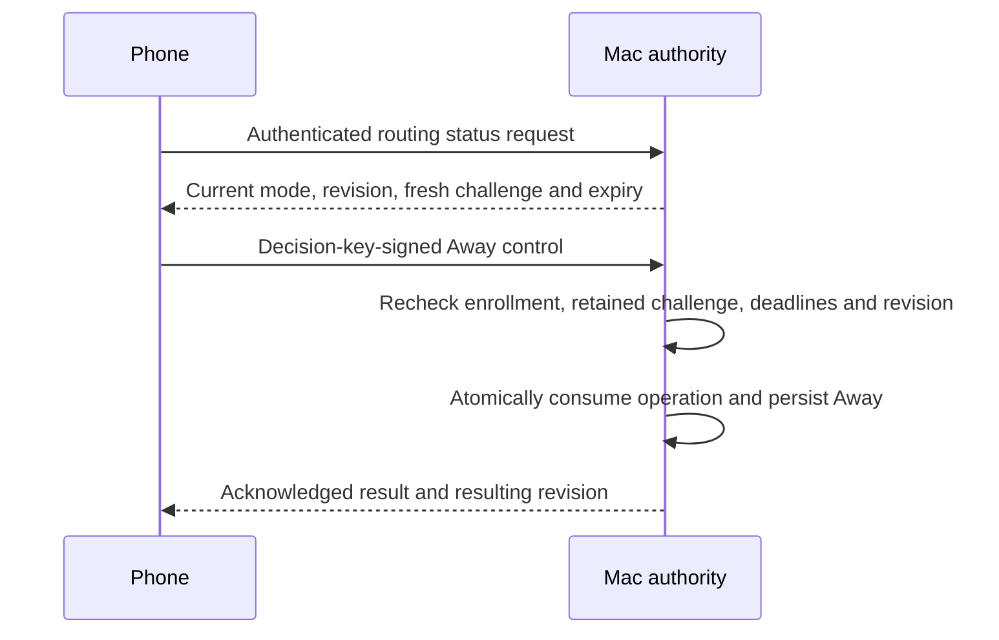

# Phone routing control, version 1

The phone can request Away for one enrolled Mac/account. Automatic and Present remain local Mac controls.
This changes request delivery only. It cannot approve an action, change enrollment, extend a request, or disable biometrics.
The Set Away tap uses the enrolled decision key. It needs no biometric prompt or extra confirmation.

## Payload

`RoutingAwayControl` uses a closed deterministic CBOR map. All fields are required.

| Key | Field | Value |
| --- | --- | --- |
| 0 | Schema | Unsigned 1 |
| 1 | Mac ID | 16 bytes |
| 2 | Account ID | 16 bytes |
| 3 | Phone ID | 16 bytes |
| 4 | Enrollment epoch | 16 bytes |
| 5 | Operation ID | 16 bytes |
| 6 | Authority challenge | 32 bytes |
| 7 | Decision key ID | 16 bytes |
| 8 | Expected routing revision | Full unsigned 64-bit value, including zero |
| 9 | Issued time | Unsigned Unix milliseconds |
| 10 | Expiry | Unsigned Unix milliseconds, greater than issued time |
| 11 | Requested mode | Unsigned 2, Away |

Mode values 0 and 1 are reserved for Automatic and Present. This phone control rejects both, including correctly signed payloads.
Unknown fields, versions, modes, lengths, types, noncanonical encodings, and trailing bytes fail.
Every call uses explicit byte, depth, and item limits. The codec does not set a production lifetime or message budget.
Kotlin constructors and getters copy mutable byte arrays. Both implementations redact descriptions.

## Signature

Sign the deterministic CBOR map `{0: "dev.remozio.routing", 1: 1, 2: 1, 3: 1, 4: payloadBytes}`.
These fields bind the domain, wire version, control message type, Away purpose, and exact canonical payload.
Use the existing P-256/SHA-256 format: a 65-byte uncompressed public key and a 64-byte raw `r || s` signature.
Approval, gateway, and routing signatures are not interchangeable. This adds no purpose to the approval-action signing API.

The verifier receives the expected public key from trusted enrollment state. The payload does not supply its own verification key.
The key ID selects only the current decision key for the exact phone and enrollment epoch. A biometric key is not a substitute.

## Authority integration

The root must compare every identity, challenge, operation, key, time, and revision with retained authority state.
Check the original monotonic deadline as well as wall expiry. A later signed expiry must not extend the retained challenge.
Reject removed enrollments, stale challenges, exhausted revision space, and concurrent revision conflicts without changing the mode.
A valid retry returns the retained result without another mutation. Restart must not revive an unconsumed challenge.

Only acknowledge success after the durable change commits. Synchronize the resulting revision to the Mac menu and other enrolled phones.
An unreachable Mac remains offline or unknown. Do not queue a routing change or show optimistic success.
Manual modes persist until explicitly changed. Conflict recovery shows current state instead of silently overwriting it.

The [Mac routing journal](../macos/core/routing-journal.md) now issues retained challenges and commits routing changes against current enrollment.
Authenticated channels, continuity checks, status synchronization, and UI remain required before Set Away becomes available.

## Validation

Swift and Kotlin share three valid vectors and 87 invalid vectors, including correctly signed Automatic and Present requests.
Tests cover every bound field, unsigned boundaries, key and domain separation, limits, versions, redaction, and mutable-array ownership.
The fixtures contain ephemeral synthetic keys and no user identity or credentials. No device or privileged service is involved.
