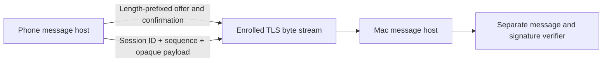

# Negotiated TLS message hosts

`NegotiatedTLSChannel` on the phone and `NegotiatedNetworkChannel` on the Mac own one connection from TLS admission through application delivery. They use the shared [negotiation contract](channel-negotiation.md). They do not authorize a request, decision, audit update, or routing change.

The caller supplies the current enrollment scope and capabilities. It configures pinned TLS identities and admission before transferring exclusive ownership of the native channel. The phone host uses `TLSRecordSession`; the Mac host starts the supplied, unstarted `NetworkByteChannel`. Neither host accepts a relay-supplied identity, changes a pin, or retries negotiation with weaker settings.

## Framing and admission

Every message has a four-byte unsigned network-order length followed by that many bytes. A zero length fails. The receiver checks the length before allocating the body. It retains partial headers and bodies across TLS chunks, and preserves bytes following the current frame. TLS chunks remain bounded at 32,768 bytes.

Handshake offers have a 65,536-byte limit; confirmations have a 128-byte limit. The phone sends its offer first. The Mac receives and verifies it before sending its offer. Both hosts generate a fresh 32-byte nonce through the platform CSPRNG. Their implemented envelope set is exactly `{1}`; a higher trusted floor fails without removing pairing.

One overall timeout covers TLS opening and the application handshake. The default is 15 seconds; callers can select 1–60,000 milliseconds. Timeout, cancellation, malformed data, and failed I/O close the transferred channel. A successful local final send precedes publication of negotiated metadata. No failed constructor returns a partially usable host.

The framing owner remains the same after confirmation. This preserves application bytes that arrive in the same TLS chunk as the final handshake message.

## Application envelope version 1

The frame body is this canonical CBOR map. All fields are mandatory, and additional fields fail.

| Key | Value |
| --- | --- |
| 0 | Unsigned envelope version 1 |
| 1 | The confirmed 32-byte session ID |
| 2 | Per-direction unsigned 64-bit sequence |
| 3 | Nonempty opaque payload bytes |

Each direction starts at sequence zero and accepts only the next exact value. Wrong session IDs, repeated or skipped sequences, and unsupported envelope versions close the connection before exposing the payload. Sequence exhaustion never wraps; a new connection needs a fresh negotiation.

The caller sets a payload limit from 1 byte through 16 MiB. Framing permits 64 extra bytes for the canonical envelope. This is an approval-transport resource bound, not an ADB transfer cap. Handshake and application limits are independent. The hosts permit one send and one receive concurrently; overlapping operations in the same direction fail and close the host instead of adding an unbounded internal queue.

Completion of `send` reports local transport processing. It does not prove remote delivery, durable consumption, execution, or an action result. EOF and cancellation supply no such proof either. Reconnect never retries a decision automatically.

Negotiated metadata is an immutable snapshot, not an admission token. The enrollment owner must close the channel when authorization changes and recheck current enrollment around each await. The application consumer must verify the signed message, exact operation contract, required features, expiry, and current authority independently of this envelope.

## Evidence and remaining integration

Swift and Kotlin tests share a canonical envelope example, including the full unsigned sequence range. Host tests cover fragmented headers, chunks with nonzero collection indices, confirmation coalesced with application data, invalid session IDs, replay, invalid length headers, handshake deadlines, cancellation, and invalid configuration cleanup.

The debug-only native TLS peer can run the actual Mac host with a fixed synthetic enrollment scope. Kotlin interoperability tests use the actual phone host through the existing local HTTPS/WebSocket relay. They exchange multiple session-bound payloads and reject a wrong enrollment scope. The fixture remains loopback-only, uses disposable keys, refuses root and release builds, and terminates when its controller pipe closes. It processes no real requests or decisions.

Production listeners, enrollment runtime ownership, current-authority reconciliation, message dispatch, and UI status remain separate integrations. Pixel provider behavior, background execution, and physical-device tests remain unproven. No service installation, credentials, Cloudflare resources, or real approvals are involved in these tests.
