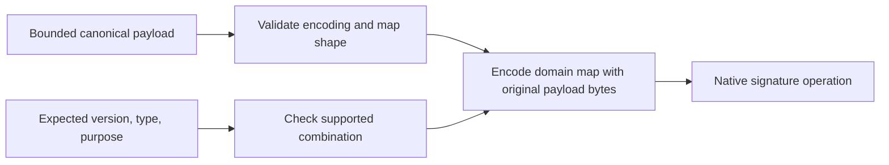

# Signature input, wire version 1

`SigningInput.make` constructs the exact bytes for signing or verification. It does not sign, verify, or authorize anything.

The verifier must derive the expected context from its retained request and negotiated contract. It must not select a purpose or key because an untrusted message asks for it.

## Exact input

Encode this map with the deterministic CBOR subset. Integer keys have the following meanings:

| Key | Value |
| --- | --- |
| 0 | UTF-8 text `dev.remozio.approval` |
| 1 | Wire version, unsigned integer `1` |
| 2 | Message type tag |
| 3 | Signing purpose tag |
| 4 | Byte string containing the complete original canonical payload |

The payload must itself be a canonical CBOR map. Validate it before constructing the input, under explicit payload limits. Encode the complete signature input under separate limits. Unknown optional fields stay inside the original bytes; this helper does not remove or interpret them.

This registry covers approval requests, decisions, and status only. Pairing, handshake, local IPC, ADB, and release metadata need their own domain and contract. Never reuse this domain for them.

| Message type | Tag | Allowed purpose | Purpose tag |
| --- | --- | --- | --- |
| Request | 1 | Issued request | 1 |
| Decision | 2 | Cancellation | 2 |
| Decision | 2 | One-time UI action | 3 |
| Decision | 2 | Biometric authorization | 4 |
| Status | 3 | Status | 5 |

Wire version 1 is the only supported version. Unknown tags must fail parsing; incompatible known type/purpose combinations fail construction. Never default an unknown purpose to a weaker one.

The action policy supplies the required decision purpose and key class. A verifier checks that policy against the retained request before accepting a decision signature. In particular, a valid one-time decision signature cannot authorize a reusable rule.

## Integration boundary

The caller still must validate the full payload schema, critical fields, identity, enrollment epoch, request challenge, action binding, expiry, and supported security features. Canonical encoding does not establish any of those facts.

The signature covers the encoded domain map, not the raw payload alone. Native key adapters must agree on the algorithm, hashing, and signature representation. Those adapters and cryptographic vectors are separate work. This helper is not an authenticated network envelope or an algorithm negotiation mechanism.

The [shared vectors](vectors/signing-input-v1.json) pin exact inputs for all five allowed contexts. Each uses an empty map and a map containing a leading UTF-8 BOM. Tests also check purpose substitution, unsupported versions, malformed payloads, and independent size bounds.
